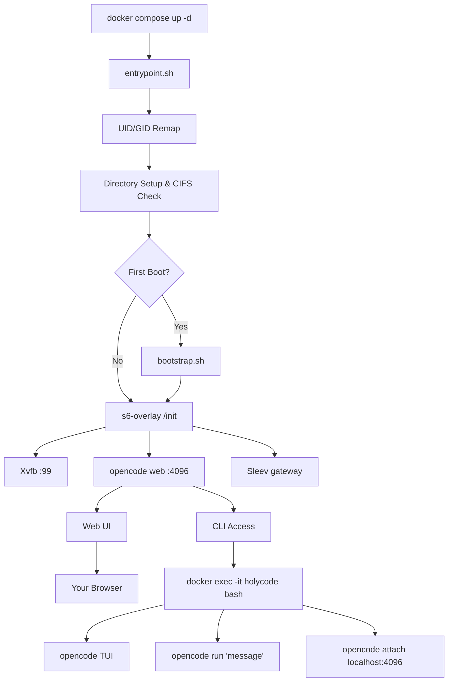

🌍 **English** | [Español](docs/translations/README.es.md) | [Français](docs/translations/README.fr.md) | [Italiano](docs/translations/README.it.md) | [Português](docs/translations/README.pt.md) | [Deutsch](docs/translations/README.de.md) | [Русский](docs/translations/README.ru.md) | [हिन्दी](docs/translations/README.hi.md) | [中文](docs/translations/README.zh.md) | [日本語](docs/translations/README.ja.md) | [한국어](docs/translations/README.ko.md)

<a name="top"></a>

#  HolyCode

<div align="center">
  
</div>

<p align="center">

[](https://opensource.org/licenses/MIT)
[](https://hub.docker.com/r/coderluii/holycode)
[](https://hub.docker.com/r/coderluii/holycode)
[](https://github.com/coderluii/holycode)
[](https://x.com/CoderLuii)
[](https://www.paypal.com/donate/?hosted_button_id=PM2UXGVSTHDNL)
[](https://buymeacoffee.com/CoderLuii)
[](https://coderluii.dev)
[](https://github.com/coderluii/holycode/releases)
[](https://github.com/coderluii/holycode/issues)
[](https://github.com/coderluii/holycode/graphs/contributors)

</p>

### One container. Every tool. Any provider.

OpenCode running in a container with 50+ dev tools, 10+ AI providers, headless browser, and persistent state pre-configured.

---

## What is this?

HolyCode is a pre-configured Docker environment for [OpenCode](https://opencode.ai), an AI coding agent with a built-in web UI. It includes 50+ dev tools, a headless browser stack, process supervision, and provider-agnostic model support.

Your settings, sessions, MCP configs, plugins, and tool history live in a bind mount outside the container. Rebuild, update, or move machines — your state persists.

Based on the same approach as [HolyClaude](https://github.com/coderluii/holyclaude), but wrapping OpenCode instead of Claude Code. OpenCode is provider-agnostic: point it at Anthropic, OpenAI, Google Gemini, Groq, AWS Bedrock, Azure OpenAI, or any OpenAI-compatible endpoint.

---

## Table of Contents

| | Section |
|---|---------|
| 1 | [Quick Start](#quick-start) |
| 2 | [Platform Support](#platform-support) |
| 3 | [Why HolyCode](#why-holycode) |
| 4 | [Provider Support](#provider-support) |
| 5 | [Docker Compose - Quick](#docker-compose---quick) |
| 6 | [Docker Compose - Full](#docker-compose---full) |
| 7 | [Podman](#podman) |
| 8 | [Environment Variables](#environment-variables) |
| 9 | [What's Inside](#whats-inside) |
| 10 | [Architecture](#architecture) |
| 11 | [CLI Usage](#cli-usage) |
| 12 | [Data and Persistence](#data-and-persistence) |
| 13 | [Permissions](#permissions) |
| 14 | [Upgrading](#upgrading) |
| 15 | [Troubleshooting](#troubleshooting) |
| 16 | [Building Locally](#building-locally) |
| 17 | [Contributing](#contributing) |
| 18 | [Support](#support) |
| 19 | [License](#license) |

---

## Quick Start

**Step 1.** Pull the image.

```bash
docker pull coderluii/holycode:latest
```

**Step 2.** Create a `docker-compose.yaml`.

```yaml
services:
  holycode:
    image: coderluii/holycode:latest
    container_name: holycode
    restart: unless-stopped
    shm_size: 2g
    ports:
      - "4096:4096"
    volumes:
      - ./data/opencode:/home/opencode
      - ./local-cache/opencode:/home/opencode/.cache/opencode
      - ./workspace:/workspace
    environment:
      - PUID=1000
      - PGID=1000
      - ANTHROPIC_API_KEY=your-key-here
```

In that example, `/home/opencode` is the fixed path **inside** the container. On the host, `./data/opencode` and `./local-cache/opencode` are just example bind-mount paths relative to the folder containing your `docker-compose.yaml`. You can replace them with any host paths you want.

**Step 3.** Start it.

```bash
docker compose up -d
```

Open http://localhost:4096. You're in.

> The shipped `docker-compose.yaml` uses `${ANTHROPIC_API_KEY}` syntax which reads from your shell environment or a `.env` file. Copy `.env.example` to `.env` and fill in your API key.

> `./data/opencode` is only an example host path. If your compose file lives at `/opt/holycode`, that same bind mount becomes `/opt/holycode/data/opencode` on the host.

> Keep `./local-cache/opencode` on local disk. If this project folder lives on NAS/CIFS/SMB storage, change that cache mount to an absolute local host path instead.

---

## Platform Support

| Platform | Architecture | Status |
|----------|-------------|--------|
| Linux | amd64 | Supported |
| Linux | arm64 | Supported |
| macOS (Docker Desktop) | amd64 / arm64 | Supported |
| Windows (WSL2) | amd64 | Supported |


---

## Why HolyCode

HolyCode packages a complete AI coding environment into a single container so you skip the setup and get straight to building.

| | HolyCode | DIY |
|---|----------|-----|
| Time to first working session | Under 2 minutes | 30-60 minutes |
| Chromium + Xvfb headless browser | Pre-configured | Research, install, debug yourself |
| Dev tool suite (ripgrep, fzf, lazygit, etc.) | Pre-installed | Hunt down and install one by one |
| State persistence across rebuilds | Automatic via bind mount | Manual bind mounts, easy to misconfigure |
| UID/GID file permission remapping | Built-in PUID/PGID | Dockerfile chmod hacks |
| Multi-arch support | amd64 + arm64 out of the box | Build and push both yourself |
| Updates | `docker pull` + `compose up` | Rebuild from scratch, hope nothing breaks |


---

## Provider Support

OpenCode is provider-agnostic. Set whichever API key you use and you're done.

| Provider | Environment Variable | Notes |
|----------|---------------------|-------|
| Anthropic | `ANTHROPIC_API_KEY` | Claude models |
| OpenAI | `OPENAI_API_KEY` | GPT models |
| Google Gemini | `GEMINI_API_KEY` | Gemini models |
| Groq | `GROQ_API_KEY` | Fast inference |
| AWS Bedrock | `AWS_ACCESS_KEY_ID`, `AWS_SECRET_ACCESS_KEY`, `AWS_REGION` | Set all three |
| Azure OpenAI | `AZURE_OPENAI_ENDPOINT`, `AZURE_OPENAI_API_KEY`, `AZURE_OPENAI_API_VERSION` | Set all three |
| GitHub | `GITHUB_TOKEN` | GitHub CLI auth and Copilot |
| Vertex AI | (configured via OpenCode) | Google Vertex AI models |
| GitHub Models | (configured via OpenCode) | GitHub-hosted models |
| Ollama | (configured via OpenCode) | Local models via Ollama |

You only need to set keys for providers you actually use. Everything else is optional and ignored.

Vertex AI, GitHub Models, and Ollama are configured through OpenCode's provider system. Run `opencode providers login` inside the container.


---

## Docker Compose - Quick

The minimal setup. Copy, fill in your key, run.

```yaml
services:
  holycode:
    image: coderluii/holycode:latest
    container_name: holycode
    restart: unless-stopped
    shm_size: 2g              # Required for Chromium stability
    ports:
      - "4096:4096"           # OpenCode web UI
    volumes:
      - ./data/opencode:/home/opencode
      - ./local-cache/opencode:/home/opencode/.cache/opencode
      - ./workspace:/workspace  # Your project files
    environment:
      - PUID=1000
      - PGID=1000
      - ANTHROPIC_API_KEY=your-key-here  # Or swap for any provider key
```


---

## Docker Compose - Full

Every option documented. Copy to `docker-compose.yaml` and uncomment what you need.

```yaml
# HolyCode - Full Configuration Reference
# Copy this file to docker-compose.yaml and customize.
# All options documented. Uncomment what you need.

services:
  holycode:
    image: coderluii/holycode:latest
    container_name: holycode
    restart: unless-stopped
    shm_size: 2g

    ports:
      - "4096:4096"   # OpenCode web UI

    volumes:
      # --- Main HolyCode data ---
      # Pick any host path you want here. This path maps to /home/opencode in the container.
      # It can live on local disk or network storage.
      - ./data/opencode:/home/opencode

      # --- Cache path ---
      # Keep this one on LOCAL disk for plugin/cache reliability.
      # If your main data path lives on NAS/CIFS/SMB, make this a separate local path.
      - ./local-cache/opencode:/home/opencode/.cache/opencode

      # --- Workspace ---
      - ./workspace:/workspace   # Your project files

    environment:
      # --- Container user ---
      - PUID=1000                # Match your host UID for file permissions
      - PGID=1000                # Match your host GID for file permissions

      # --- Git identity (used on first boot) ---
      # - GIT_USER_NAME=Your Name
      # - GIT_USER_EMAIL=you@example.com

      # --- AI provider API keys (add the ones you use) ---
      - ANTHROPIC_API_KEY=${ANTHROPIC_API_KEY:-}
      # - OPENAI_API_KEY=${OPENAI_API_KEY:-}
      # - GEMINI_API_KEY=${GEMINI_API_KEY:-}
      # - GROQ_API_KEY=${GROQ_API_KEY:-}
      # - GITHUB_TOKEN=${GITHUB_TOKEN:-}

      # --- AWS Bedrock (uncomment all 3 for Bedrock) ---
      # - AWS_ACCESS_KEY_ID=
      # - AWS_SECRET_ACCESS_KEY=
      # - AWS_REGION=us-east-1

      # --- Azure OpenAI (uncomment all 3 for Azure) ---
      # - AZURE_OPENAI_ENDPOINT=
      # - AZURE_OPENAI_API_KEY=
      # - AZURE_OPENAI_API_VERSION=

      # --- OpenCode behavior (overrides image defaults) ---
      # - OPENCODE_MODEL=claude-sonnet-4-6
      # - OPENCODE_PERMISSION=auto
      # - OPENCODE_DISABLE_LSP_DOWNLOAD=true
      # - OPENCODE_DISABLE_AUTOCOMPACT=true
      # - OPENCODE_ENABLE_EXA=true

      # --- Web UI Security (basic auth for opencode web) ---
      # - OPENCODE_SERVER_PASSWORD=your-password
      # - OPENCODE_SERVER_USERNAME=opencode
```

For the shipped `docker-compose.full.yaml` reference file, see the one included in this repo.


---

## Podman

Prefer Podman? HolyCode uses the same container image there too. The Podman guide covers the minimal `podman run` setup, env-file usage, SELinux labels, rootless permissions, and update/recreate behavior.

**[Read the Podman guide](docs/podman.md)**


---

## Environment Variables

| Variable | Default | Purpose |
|----------|---------|---------|
| `PUID` | `1000` | Container user UID, match your host for correct file ownership |
| `PGID` | `1000` | Container user GID, match your host for correct file ownership |
| `GIT_USER_NAME` | `HolyCode User` | Git identity configured on first boot |
| `GIT_USER_EMAIL` | `noreply@holycode.local` | Git identity configured on first boot |
| `ANTHROPIC_API_KEY` | (none) | Anthropic Claude |
| `OPENAI_API_KEY` | (none) | OpenAI GPT models |
| `GEMINI_API_KEY` | (none) | Google Gemini |
| `GROQ_API_KEY` | (none) | Groq fast inference |
| `GITHUB_TOKEN` | (none) | GitHub CLI auth and Copilot |
| `AWS_ACCESS_KEY_ID` | (none) | AWS Bedrock - set all three AWS vars |
| `AWS_SECRET_ACCESS_KEY` | (none) | AWS Bedrock |
| `AWS_REGION` | (none) | AWS Bedrock region (e.g. `us-east-1`) |
| `AZURE_OPENAI_ENDPOINT` | (none) | Azure OpenAI - set all three Azure vars |
| `AZURE_OPENAI_API_KEY` | (none) | Azure OpenAI |
| `AZURE_OPENAI_API_VERSION` | (none) | Azure OpenAI API version |
| `OPENCODE_MODEL` | (none) | Override the default model |
| `OPENCODE_PERMISSION` | (none) | Set to `auto` to skip permission prompts |
| `OPENCODE_DISABLE_LSP_DOWNLOAD` | (none) | Disable automatic LSP server downloads |
| `OPENCODE_DISABLE_AUTOCOMPACT` | (none) | Disable automatic context compaction |
| `OPENCODE_ENABLE_EXA` | (none) | Enable Exa web search integration |
| `OPENCODE_SERVER_PASSWORD` | (none) | Protect the web UI with basic auth |
| `OPENCODE_SERVER_USERNAME` | `opencode` | Username for web UI basic auth |

> `OPENCODE_DISABLE_AUTOUPDATE` and `OPENCODE_DISABLE_TERMINAL_TITLE` are set to `true` by default in the Docker image. You can override them if needed.

> `GIT_USER_NAME` and `GIT_USER_EMAIL` are only applied on first boot. To re-apply, delete the sentinel file and restart: `docker exec holycode rm /home/opencode/.config/opencode/.holycode-bootstrapped` then `docker compose restart`.


---

## What's Inside

<details>
<summary><strong>Core tools</strong></summary>

| Tool | Purpose |
|------|---------|
| `git` | Version control |
| `ripgrep` | Fast file content search |
| `fd` | Fast file finder |
| `fzf` | Fuzzy finder |
| `bat` | Cat with syntax highlighting |
| `eza` | Modern ls replacement |
| `lazygit` | Terminal git UI |
| `delta` | Better git diffs |
| `gh` | GitHub CLI |
| `htop` | Process monitor |
| `tar` | Archive creation and extraction |
| `tree` | Directory tree visualization |
| `less` | Paged file viewer |
| `vim` | Terminal text editor |
| `tmux` | Terminal multiplexer |

</details>

<details>
<summary><strong>Language runtimes</strong></summary>

| Runtime | Version |
|---------|---------|
| Node.js | 22 (LTS) |
| npm | Bundled with Node.js 22 |
| Python | 3 (system) |
| pip | Bundled with Python 3 |

</details>

<details>
<summary><strong>Dev tools</strong></summary>

| Tool | Purpose |
|------|---------|
| `curl` | HTTP requests |
| `wget` | File downloads |
| `jq` | JSON processing |
| `unzip` / `zip` | Archive tools |
| `ssh` | Remote access |
| `build-essential` + `pkg-config` | Native npm addon compilation |
| `python3-venv` | Python virtual environments |
| `procps` | Process tools: ps, top |
| `iproute2` | Network tools: ip, ss |
| `lsof` | Open file diagnostics |
| `strace` | System call tracer |
| `pandoc` | Document converter |
| `ffmpeg` | Media processing |
| `imagemagick` | Image manipulation |
| OpenSSL | Crypto and cert tools (via base image) |

</details>

<details>
<summary><strong>Database tools</strong></summary>

| Tool | Purpose |
|------|---------|
| `sqlite3` | SQLite CLI |
| `postgresql-client` | PostgreSQL client (psql, pg_dump) |
| `redis-tools` | Redis CLI |

</details>

<details>
<summary><strong>Global npm packages</strong></summary>

| Package | Purpose |
|---------|---------|
| `typescript` | TypeScript compiler |
| `tsx` | TypeScript executor |
| `pnpm` | Fast package manager |
| `vite` | Frontend build tool |
| `esbuild` | Fast bundler |
| `eslint` | JavaScript linter |
| `prettier` | Code formatter |
| `prisma` | ORM for Node.js and TypeScript |
| `drizzle-kit` | SQL ORM toolkit |
| `wrangler` | Cloudflare Workers CLI |
| `vercel` | Vercel deployment CLI |
| `netlify-cli` | Netlify deployment CLI |
| `pm2` | Node.js process manager |
| `lighthouse` | Web performance auditing |
| `serve` | Static file server |
| `nodemon` | Auto-restart on file changes |
| `concurrently` | Run multiple commands |
| `dotenv-cli` | Load .env from CLI |

</details>

<details>
<summary><strong>Browser stack</strong></summary>

| Component | Purpose |
|-----------|---------|
| Chromium | Headless browser engine |
| Xvfb | Virtual framebuffer display server |
| Playwright | Browser automation framework |

The browser stack runs headless out of the box. No display server, no GPU, no extra config needed. Playwright and Puppeteer scripts work as expected.

Includes Liberation, DejaVu, Noto, and Noto Color Emoji fonts for correct page rendering and screenshots.

</details>

<details>
<summary><strong>AI coding tools</strong></summary>

| Tool | Purpose |
|------|---------|
| `opencode` | AI coding agent with web UI on port 4096 |
| `sleev` | Context compression gateway |
| `aft` (`@cortexkit/aft`) | Code search and analysis |
| `aft-opencode` (`@cortexkit/aft-opencode`) | AFT OpenCode plugin |
| `opencode-ralph-rlm` (`@doeixd/opencode-ralph-rlm`) | Self-correcting coding loop |
| `bun` | Fast JavaScript runtime (via `bunx`) |

</details>

<details>
<summary><strong>Process management</strong></summary>

| Component | Purpose |
|-----------|---------|
| s6-overlay v3 | Process supervisor and init system |
| Custom entrypoint | UID/GID remapping, git setup, bootstrap |

s6-overlay supervises OpenCode, Xvfb, and the Sleev gateway. If a process crashes, it restarts automatically. Container restart policies stay clean because the supervisor handles it internally.

</details>


---

## Architecture



The entrypoint handles user remapping and first-boot setup. s6-overlay supervises Xvfb, the OpenCode web server, and the Sleev context compression gateway. Access the web UI at port 4096.


---

## CLI Usage

The web UI at port 4096 is the primary interface. But you can also use OpenCode directly from the command line inside the container.

### Interactive TUI

```bash
docker exec -it holycode bash
opencode
```

This opens OpenCode's full terminal UI with all the same features as the web version.

### One-shot commands

Run a single prompt without entering the TUI:

```bash
docker exec -it holycode bash -c "opencode run 'explain this codebase'"
```

### Attach to the running server

Connect a local TUI session to the already-running OpenCode web server:

```bash
docker exec -it holycode bash -c "opencode attach http://localhost:4096"
```

This shares the same session as the web UI. Changes in one appear in the other.

### Provider management

List and configure AI providers from inside the container:

```bash
docker exec -it holycode bash -c "opencode providers list"
docker exec -it holycode bash -c "opencode providers login"
```

### Useful commands

| Command | What it does |
|---------|-------------|
| `opencode` | Launch the TUI |
| `opencode run 'message'` | One-shot prompt |
| `opencode attach <url>` | Attach TUI to running server |
| `opencode web --port 4096` | Start web server (already running via s6) |
| `opencode serve` | Headless API server |
| `opencode providers list` | Show configured providers |
| `opencode providers login` | Add or switch provider |
| `opencode models` | List available models |
| `opencode models <provider>` | List models for a specific provider |
| `opencode stats` | Show token usage and costs |
| `opencode session list` | List past sessions |
| `opencode export <sessionID>` | Export session as JSON |
| `opencode plugin <module>` | Install a plugin |
| `opencode upgrade` | Upgrade OpenCode (disabled by default in container) |
| `aft_search` | Semantic code search |
| `aft_inspect` | Codebase health diagnostics |
| `aft_outline` | Structural code outline |
| `sleev status` | Sleev gateway status |
| `opencode-ralph-rlm setup` | Set up Ralph-RLM coding loop in current project |


---

## Data and Persistence

Most OpenCode state lives under `/home/opencode` inside the container. On the host, that data appears wherever you bind-mount `/home/opencode`. In the default examples below, the host path is `./data/opencode`, but you can replace it with any path you want.

Plugin cache is mounted separately at `./local-cache/opencode` by default so you can keep that cache path on local disk even if your main data path is somewhere else.

| Host Path | Container Path | What's in it |
|-----------|---------------|-------------|
| `./data/opencode/.config/opencode`* | `/home/opencode/.config/opencode` | Settings, agents, MCP configs, themes, plugins |
| `./data/opencode/.local/share/opencode`* | `/home/opencode/.local/share/opencode` | SQLite sessions database, MCP OAuth tokens |
| `./data/opencode/.local/state/opencode`* | `/home/opencode/.local/state/opencode` | Frecency data, model cache, key-value store |
| `./local-cache/opencode` | `/home/opencode/.cache/opencode` | Plugin node_modules, auto-installed dependencies |

\* These `./data/opencode/...` paths are example host paths from the sample compose file. If you bind `/home/opencode` to a different host path, the same subdirectories will appear there instead.

Rebuild the container anytime. Run `docker compose pull && docker compose up -d` and your sessions, settings, and configs come back automatically.

**SQLite WAL note.** The sessions database uses Write-Ahead Logging. Don't copy the `.db` file while the container is running. Stop the container first if you need to back up or migrate the database file.

**Network storage note.** If `./data/opencode` is on a CIFS/SMB network mount (NAS, Synology, TrueNAS), you need two mount options:
- `nobrl` — SQLite WAL mode requires this (byte-range locking workaround)
- `mfsymlinks` — plugin installation requires this (symlink support for node_modules)

Keep `./local-cache/opencode` on local disk. If your whole HolyCode folder lives on network storage, change that cache mount to an absolute local host path such as `/var/lib/holycode-cache/opencode:/home/opencode/.cache/opencode`.

See the Troubleshooting section below.


---

## Permissions

HolyCode uses `PUID` and `PGID` to remap the internal container user to match your host user. This means files written to `./workspace` are owned by you, not by root.

Find your IDs on Linux and macOS:

```bash
id -u   # PUID
id -g   # PGID
```

On most systems this is `1000:1000`. On macOS it's often `501:20`. Set them in your compose file:

```yaml
environment:
  - PUID=501
  - PGID=20
```

If you skip this, files in your workspace may be owned by root and you'll need sudo to edit them from the host.


---

## Upgrading

Pull the latest image and recreate the container. Your data stays untouched.

```bash
docker compose pull
docker compose up -d
```

That's it. One command. Your sessions, settings, and configs are in the bind mount so nothing is lost.


---

## Troubleshooting

<details>
<summary><strong>Chromium crashes or browser automation fails</strong></summary>

The most common cause is not enough shared memory. Chromium needs at least 1-2 GB of `/dev/shm` to run reliably.

Make sure your compose file has `shm_size: 2g`:

```yaml
services:
  holycode:
    shm_size: 2g
```

Without this, Chromium will crash silently or produce broken screenshots.

</details>

<details>
<summary><strong>Permission denied on workspace files</strong></summary>

Your `PUID` and `PGID` don't match your host user. Find your IDs:

```bash
id -u && id -g
```

Update your compose environment section to match:

```yaml
environment:
  - PUID=1001   # replace with your actual UID
  - PGID=1001   # replace with your actual GID
```

Then recreate the container: `docker compose up -d --force-recreate`

</details>

<details>
<summary><strong>Port 4096 already in use</strong></summary>

Something else on your machine is using port 4096. Remap to a different host port:

```yaml
ports:
  - "4097:4096"   # access via http://localhost:4097
```

Or find and stop the conflicting process:

```bash
# Linux / macOS
lsof -i :4096

# Windows
netstat -ano | findstr :4096
```

</details>

<details>
<summary><strong>Container starts but web UI never loads</strong></summary>

Check the container logs:

```bash
docker compose logs -f holycode
```

OpenCode takes a few seconds to initialize. Give it 10-15 seconds after `docker compose up -d` before opening the browser. If it's still not up, the logs will tell you why.

</details>

<details>
<summary><strong>Why doesn't HolyCode need SYS_ADMIN or seccomp=unconfined?</strong></summary>

Chromium runs with `--no-sandbox` inside the container, which is standard for containerized browser setups. This eliminates the need for `SYS_ADMIN` capabilities or `seccomp=unconfined` that some other Docker browser setups require. The container itself provides the isolation boundary.

If you prefer to use Chromium's built-in sandbox instead, add the following to your compose file and remove `--no-sandbox` from the `CHROMIUM_FLAGS` environment variable:

```yaml
cap_add:
  - SYS_ADMIN
security_opt:
  - seccomp=unconfined
```

</details>

<details>
<summary><strong>SQLite WAL or plugins fail on CIFS/SMB network mounts (NAS)</strong></summary>

If your `./data/opencode` directory lives on a CIFS/SMB network share (e.g. NAS, Synology, TrueNAS), OpenCode may fail with:

```
Failed to run the query 'PRAGMA journal_mode = WAL'
```

OpenCode uses SQLite with Write-Ahead Logging (WAL) for its sessions database. WAL requires byte-range locking, which CIFS/SMB doesn't support by default.

HolyCode detects this at startup and prints a warning with the fix instructions.

**Fix:** Add `nobrl,mfsymlinks` to your CIFS mount options in `/etc/fstab`:

```
# Before
//192.168.1.100/share /mnt/share cifs credentials=/etc/smbcreds,uid=1000,gid=1000 0 0

# After — add nobrl and mfsymlinks
//192.168.1.100/share /mnt/share cifs credentials=/etc/smbcreds,uid=1000,gid=1000,nobrl,mfsymlinks 0 0
```

Then remount:

```bash
sudo umount /mnt/share
sudo mount /mnt/share
```

Restart HolyCode: `docker compose up -d --force-recreate`

If you are using the default HolyCode Compose files, the cache mount is `./local-cache/opencode:/home/opencode/.cache/opencode`. Keep that path on local disk. If your entire HolyCode folder lives on network storage, replace it with an absolute local host path.

</details>


---

## Building Locally

Clone the repo, build the image, swap it into your compose file.

```bash
git clone https://github.com/coderluii/holycode.git
cd holycode
docker build -t holycode:local .
```

Then in your `docker-compose.yaml` swap the image:

```yaml
image: holycode:local
```


---

## Contributing

1. Fork the repo
2. Create a branch: `git checkout -b feature/your-feature`
3. Commit your changes: `git commit -m "feat: your feature"`
4. Push: `git push origin feature/your-feature`
5. Open a pull request


---

## Support

If HolyCode saved you from another hour of environment setup, here's how to pay it forward.

- Star the repo on GitHub
- Share it with someone who'd find it useful
- [Buy Me A Coffee](https://buymeacoffee.com/CoderLuii)
- [PayPal](https://www.paypal.com/donate/?hosted_button_id=PM2UXGVSTHDNL)
- [GitHub Sponsors](https://github.com/sponsors/CoderLuii)


---

## License

MIT License - see [LICENSE](LICENSE).


---

<div align="center">

Built by [CoderLuii](https://github.com/coderluii) · [coderluii.dev](https://coderluii.dev)

</div>
