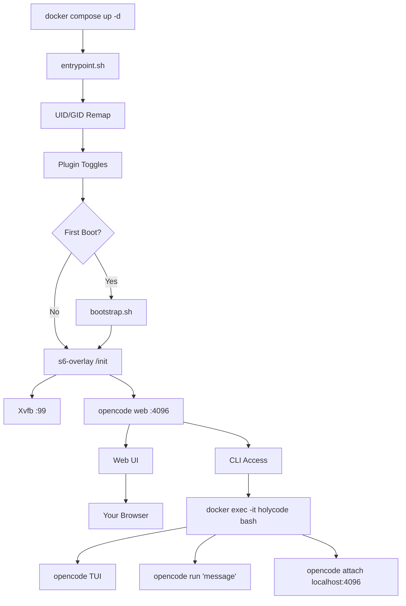

🌍 [English](../../README.md) | [Español](README.es.md) | [Français](README.fr.md) | [Italiano](README.it.md) | [Português](README.pt.md) | **Deutsch** | [Русский](README.ru.md) | [हिन्दी](README.hi.md) | [中文](README.zh.md) | [日本語](README.ja.md) | [한국어](README.ko.md)

> **📝 Note:** The [English README](../../README.md) is the canonical version. This translation may lag behind. Check the English version for the most current feature set and configuration options.

<a name="top"></a>

#  HolyCode

<div align="center">
  
</div>

<p align="center">

[](https://opensource.org/licenses/MIT)
[](https://hub.docker.com/r/coderluii/holycode)
[](https://hub.docker.com/r/coderluii/holycode)
[](https://github.com/coderluii/holycode)
[](https://x.com/CoderLuii)
[](https://www.paypal.com/donate/?hosted_button_id=PM2UXGVSTHDNL)
[](https://buymeacoffee.com/CoderLuii)
[](https://coderluii.dev)
[](https://github.com/coderluii/holycode/releases)
[](https://github.com/coderluii/holycode/issues)
[](https://github.com/coderluii/holycode/graphs/contributors)

</p>

### Ein Container. Alle Werkzeuge. Jeder Anbieter.

OpenCode läuft in einem Container mit allem bereits installiert. 50+ Entwicklungswerkzeuge, 10+ KI-Anbieter, headloser Browser, persistenter Zustand. Lege es auf einem beliebigen Rechner ab und mach genau dort weiter, wo du aufgehört hast.

**Du wolltest eine Stunde damit verbringen, deine Umgebung wiederherzustellen. Oder du kannst einfach `docker compose up` ausführen.**
> **Kein Self-Hosting gewünscht?** [HolyCode Cloud](https://holycode.coderluii.dev/cloud) kommt. Dieselben Werkzeuge, null Einrichtung. Frühzugang ist kostenlos.

---

## Was ist das?

Du kennst die Geschichte. Du richtest deine Entwicklungsumgebung perfekt ein. Dann wechselst du den Rechner. Oder baust einen Container neu auf. Oder dein System entscheidet, dass heute der Tag ist, an dem es stirbt.

Plötzlich installierst du Werkzeuge neu. Suchst nach Konfigurationsdateien. Gibst API-Schlüssel erneut ein. Fragst dich, warum ripgrep nicht mehr im PATH ist. Versuchst herauszufinden, warum Chromium nicht startet, weil Docker Containern 64 MB gemeinsamen Speicher gibt. Dann ist Xvfb nicht konfiguriert. Dann stimmt die UID im Container nicht mit der des Hosts überein und alles gibt Permission denied.

**HolyCode ist der Container, den ich gebaut habe, nachdem ich jeden einzelnen dieser Probleme gelöst hatte.**

Er kapselt [OpenCode](https://opencode.ai), einen KI-Programmieragenten mit eingebautem Web-UI. Alle deine Einstellungen, Sitzungen, MCP-Konfigurationen, Plugins und Werkzeugverlauf leben in einem Bind-Mount außerhalb des Containers. Neu aufbauen, aktualisieren oder auf einen neuen Rechner umziehen. Dein Zustand kommt sofort zurück.

Es ist die gleiche Idee wie [HolyClaude](https://github.com/coderluii/holyclaude), aber OpenCode statt Claude Code kapselnd. Und hier ist der Punkt: OpenCode ist nicht an einen einzigen Anbieter gebunden. Weise es auf Anthropic, OpenAI, Google Gemini, Groq, AWS Bedrock oder Azure OpenAI. Gleicher Container, deine Wahl des Modells.

50+ Entwicklungswerkzeuge, zwei Sprachlaufzeiten, ein headloser Browser-Stack und Prozessüberwachung. Alles verkabelt, alles beim ersten Start bereit. Ich betreibe das auf meinem eigenen Server. Jeder Fehler wurde gefunden, diagnostiziert und behoben.

Du lädst es herunter. Du startest es. Du öffnest den Browser. Du baust.

---

## Inhaltsverzeichnis

| | Abschnitt |
|---|---------|
| 1 | [Schnellstart](#-schnellstart) |
| 2 | [HolyCode Cloud](#-holycode-cloud-demnächst) |
| 3 | [Plattformunterstützung](#-plattformunterstützung) |
| 4 | [Warum HolyCode](#-warum-holycode) |
| 5 | [Anbieterunterstützung](#-anbieterunterstützung) |
| 6 | [Docker Compose - Schnell](#-docker-compose---schnell) |
| 7 | [Docker Compose - Vollständig](#-docker-compose---vollständig) |
| 8 | [Umgebungsvariablen](#-umgebungsvariablen) |
| 9 | [Was ist enthalten](#-was-ist-enthalten) |
| 10 | [Integrierte Dienste](#-integrierte-dienste) |
| 11 | [Architektur](#-architektur) |
| 12 | [CLI-Verwendung](#-cli-verwendung) |
| 13 | [Daten und Persistenz](#-daten-und-persistenz) |
| 14 | [Berechtigungen](#-berechtigungen) |
| 15 | [Aktualisierungen](#-aktualisierungen) |
| 16 | [Fehlerbehebung](#-fehlerbehebung) |
| 17 | [Lokale Erstellung](#-lokale-erstellung) |
| 18 | [Mitwirken](#-mitwirken) |
| 19 | [Support](#-support) |
| 20 | [Lizenz](#-lizenz) |

---

## 🚀 Schnellstart

**Schritt 1.** Lade das Image herunter.

```bash
docker pull coderluii/holycode:latest
```

**Schritt 2.** Erstelle eine `docker-compose.yaml`.

```yaml
services:
  holycode:
    image: coderluii/holycode:latest
    container_name: holycode
    restart: unless-stopped
    shm_size: 2g
    ports:
      - "4096:4096"
    volumes:
      - ./data/opencode:/home/opencode
      - ./local-cache/opencode:/home/opencode/.cache/opencode
      - ./workspace:/workspace
    environment:
      - PUID=1000
      - PGID=1000
      - ANTHROPIC_API_KEY=your-key-here

```

**Schritt 3.** Starte es.

```bash
docker compose up -d
```

Öffne http://localhost:4096. Du bist drin.

> Die mitgelieferte `docker-compose.yaml` verwendet die Syntax `${ANTHROPIC_API_KEY}`, die aus deiner Shell-Umgebung oder einer `.env`-Datei liest. Kopiere `.env.example` nach `.env` und trage deinen API-Schlüssel ein.

<p align="right">
  <a href="#top">nach oben</a>
</p>

---

## ☁ HolyCode Cloud (Demnächst)

Kein Self-Hosting gewünscht? Wir bauen eine verwaltete Version von HolyCode.

Die gleichen 50+ Werkzeuge. Die gleichen 10+ Anbieter. Der gleiche persistente Zustand. Kein Docker. Kein Terminal. Öffne einfach deinen Browser und programmiere.

**Was du mit Cloud bekommst:**
- Null Einrichtung. Kein Docker, keine Konfigurationsdateien, keine Terminalbefehle.
- Funktioniert auf jedem Gerät. Laptop, Tablet, Smartphone. Öffne einen Browser und los.
- Immer aktuell. Neuestes OpenCode, neueste Werkzeuge. Wir kümmern uns darum.
- Dein Zustand folgt dir. Sitzungen, Einstellungen, MCP-Konfigurationen zwischen Nutzungen gespeichert.

**Der Frühzugang ist kostenlos.** Keine Kreditkarte erforderlich.

**[Sichere deinen Platz](https://holycode.coderluii.dev/cloud)**

<p align="right">
  <a href="#top">nach oben</a>
</p>

---

## 💻 Plattformunterstützung

| Plattform | Architektur | Status |
|-----------|-------------|--------|
| Linux | amd64 | Unterstützt |
| Linux | arm64 | Unterstützt |
| macOS (Docker Desktop) | amd64 / arm64 | Unterstützt |
| Windows (WSL2) | amd64 | Unterstützt |

<p align="right">
  <a href="#top">nach oben</a>
</p>

---

## ⚡ Warum HolyCode

Ich habe das gebaut, weil ich es leid war, jedes Mal das gleiche Setup zu wiederholen. OpenCode installieren, einen headlosen Browser einrichten, Berechtigungsprobleme beheben, Prozessüberwachung debuggen. Jedes. Mal.

Also habe ich einen Container gemacht, der das alles erledigt. Und dann habe ich jeden möglichen Fehler getroffen, damit du es nicht musst.

| | HolyCode | Selbst gemacht |
|---|----------|-----|
| Zeit bis zur ersten funktionierenden Sitzung | Unter 2 Minuten | 30-60 Minuten |
| Chromium + Xvfb headloser Browser | Vorkonfiguriert | Selbst recherchieren, installieren, debuggen |
| Entwicklungswerkzeug-Suite (ripgrep, fzf, lazygit, etc.) | Vorinstalliert | Einzeln suchen und installieren |
| Zustandspersistenz über Neuerstellungen hinweg | Automatisch via Bind-Mount | Manuelle Bind-Mounts, leicht falsch zu konfigurieren |
| UID/GID-Dateiberechtigungs-Remapping | Eingebautes PUID/PGID | chmod-Hacks im Dockerfile |
| Multi-Architektur-Unterstützung | amd64 + arm64 sofort einsatzbereit | Selbst erstellen und beide pushen |
| Aktualisierungen | `docker pull` + `compose up` | Von Grund auf neu erstellen, hoffen dass nichts bricht |

<p align="right">
  <a href="#top">nach oben</a>
</p>

---

## 🤖 Anbieterunterstützung

OpenCode ist anbieterunabhängig. Setze den API-Schlüssel, den du verwendest, und fertig.

| Anbieter | Umgebungsvariable | Hinweise |
|----------|-------------------|---------|
| Anthropic | `ANTHROPIC_API_KEY` | Claude-Modelle |
| OpenAI | `OPENAI_API_KEY` | GPT-Modelle |
| Google Gemini | `GEMINI_API_KEY` | Gemini-Modelle |
| Groq | `GROQ_API_KEY` | Schnelle Inferenz |
| AWS Bedrock | `AWS_ACCESS_KEY_ID`, `AWS_SECRET_ACCESS_KEY`, `AWS_REGION` | Alle drei setzen |
| Azure OpenAI | `AZURE_OPENAI_ENDPOINT`, `AZURE_OPENAI_API_KEY`, `AZURE_OPENAI_API_VERSION` | Alle drei setzen |
| GitHub | `GITHUB_TOKEN` | GitHub Copilot über OpenAI-kompatiblen Endpunkt |
| Vertex AI | (über OpenCode konfiguriert) | Google Vertex AI-Modelle |
| GitHub Models | (über OpenCode konfiguriert) | Auf GitHub gehostete Modelle |
| Ollama | (über OpenCode konfiguriert) | Lokale Modelle via Ollama |

Du musst nur Schlüssel für Anbieter setzen, die du tatsächlich verwendest. Alles andere ist optional und wird ignoriert.

Vertex AI, GitHub Models und Ollama werden über das Anbietersystem von OpenCode konfiguriert. Führe `opencode providers login` im Container aus.

<p align="right">
  <a href="#top">nach oben</a>
</p>

---

## 📋 Docker Compose - Schnell

Die minimale Einrichtung. Kopieren, Schlüssel eintragen, ausführen.

```yaml
services:
  holycode:
    image: coderluii/holycode:latest
    container_name: holycode
    restart: unless-stopped
    shm_size: 2g              # Erforderlich für Chromium-Stabilität
    ports:
      - "4096:4096"           # OpenCode Web-UI
    volumes:
      - ./data/opencode:/home/opencode
      - ./local-cache/opencode:/home/opencode/.cache/opencode
      - ./workspace:/workspace  # Deine Projektdateien
    environment:
      - PUID=1000
      - PGID=1000
      - ANTHROPIC_API_KEY=your-key-here  # Oder durch beliebigen Anbieterschlüssel ersetzen

```

<p align="right">
  <a href="#top">nach oben</a>
</p>

---

## 📄 Docker Compose - Vollständig

Jede Option dokumentiert. In `docker-compose.yaml` kopieren und auskommentieren, was benötigt wird.

```yaml
# HolyCode - Full Configuration Reference
# Copy this file to docker-compose.yaml and customize.
# All options documented. Uncomment what you need.

services:
  holycode:
    image: coderluii/holycode:latest
    container_name: holycode
    restart: unless-stopped
    shm_size: 2g

    ports:
      - "4096:4096"   # OpenCode web UI

    volumes:
      # --- Persistent state (all OpenCode data under home dir) ---
      - ./data/opencode:/home/opencode   # Config, sessions, plugins, all XDG paths

      # --- Cache isolation (keeps plugin cache on local disk, avoids CIFS/SMB symlink issues) ---
      - ./local-cache/opencode:/home/opencode/.cache/opencode

      # --- Workspace ---
      - ./workspace:/workspace   # Your project files

    environment:
      # --- Container user ---
      - PUID=1000                # Match your host UID for file permissions
      - PGID=1000                # Match your host GID for file permissions

      # --- Git identity (used on first boot) ---
      # - GIT_USER_NAME=Your Name
      # - GIT_USER_EMAIL=you@example.com

      # --- AI provider API keys (add the ones you use) ---
      - ANTHROPIC_API_KEY=${ANTHROPIC_API_KEY:-}
      # - OPENAI_API_KEY=${OPENAI_API_KEY:-}
      # - GEMINI_API_KEY=${GEMINI_API_KEY:-}
      # - GROQ_API_KEY=${GROQ_API_KEY:-}
      # - GITHUB_TOKEN=${GITHUB_TOKEN:-}

      # --- AWS Bedrock (uncomment all 3 for Bedrock) ---
      # - AWS_ACCESS_KEY_ID=
      # - AWS_SECRET_ACCESS_KEY=
      # - AWS_REGION=us-east-1

      # --- Azure OpenAI (uncomment all 3 for Azure) ---
      # - AZURE_OPENAI_ENDPOINT=
      # - AZURE_OPENAI_API_KEY=
      # - AZURE_OPENAI_API_VERSION=

      # --- OpenCode behavior (set by default in image, override if needed) ---
      # - OPENCODE_DISABLE_AUTOUPDATE=true
      # - OPENCODE_DISABLE_TERMINAL_TITLE=true
      # - OPENCODE_MODEL=claude-sonnet-4-6
      # - OPENCODE_PERMISSION=auto
      # - OPENCODE_DISABLE_LSP_DOWNLOAD=true
      # - OPENCODE_DISABLE_AUTOCOMPACT=true
      # - OPENCODE_ENABLE_EXA=true

      # --- Web UI Security (basic auth for opencode web) ---
      # - OPENCODE_SERVER_PASSWORD=your-password
      # - OPENCODE_SERVER_USERNAME=opencode


```

<p align="right">
  <a href="#top">nach oben</a>
</p>

---

## 🔧 Umgebungsvariablen

| Variable | Standard | Zweck |
|----------|---------|---------|
| `PUID` | `1000` | Container-Benutzer-UID, an Host anpassen für korrekte Dateirechte |
| `PGID` | `1000` | Container-Benutzer-GID, an Host anpassen für korrekte Dateirechte |
| `GIT_USER_NAME` | `HolyCode User` | Git-Identität beim ersten Start konfiguriert |
| `GIT_USER_EMAIL` | `noreply@holycode.local` | Git-Identität beim ersten Start konfiguriert |
| `ANTHROPIC_API_KEY` | (keiner) | Anthropic Claude |
| `OPENAI_API_KEY` | (keiner) | OpenAI GPT-Modelle |
| `GEMINI_API_KEY` | (keiner) | Google Gemini |
| `GROQ_API_KEY` | (keiner) | Groq schnelle Inferenz |
| `GITHUB_TOKEN` | (keiner) | GitHub CLI-Authentifizierung und Copilot |
| `AWS_ACCESS_KEY_ID` | (keiner) | AWS Bedrock - alle drei AWS-Variablen setzen |
| `AWS_SECRET_ACCESS_KEY` | (keiner) | AWS Bedrock |
| `AWS_REGION` | (keiner) | AWS Bedrock-Region (z.B. `us-east-1`) |
| `AZURE_OPENAI_ENDPOINT` | (keiner) | Azure OpenAI - alle drei Azure-Variablen setzen |
| `AZURE_OPENAI_API_KEY` | (keiner) | Azure OpenAI |
| `AZURE_OPENAI_API_VERSION` | (keiner) | Azure OpenAI API-Version |
| `OPENCODE_DISABLE_AUTOUPDATE` | `true` | Verhindert, dass OpenCode sich im Container selbst aktualisiert |
| `OPENCODE_DISABLE_TERMINAL_TITLE` | `true` | Verhindert, dass OpenCode den Terminal-Titel ändert |
| `OPENCODE_MODEL` | (keiner) | Überschreibt das Standardmodell |
| `OPENCODE_PERMISSION` | (keiner) | Auf `auto` setzen, um Berechtigungsaufforderungen zu überspringen |
| `OPENCODE_DISABLE_LSP_DOWNLOAD` | (keiner) | Deaktiviert automatische LSP-Server-Downloads |
| `OPENCODE_DISABLE_AUTOCOMPACT` | (keiner) | Deaktiviert automatische Kontextkomprimierung |
| `OPENCODE_ENABLE_EXA` | (keiner) | Aktiviert Exa-Websuchintegration |
| `OPENCODE_SERVER_PASSWORD` | (keiner) | Schützt das Web-UI mit Basisauthentifizierung |
| `OPENCODE_SERVER_USERNAME` | `opencode` | Benutzername für Web-UI-Basisauthentifizierung |

> `GIT_USER_NAME` und `GIT_USER_EMAIL` werden nur beim ersten Start angewendet. Zum erneuten Anwenden die Sentinel-Datei löschen und neu starten: `docker exec holycode rm /home/opencode/.config/opencode/.holycode-bootstrapped` dann `docker compose restart`.

<p align="right">
  <a href="#top">nach oben</a>
</p>

---

## 📦 Was ist enthalten

<details>
<summary><strong>Kernwerkzeuge</strong></summary>

| Werkzeug | Zweck |
|------|---------|
| `git` | Versionskontrolle |
| `ripgrep` | Schnelle Dateiinhalt-Suche |
| `fd` | Schneller Dateisucher |
| `fzf` | Unscharfe Suche |
| `bat` | Cat mit Syntaxhervorhebung |
| `eza` | Moderner ls-Ersatz |
| `lazygit` | Terminal-Git-UI |
| `delta` | Bessere Git-Diffs |
| `gh` | GitHub CLI |
| `htop` | Prozessmonitor |
| `tar` | Archiv-Erstellung und -Extraktion |
| `tree` | Verzeichnisbaumvisualisierung |
| `less` | Seitenweise Dateiansicht |
| `vim` | Terminal-Texteditor |
| `tmux` | Terminal-Multiplexer |

</details>

<details>
<summary><strong>Sprachlaufzeiten</strong></summary>

| Laufzeit | Version |
|---------|---------|
| Node.js | 22 (LTS) |
| npm | Mit Node.js 22 gebündelt |
| Python | 3 (System) |
| pip | Mit Python 3 gebündelt |

</details>

<details>
<summary><strong>Entwicklungswerkzeuge</strong></summary>

| Werkzeug | Zweck |
|------|---------|
| `curl` | HTTP-Anfragen |
| `wget` | Datei-Downloads |
| `jq` | JSON-Verarbeitung |
| `unzip` / `zip` | Archivwerkzeuge |
| `ssh` | Fernzugriff |
| `build-essential` + `pkg-config` | Kompilierung nativer npm-Addons |
| `python3-venv` | Virtuelle Python-Umgebungen |
| `procps` | Prozesswerkzeuge: ps, top |
| `iproute2` | Netzwerkwerkzeuge: ip, ss |
| `lsof` | Offene-Dateien-Diagnose |
| OpenSSL | Krypto- und Zertifikatwerkzeuge (über Basis-Image) |

</details>

<details>
<summary><strong>Browser-Stack</strong></summary>

| Komponente | Zweck |
|-----------|---------|
| Chromium | Headloser Browser-Engine |
| Xvfb | Virtueller Framebuffer-Display-Server |
| Playwright | Browser-Automatisierungs-Framework |

Der Browser-Stack läuft sofort headless. Kein Display-Server, keine GPU, keine zusätzliche Konfiguration. Playwright- und Puppeteer-Skripte funktionieren wie erwartet.

Enthält Liberation-, DejaVu-, Noto- und Noto Color Emoji-Schriftarten für korrektes Seiten-Rendering und Screenshots.

</details>

<details>
<summary><strong>Integrierte Dienste</strong></summary>

| Dienst | Zweck |
|---------|---------|
| Hermes Agent | Selbstverbessernder Meta-Agent mit MCP, Messaging-Adaptern und OpenCode-Delegation |
| Paperclip | Lokales Agenten-Board, das OpenCode-Arbeiter einstellt und per Heartbeat weckt |

</details>

<details>
<summary><strong>Prozessverwaltung</strong></summary>

| Komponente | Zweck |
|-----------|---------|
| s6-overlay v3 | Prozesssupervisor und Init-System |
| Benutzerdefinierter Einstiegspunkt | UID/GID-Remapping, Git-Einrichtung, Bootstrap |

s6-overlay überwacht OpenCode und Xvfb. Wenn ein Prozess abstürzt, startet er automatisch neu. Container-Neustart-Richtlinien bleiben sauber, weil der Supervisor das intern handhabt.

</details>

<p align="right">
  <a href="#top">nach oben</a>
</p>

---

## 🏗 Architektur



Der Einstiegspunkt verwaltet Benutzer-Remapping und die Erststart-Einrichtung. s6-overlay überwacht Xvfb, den OpenCode-Webserver. Bei einem Absturz eines überwachten Prozesses startet s6 ihn automatisch neu. Greife auf das Web-UI auf Port 4096 zu oder führe Befehle im Container aus für die vollständige CLI-Erfahrung.

<p align="right">
  <a href="#top">nach oben</a>
</p>

---

## 💻 CLI-Verwendung

Das Web-UI auf Port 4096 ist die primäre Schnittstelle. Du kannst OpenCode aber auch direkt von der Kommandozeile im Container verwenden.

### Interaktives TUI

```bash
docker exec -it holycode bash
opencode
```

Dies öffnet OpenCodes vollständiges Terminal-UI mit denselben Funktionen wie die Web-Version.

### Einmalige Befehle

Führe einen einzelnen Prompt aus ohne das TUI zu betreten:

```bash
docker exec -it holycode bash -c "opencode run 'explain this codebase'"
```

### Mit dem laufenden Server verbinden

Verbinde eine lokale TUI-Sitzung mit dem bereits laufenden OpenCode-Webserver:

```bash
docker exec -it holycode bash -c "opencode attach http://localhost:4096"
```

Dies teilt dieselbe Sitzung wie das Web-UI. Änderungen in einem erscheinen im anderen.

### Anbieterverwaltung

Anbieter von innerhalb des Containers auflisten und konfigurieren:

```bash
docker exec -it holycode bash -c "opencode providers list"
docker exec -it holycode bash -c "opencode providers login"
```

### Nützliche Befehle

| Befehl | Was er tut |
|---------|-------------|
| `opencode` | Startet das TUI |
| `opencode run 'message'` | Einmaliger Prompt |
| `opencode attach <url>` | Verbindet TUI mit laufendem Server |
| `opencode web --port 4096` | Startet Webserver (läuft bereits via s6) |
| `opencode serve` | Headloser API-Server |
| `opencode providers list` | Zeigt konfigurierte Anbieter |
| `opencode providers login` | Anbieter hinzufügen oder wechseln |
| `opencode models` | Listet verfügbare Modelle |
| `opencode models <provider>` | Listet Modelle für einen bestimmten Anbieter |
| `opencode stats` | Zeigt Token-Nutzung und Kosten |
| `opencode session list` | Listet vergangene Sitzungen |
| `opencode export <sessionID>` | Exportiert Sitzung als JSON |
| `opencode plugin <module>` | Installiert ein Plugin |
| `opencode upgrade` | Aktualisiert OpenCode (standardmäßig im Container deaktiviert) |

<p align="right">
  <a href="#top">nach oben</a>
</p>

---

## 💾 Daten und Persistenz

Der gesamte OpenCode-Zustand lebt in einem einzigen Bind-Mount unter `./data/opencode`. Der Container ist zustandslos. Der Bind-Mount enthält alles, was wichtig ist.

| Host-Pfad | Container-Pfad | Inhalt |
|-----------|---------------|-------------|
| `./data/opencode/.config/opencode` | `/home/opencode/.config/opencode` | Einstellungen, Agenten, MCP-Konfigurationen, Themes, Plugins |
| `./data/opencode/.local/share/opencode` | `/home/opencode/.local/share/opencode` | SQLite-Sitzungsdatenbank, MCP-OAuth-Tokens |
| `./data/opencode/.local/state/opencode` | `/home/opencode/.local/state/opencode` | Häufigkeitsdaten, Modell-Cache, Schlüssel-Wert-Speicher |
| `./local-cache/opencode` | `/home/opencode/.cache/opencode` | Plugin-node_modules, automatisch installierte Abhängigkeiten |

Den Container jederzeit neu erstellen. `docker compose pull && docker compose up -d` ausführen und Sitzungen, Einstellungen und Konfigurationen kommen automatisch zurück.

**SQLite WAL-Hinweis.** Die Sitzungsdatenbank verwendet Write-Ahead Logging. Die `.db`-Datei nicht kopieren, während der Container läuft. Den Container zuerst stoppen, wenn die Datenbankdatei gesichert oder migriert werden muss.

**Netzwerkspeicher-Hinweis.** Wenn sich `./data/opencode` auf einem CIFS/SMB-Netzwerk-Mount (NAS, Synology, TrueNAS) befindet, kann der SQLite WAL-Modus fehlschlagen, da SMB standardmäßig kein Byte-Range-Locking unterstützt. HolyCode erkennt dies beim Start und gibt eine Warnung mit dem Fix aus. Siehe den Abschnitt Fehlerbehebung unten.

<p align="right">
  <a href="#top">nach oben</a>
</p>

---

## 🔐 Berechtigungen

HolyCode verwendet `PUID` und `PGID`, um den internen Container-Benutzer dem Host-Benutzer anzupassen. Das bedeutet, dass Dateien, die in `./workspace` geschrieben werden, dir gehören, nicht root.

Finde deine IDs auf Linux und macOS:

```bash
id -u   # PUID
id -g   # PGID
```

Auf den meisten Systemen ist das `1000:1000`. Auf macOS ist es oft `501:20`. Im Compose-File eintragen:

```yaml
environment:
  - PUID=501
  - PGID=20
```

Wenn du das weglässt, können Dateien in deinem Workspace root gehören und du brauchst sudo, um sie vom Host aus zu bearbeiten.

<p align="right">
  <a href="#top">nach oben</a>
</p>

---

## ⬆️ Aktualisierungen

Das neueste Image herunterladen und den Container neu erstellen. Deine Daten bleiben unberührt.

```bash
docker compose pull
docker compose up -d
```

Das ist alles. Ein Befehl. Deine Sitzungen, Einstellungen und Konfigurationen sind im Bind-Mount, also geht nichts verloren.

<p align="right">
  <a href="#top">nach oben</a>
</p>

---

## 🛠 Fehlerbehebung

<details>
<summary><strong>Chromium stürzt ab oder Browser-Automatisierung schlägt fehl</strong></summary>

Die häufigste Ursache ist unzureichender gemeinsamer Speicher. Chromium benötigt mindestens 1-2 GB `/dev/shm` für zuverlässigen Betrieb.

Sicherstellen, dass die Compose-Datei `shm_size: 2g` hat:

```yaml
services:
  holycode:
    shm_size: 2g
```

Ohne das wird Chromium lautlos abstürzen oder fehlerhafte Screenshots produzieren.

</details>

<details>
<summary><strong>Permission denied bei Workspace-Dateien</strong></summary>

`PUID` und `PGID` stimmen nicht mit dem Host-Benutzer überein. IDs finden:

```bash
id -u && id -g
```

Den Umgebungsabschnitt der Compose-Datei entsprechend aktualisieren:

```yaml
environment:
  - PUID=1001   # durch tatsächliche UID ersetzen
  - PGID=1001   # durch tatsächliche GID ersetzen
```

Dann den Container neu erstellen: `docker compose up -d --force-recreate`

</details>

<details>
<summary><strong>Port 4096 bereits in Verwendung</strong></summary>

Etwas anderes auf dem Rechner verwendet Port 4096. Auf einen anderen Host-Port umleiten:

```yaml
ports:
  - "4097:4096"   # Zugriff über http://localhost:4097
```

Oder den konfliktierenden Prozess finden und stoppen:

```bash
# Linux / macOS
lsof -i :4096

# Windows
netstat -ano | findstr :4096
```

</details>

<details>
<summary><strong>Container startet, aber Web-UI lädt nie</strong></summary>

Container-Logs überprüfen:

```bash
docker compose logs -f holycode
```

OpenCode braucht ein paar Sekunden zur Initialisierung. 10-15 Sekunden nach `docker compose up -d` warten, bevor der Browser geöffnet wird. Wenn es immer noch nicht verfügbar ist, werden die Logs den Grund angeben.

</details>

<details>
<summary><strong>Warum braucht HolyCode kein SYS_ADMIN oder seccomp=unconfined?</strong></summary>

Chromium läuft mit `--no-sandbox` im Container, was für containerisierte Browser-Setups Standard ist. Das eliminiert den Bedarf an `SYS_ADMIN`-Fähigkeiten oder `seccomp=unconfined`, die einige andere Docker-Browser-Setups benötigen. Der Container selbst stellt die Isolierungsgrenze bereit.

Wenn der eingebaute Sandbox von Chromium bevorzugt wird, folgendes zur Compose-Datei hinzufügen und `--no-sandbox` aus der `CHROMIUM_FLAGS`-Umgebungsvariable entfernen:

```yaml
cap_add:
  - SYS_ADMIN
security_opt:
  - seccomp=unconfined
```

</details>

<details>
<summary><strong>SQLite WAL schlägt auf CIFS/SMB-Netzwerk-Mounts fehl (NAS)</strong></summary>

Wenn sich das Verzeichnis `./data/opencode` auf einer CIFS/SMB-Netzwerkfreigabe befindet, schlägt OpenCode
möglicherweise mit folgendem Fehler fehl:

```
Failed to run the query 'PRAGMA journal_mode = WAL'
```

OpenCode verwendet SQLite mit Write-Ahead Logging (WAL) für die Sitzungsdatenbank.
WAL erfordert Byte-Range-Locking, das CIFS/SMB standardmäßig nicht unterstützt. HolyCode erkennt dies beim Start.

**Fix:** Fügen Sie `nobrl,mfsymlinks` zu den CIFS-Mount-Optionen in `/etc/fstab` hinzu:

```
# Vorher
//192.168.1.100/share /mnt/share cifs credentials=/etc/smbcreds,uid=1000,gid=1000 0 0

# Nachher (nobrl,mfsymlinks hinzufügen)
//192.168.1.100/share /mnt/share cifs credentials=/etc/smbcreds,uid=1000,gid=1000,nobrl,mfsymlinks 0 0
```

Dann neu einhängen:

```bash
sudo umount /mnt/share
sudo mount /mnt/share
```

HolyCode neu starten: `docker compose up -d --force-recreate`

</details>

<p align="right">
  <a href="#top">nach oben</a>
</p>

---

## 🔨 Lokale Erstellung

Das Repository klonen, das Image erstellen, in der Compose-Datei ersetzen.

```bash
git clone https://github.com/coderluii/holycode.git
cd holycode
docker build -t holycode:local .
```

Dann in der `docker-compose.yaml` das Image ersetzen:

```yaml
image: holycode:local
```

<p align="right">
  <a href="#top">nach oben</a>
</p>

---

## 🤝 Mitwirken

1. Das Repository forken
2. Einen Branch erstellen: `git checkout -b feature/your-feature`
3. Änderungen committen: `git commit -m "feat: your feature"`
4. Pushen: `git push origin feature/your-feature`
5. Einen Pull Request öffnen


<p align="right">
  <a href="#top">nach oben</a>
</p>

---

## ⭐ Support

Wenn HolyCode dir eine weitere Stunde Umgebungseinrichtung erspart hat, hier ist wie du es weitergeben kannst.

- Das Repository auf GitHub mit einem Stern versehen
- Mit jemandem teilen, der es nützlich finden würde
- [Buy Me A Coffee](https://buymeacoffee.com/CoderLuii)
- [PayPal](https://www.paypal.com/donate/?hosted_button_id=PM2UXGVSTHDNL)
- [GitHub Sponsors](https://github.com/sponsors/CoderLuii)

<p align="right">
  <a href="#top">nach oben</a>
</p>

---

## 📄 Lizenz

MIT-Lizenz - siehe [LICENSE](../../LICENSE).

<p align="right">
  <a href="#top">nach oben</a>
</p>

---

<div align="center">

Erstellt von [CoderLuii](https://github.com/coderluii) · [coderluii.dev](https://coderluii.dev)

</div>
