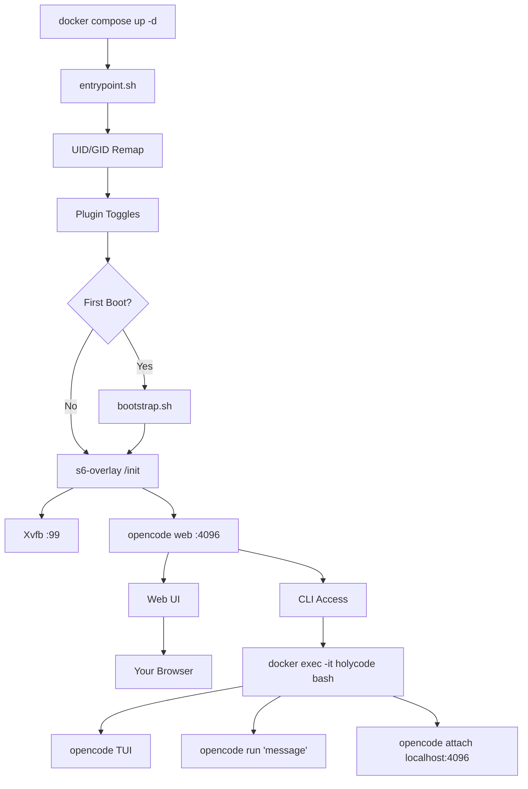

🌍 [English](../../README.md) | **Español** | [Français](README.fr.md) | [Italiano](README.it.md) | [Português](README.pt.md) | [Deutsch](README.de.md) | [Русский](README.ru.md) | [हिन्दी](README.hi.md) | [中文](README.zh.md) | [日本語](README.ja.md) | [한국어](README.ko.md)

> **📝 Note:** The [English README](../../README.md) is the canonical version. This translation may lag behind. Check the English version for the most current feature set and configuration options.

<a name="top"></a>

#  HolyCode

<div align="center">
  
</div>

<p align="center">

[](https://opensource.org/licenses/MIT)
[](https://hub.docker.com/r/coderluii/holycode)
[](https://hub.docker.com/r/coderluii/holycode)
[](https://github.com/coderluii/holycode)
[](https://x.com/CoderLuii)
[](https://www.paypal.com/donate/?hosted_button_id=PM2UXGVSTHDNL)
[](https://buymeacoffee.com/CoderLuii)
[](https://coderluii.dev)
[](https://github.com/coderluii/holycode/releases)
[](https://github.com/coderluii/holycode/issues)
[](https://github.com/coderluii/holycode/graphs/contributors)

</p>

### Un contenedor. Todas las herramientas. Cualquier proveedor.

OpenCode ejecutándose en un contenedor con todo ya instalado. Más de 50 herramientas de desarrollo, más de 10 proveedores de IA, navegador sin cabeza, estado persistente. Ponlo en cualquier máquina y continúa exactamente donde lo dejaste.

**Ibas a pasar una hora recuperando tu entorno. O simplemente puedes ejecutar `docker compose up`.**
> **¿No quieres hacer el alojamiento propio?** [HolyCode Cloud](https://holycode.coderluii.dev/cloud) está llegando. Las mismas herramientas, sin configuración. El acceso anticipado es gratuito.

---

## ¿Qué es esto?

Ya conoces la historia. Configuras tu entorno de desarrollo perfectamente. Luego cambias de máquina. O reconstruyes un contenedor. O tu sistema decide que hoy es el día en que muere.

De repente estás reinstalando herramientas. Buscando archivos de configuración. Reingresando claves API. Preguntándote por qué ripgrep ya no está en el PATH. Averiguando por qué Chromium no arranca porque Docker le da a los contenedores 64 MB de memoria compartida. Luego Xvfb no está configurado. Luego el UID dentro del contenedor no coincide con el del host y todo da permiso denegado.

**HolyCode es el contenedor que construí después de resolver cada uno de esos problemas.**

Envuelve [OpenCode](https://opencode.ai), un agente de programación con IA con una interfaz web integrada. Todos tus ajustes, sesiones, configuraciones MCP, plugins e historial de herramientas viven en un bind mount fuera del contenedor. Reconstruye, actualiza o muévete a una nueva máquina. Tu estado vuelve enseguida.

Es la misma idea que [HolyClaude](https://github.com/coderluii/holyclaude) pero envolviendo OpenCode en lugar de Claude Code. Y esto es lo importante: OpenCode no está atado a un solo proveedor. Apúntalo a Anthropic, OpenAI, Google Gemini, Groq, AWS Bedrock o Azure OpenAI. El mismo contenedor, tu elección de modelo.

Más de 30 herramientas de desarrollo, dos entornos de ejecución de lenguajes, una pila de navegador sin cabeza y supervisión de procesos. Todo conectado, todo listo desde el primer arranque. He estado ejecutando esto en mi propio servidor. Cada error ha sido encontrado, diagnosticado y corregido.

Lo bajas. Lo ejecutas. Abres el navegador. Construyes.

---

## Tabla de contenidos

| | Sección |
|---|---------|
| 1 | [Inicio rápido](#-inicio-rápido) |
| 2 | [HolyCode Cloud](#-holycode-cloud-próximamente) |
| 3 | [Plataformas compatibles](#-plataformas-compatibles) |
| 4 | [Por qué HolyCode](#-por-qué-holycode) |
| 5 | [Proveedores compatibles](#-proveedores-compatibles) |
| 6 | [Docker Compose - Rápido](#-docker-compose---rápido) |
| 7 | [Docker Compose - Completo](#-docker-compose---completo) |
| 8 | [Variables de entorno](#-variables-de-entorno) |
| 9 | [Qué hay dentro](#-qué-hay-dentro) |
| 10 | [Servicios incluidos](#-servicios-incluidos) |
| 11 | [Arquitectura](#-arquitectura) |
| 12 | [Uso de CLI](#-uso-de-cli) |
| 13 | [Datos y persistencia](#-datos-y-persistencia) |
| 14 | [Permisos](#-permisos) |
| 15 | [Actualizaciones](#-actualizaciones) |
| 16 | [Solución de problemas](#-solución-de-problemas) |
| 17 | [Compilación local](#-compilación-local) |
| 18 | [Contribuir](#-contribuir) |
| 19 | [Soporte](#-soporte) |
| 20 | [Licencia](#-licencia) |

---

## 🚀 Inicio rápido

**Paso 1.** Descarga la imagen.

```bash
docker pull coderluii/holycode:latest
```

**Paso 2.** Crea un `docker-compose.yaml`.

```yaml
services:
  holycode:
    image: coderluii/holycode:latest
    container_name: holycode
    restart: unless-stopped
    shm_size: 2g
    ports:
      - "4096:4096"
    volumes:
      - ./data/opencode:/home/opencode
      - ./local-cache/opencode:/home/opencode/.cache/opencode
      - ./workspace:/workspace
    environment:
      - PUID=1000
      - PGID=1000
      - ANTHROPIC_API_KEY=your-key-here

```

**Paso 3.** Inícialo.

```bash
docker compose up -d
```

Abre http://localhost:4096. Ya estás dentro.

> El `docker-compose.yaml` incluido usa la sintaxis `${ANTHROPIC_API_KEY}` que lee desde tu entorno de shell o un archivo `.env`. Copia `.env.example` a `.env` y rellena tu clave API.

<p align="right">
  <a href="#top">volver arriba</a>
</p>

---

## ☁ HolyCode Cloud (Próximamente)

¿No quieres hacer el alojamiento propio? Estamos construyendo una versión gestionada de HolyCode.

Las mismas 50+ herramientas. Los mismos 10+ proveedores. El mismo estado persistente. Sin Docker. Sin terminal. Solo abre tu navegador y programa.

**Lo que obtienes con Cloud:**
- Configuración cero. Sin Docker, sin archivos de configuración, sin comandos de terminal.
- Funciona en cualquier dispositivo. Portátil, tablet, teléfono. Abre un navegador y listo.
- Siempre actualizado. Último OpenCode, últimas herramientas. Nosotros nos encargamos.
- Tu estado te sigue. Sesiones, ajustes, configuraciones MCP guardadas entre usos.

**El acceso anticipado es gratuito.** No se requiere tarjeta de crédito.

**[Reserva tu lugar](https://holycode.coderluii.dev/cloud)**

<p align="right">
  <a href="#top">volver arriba</a>
</p>

---

## 💻 Plataformas compatibles

| Plataforma | Arquitectura | Estado |
|------------|-------------|--------|
| Linux | amd64 | Compatible |
| Linux | arm64 | Compatible |
| macOS (Docker Desktop) | amd64 / arm64 | Compatible |
| Windows (WSL2) | amd64 | Compatible |

<p align="right">
  <a href="#top">volver arriba</a>
</p>

---

## ⚡ Por qué HolyCode

Lo construí porque estaba cansado de repetir la misma configuración cada vez. Instalar OpenCode, conectar un navegador sin cabeza, corregir problemas de permisos, depurar la supervisión de procesos. Cada. Vez.

Así que hice un contenedor que hace todo eso. Y luego encontré cada posible error para que tú no tengas que hacerlo.

| | HolyCode | Hazlo tú mismo |
|---|----------|-----|
| Tiempo hasta la primera sesión funcional | Menos de 2 minutos | 30-60 minutos |
| Chromium + Xvfb navegador sin cabeza | Preconfigurado | Investiga, instala, depura tú mismo |
| Suite de herramientas de desarrollo (ripgrep, fzf, lazygit, etc.) | Preinstalado | Busca e instala uno por uno |
| Persistencia de estado entre reconstrucciones | Automática mediante bind mount | Bind mounts manuales, fácil de configurar mal |
| Reasignación de permisos UID/GID | PUID/PGID integrado | Hacks de chmod en Dockerfile |
| Soporte multi-arquitectura | amd64 + arm64 listo para usar | Compila y publica ambos tú mismo |
| Actualizaciones | `docker pull` + `compose up` | Reconstruye desde cero, espera que nada se rompa |

<p align="right">
  <a href="#top">volver arriba</a>
</p>

---

## 🤖 Proveedores compatibles

OpenCode es agnóstico al proveedor. Configura la clave API que uses y listo.

| Proveedor | Variable de entorno | Notas |
|-----------|---------------------|-------|
| Anthropic | `ANTHROPIC_API_KEY` | Modelos Claude |
| OpenAI | `OPENAI_API_KEY` | Modelos GPT |
| Google Gemini | `GEMINI_API_KEY` | Modelos Gemini |
| Groq | `GROQ_API_KEY` | Inferencia rápida |
| AWS Bedrock | `AWS_ACCESS_KEY_ID`, `AWS_SECRET_ACCESS_KEY`, `AWS_REGION` | Configura las tres |
| Azure OpenAI | `AZURE_OPENAI_ENDPOINT`, `AZURE_OPENAI_API_KEY`, `AZURE_OPENAI_API_VERSION` | Configura las tres |
| GitHub | `GITHUB_TOKEN` | GitHub Copilot mediante endpoint compatible con OpenAI |
| Vertex AI | (configurado mediante OpenCode) | Modelos Google Vertex AI |
| GitHub Models | (configurado mediante OpenCode) | Modelos alojados en GitHub |
| Ollama | (configurado mediante OpenCode) | Modelos locales mediante Ollama |

Solo necesitas configurar claves para los proveedores que realmente uses. Todo lo demás es opcional y se ignora.

Vertex AI, GitHub Models y Ollama se configuran a través del sistema de proveedores de OpenCode. Ejecuta `opencode providers login` dentro del contenedor.

<p align="right">
  <a href="#top">volver arriba</a>
</p>

---

## 📋 Docker Compose - Rápido

La configuración mínima. Copia, rellena tu clave, ejecuta.

```yaml
services:
  holycode:
    image: coderluii/holycode:latest
    container_name: holycode
    restart: unless-stopped
    shm_size: 2g              # Necesario para la estabilidad de Chromium
    ports:
      - "4096:4096"           # Interfaz web de OpenCode
    volumes:
      - ./data/opencode:/home/opencode
      - ./local-cache/opencode:/home/opencode/.cache/opencode
      - ./workspace:/workspace  # Los archivos de tu proyecto
    environment:
      - PUID=1000
      - PGID=1000
      - ANTHROPIC_API_KEY=your-key-here  # O cambia por cualquier clave de proveedor

```

<p align="right">
  <a href="#top">volver arriba</a>
</p>

---

## 📄 Docker Compose - Completo

Cada opción documentada. Copia en `docker-compose.yaml` y descomenta lo que necesites.

```yaml
# HolyCode - Full Configuration Reference
# Copy this file to docker-compose.yaml and customize.
# All options documented. Uncomment what you need.

services:
  holycode:
    image: coderluii/holycode:latest
    container_name: holycode
    restart: unless-stopped
    shm_size: 2g

    ports:
      - "4096:4096"   # OpenCode web UI

    volumes:
      # --- Persistent state (all OpenCode data under home dir) ---
      - ./data/opencode:/home/opencode   # Config, sessions, plugins, all XDG paths

      # --- Cache isolation (keeps plugin cache on local disk, avoids CIFS/SMB symlink issues) ---
      - ./local-cache/opencode:/home/opencode/.cache/opencode

      # --- Workspace ---
      - ./workspace:/workspace   # Your project files

    environment:
      # --- Container user ---
      - PUID=1000                # Match your host UID for file permissions
      - PGID=1000                # Match your host GID for file permissions

      # --- Git identity (used on first boot) ---
      # - GIT_USER_NAME=Your Name
      # - GIT_USER_EMAIL=you@example.com

      # --- AI provider API keys (add the ones you use) ---
      - ANTHROPIC_API_KEY=${ANTHROPIC_API_KEY:-}
      # - OPENAI_API_KEY=${OPENAI_API_KEY:-}
      # - GEMINI_API_KEY=${GEMINI_API_KEY:-}
      # - GROQ_API_KEY=${GROQ_API_KEY:-}
      # - GITHUB_TOKEN=${GITHUB_TOKEN:-}

      # --- AWS Bedrock (uncomment all 3 for Bedrock) ---
      # - AWS_ACCESS_KEY_ID=
      # - AWS_SECRET_ACCESS_KEY=
      # - AWS_REGION=us-east-1

      # --- Azure OpenAI (uncomment all 3 for Azure) ---
      # - AZURE_OPENAI_ENDPOINT=
      # - AZURE_OPENAI_API_KEY=
      # - AZURE_OPENAI_API_VERSION=

      # --- OpenCode behavior (set by default in image, override if needed) ---
      # - OPENCODE_DISABLE_AUTOUPDATE=true
      # - OPENCODE_DISABLE_TERMINAL_TITLE=true
      # - OPENCODE_MODEL=claude-sonnet-4-6
      # - OPENCODE_PERMISSION=auto
      # - OPENCODE_DISABLE_LSP_DOWNLOAD=true
      # - OPENCODE_DISABLE_AUTOCOMPACT=true
      # - OPENCODE_ENABLE_EXA=true

      # --- Web UI Security (basic auth for opencode web) ---
      # - OPENCODE_SERVER_PASSWORD=your-password
      # - OPENCODE_SERVER_USERNAME=opencode


```

<p align="right">
  <a href="#top">volver arriba</a>
</p>

---

## 🔧 Variables de entorno

| Variable | Valor por defecto | Propósito |
|----------|---------|---------|
| `PUID` | `1000` | UID del usuario del contenedor, iguala al del host para la propiedad correcta de archivos |
| `PGID` | `1000` | GID del usuario del contenedor, iguala al del host para la propiedad correcta de archivos |
| `GIT_USER_NAME` | `HolyCode User` | Identidad Git configurada en el primer arranque |
| `GIT_USER_EMAIL` | `noreply@holycode.local` | Identidad Git configurada en el primer arranque |
| `ANTHROPIC_API_KEY` | (ninguno) | Anthropic Claude |
| `OPENAI_API_KEY` | (ninguno) | Modelos OpenAI GPT |
| `GEMINI_API_KEY` | (ninguno) | Google Gemini |
| `GROQ_API_KEY` | (ninguno) | Inferencia rápida de Groq |
| `GITHUB_TOKEN` | (ninguno) | Autenticación de GitHub CLI y Copilot |
| `AWS_ACCESS_KEY_ID` | (ninguno) | AWS Bedrock - configura las tres variables AWS |
| `AWS_SECRET_ACCESS_KEY` | (ninguno) | AWS Bedrock |
| `AWS_REGION` | (ninguno) | Región de AWS Bedrock (ej. `us-east-1`) |
| `AZURE_OPENAI_ENDPOINT` | (ninguno) | Azure OpenAI - configura las tres variables Azure |
| `AZURE_OPENAI_API_KEY` | (ninguno) | Azure OpenAI |
| `AZURE_OPENAI_API_VERSION` | (ninguno) | Versión de la API de Azure OpenAI |
| `OPENCODE_DISABLE_AUTOUPDATE` | `true` | Evita que OpenCode se actualice automáticamente dentro del contenedor |
| `OPENCODE_DISABLE_TERMINAL_TITLE` | `true` | Evita que OpenCode cambie el título del terminal |
| `OPENCODE_MODEL` | (ninguno) | Sobreescribe el modelo por defecto |
| `OPENCODE_PERMISSION` | (ninguno) | Establece `auto` para omitir solicitudes de permisos |
| `OPENCODE_DISABLE_LSP_DOWNLOAD` | (ninguno) | Desactiva las descargas automáticas del servidor LSP |
| `OPENCODE_DISABLE_AUTOCOMPACT` | (ninguno) | Desactiva la compactación automática de contexto |
| `OPENCODE_ENABLE_EXA` | (ninguno) | Activa la integración de búsqueda web Exa |
| `OPENCODE_SERVER_PASSWORD` | (ninguno) | Protege la interfaz web con autenticación básica |
| `OPENCODE_SERVER_USERNAME` | `opencode` | Nombre de usuario para la autenticación básica de la interfaz web |

> `GIT_USER_NAME` y `GIT_USER_EMAIL` solo se aplican en el primer arranque. Para volver a aplicarlos, elimina el archivo centinela y reinicia: `docker exec holycode rm /home/opencode/.config/opencode/.holycode-bootstrapped` y luego `docker compose restart`.

<p align="right">
  <a href="#top">volver arriba</a>
</p>

---

## 📦 Qué hay dentro

<details>
<summary><strong>Herramientas principales</strong></summary>

| Herramienta | Propósito |
|------|---------|
| `git` | Control de versiones |
| `ripgrep` | Búsqueda rápida de contenido en archivos |
| `fd` | Buscador rápido de archivos |
| `fzf` | Buscador difuso |
| `bat` | Cat con resaltado de sintaxis |
| `eza` | Reemplazo moderno de ls |
| `lazygit` | Interfaz de git en terminal |
| `delta` | Mejores diffs de git |
| `gh` | GitHub CLI |
| `htop` | Monitor de procesos |
| `tar` | Creación y extracción de archivos |
| `tree` | Visualización de árbol de directorios |
| `less` | Visor de archivos por páginas |
| `vim` | Editor de texto en terminal |
| `tmux` | Multiplexor de terminal |

</details>

<details>
<summary><strong>Entornos de ejecución de lenguajes</strong></summary>

| Entorno | Versión |
|---------|---------|
| Node.js | 22 (LTS) |
| npm | Incluido con Node.js 22 |
| Python | 3 (sistema) |
| pip | Incluido con Python 3 |

</details>

<details>
<summary><strong>Herramientas de desarrollo</strong></summary>

| Herramienta | Propósito |
|------|---------|
| `curl` | Peticiones HTTP |
| `wget` | Descarga de archivos |
| `jq` | Procesamiento de JSON |
| `unzip` / `zip` | Herramientas de archivo |
| `ssh` | Acceso remoto |
| `build-essential` + `pkg-config` | Compilación de addons nativos de npm |
| `python3-venv` | Entornos virtuales de Python |
| `procps` | Herramientas de proceso: ps, top |
| `iproute2` | Herramientas de red: ip, ss |
| `lsof` | Diagnóstico de archivos abiertos |
| OpenSSL | Herramientas de cifrado y certificados (mediante imagen base) |

</details>

<details>
<summary><strong>Pila de navegador</strong></summary>

| Componente | Propósito |
|-----------|---------|
| Chromium | Motor de navegador sin cabeza |
| Xvfb | Servidor de pantalla virtual framebuffer |
| Playwright | Framework de automatización de navegador |

La pila de navegador se ejecuta en modo sin cabeza listo para usar. Sin servidor de pantalla, sin GPU, sin configuración adicional. Los scripts de Playwright y Puppeteer funcionan como se espera.

Incluye fuentes Liberation, DejaVu, Noto y Noto Color Emoji para renderizado correcto de páginas y capturas de pantalla.

</details>

<details>
<summary><strong>Servicios incluidos</strong></summary>

| Servicio | Propósito |
|---------|---------|
| Hermes Agent | Meta-agente automejorable con MCP, adaptadores de mensajería y delegación a OpenCode |
| Paperclip | Tablero de agentes local que contrata trabajadores OpenCode y los activa por latido |

</details>

<details>
<summary><strong>Gestión de procesos</strong></summary>

| Componente | Propósito |
|-----------|---------|
| s6-overlay v3 | Supervisor de procesos y sistema de inicio |
| Punto de entrada personalizado | Reasignación UID/GID, configuración de git, arranque |

s6-overlay supervisa OpenCode y Xvfb. Si un proceso falla, se reinicia automáticamente. Las políticas de reinicio del contenedor se mantienen limpias porque el supervisor lo gestiona internamente.

</details>

<p align="right">
  <a href="#top">volver arriba</a>
</p>

---

## 🏗 Arquitectura



El punto de entrada gestiona la reasignación de usuario y la configuración del primer arranque. s6-overlay supervisa Xvfb, el servidor web de OpenCode. Si un proceso supervisado falla, s6 lo reinicia automáticamente. Accede a la interfaz web en el puerto 4096 o ejecuta dentro del contenedor para la experiencia completa de CLI.

<p align="right">
  <a href="#top">volver arriba</a>
</p>

---

## 💻 Uso de CLI

La interfaz web en el puerto 4096 es la interfaz principal. Pero también puedes usar OpenCode directamente desde la línea de comandos dentro del contenedor.

### TUI interactivo

```bash
docker exec -it holycode bash
opencode
```

Esto abre la interfaz de terminal completa de OpenCode con todas las mismas funciones que la versión web.

### Comandos puntuales

Ejecuta un solo prompt sin entrar en el TUI:

```bash
docker exec -it holycode bash -c "opencode run 'explain this codebase'"
```

### Conectarse al servidor en ejecución

Conecta una sesión TUI local al servidor web de OpenCode ya en ejecución:

```bash
docker exec -it holycode bash -c "opencode attach http://localhost:4096"
```

Esto comparte la misma sesión que la interfaz web. Los cambios en uno aparecen en el otro.

### Gestión de proveedores

Lista y configura proveedores de IA desde dentro del contenedor:

```bash
docker exec -it holycode bash -c "opencode providers list"
docker exec -it holycode bash -c "opencode providers login"
```

### Comandos útiles

| Comando | Qué hace |
|---------|-------------|
| `opencode` | Lanza el TUI |
| `opencode run 'message'` | Prompt puntual |
| `opencode attach <url>` | Conecta TUI al servidor en ejecución |
| `opencode web --port 4096` | Inicia el servidor web (ya en ejecución mediante s6) |
| `opencode serve` | Servidor API sin cabeza |
| `opencode providers list` | Muestra los proveedores configurados |
| `opencode providers login` | Añade o cambia de proveedor |
| `opencode models` | Lista los modelos disponibles |
| `opencode models <provider>` | Lista modelos para un proveedor específico |
| `opencode stats` | Muestra el uso de tokens y costes |
| `opencode session list` | Lista las sesiones pasadas |
| `opencode export <sessionID>` | Exporta sesión como JSON |
| `opencode plugin <module>` | Instala un plugin |
| `opencode upgrade` | Actualiza OpenCode (desactivado por defecto en el contenedor) |

<p align="right">
  <a href="#top">volver arriba</a>
</p>

---

## 💾 Datos y persistencia

Todo el estado de OpenCode vive en un único bind mount en `./data/opencode`. El contenedor es sin estado. El bind mount contiene todo lo que importa.

| Ruta del host | Ruta del contenedor | Qué contiene |
|-----------|---------------|-------------|
| `./data/opencode/.config/opencode` | `/home/opencode/.config/opencode` | Ajustes, agentes, configuraciones MCP, temas, plugins |
| `./data/opencode/.local/share/opencode` | `/home/opencode/.local/share/opencode` | Base de datos SQLite de sesiones, tokens OAuth de MCP |
| `./data/opencode/.local/state/opencode` | `/home/opencode/.local/state/opencode` | Datos de frecuencia, caché de modelos, almacén clave-valor |
| `./local-cache/opencode` | `/home/opencode/.cache/opencode` | node_modules de plugins, dependencias instaladas automáticamente |

Reconstruye el contenedor cuando quieras. Ejecuta `docker compose pull && docker compose up -d` y tus sesiones, ajustes y configuraciones vuelven automáticamente.

**Nota sobre SQLite WAL.** La base de datos de sesiones usa Write-Ahead Logging. No copies el archivo `.db` mientras el contenedor esté en ejecución. Detén el contenedor primero si necesitas hacer copia de seguridad o migrar el archivo de base de datos.

**Nota sobre almacenamiento en red.** Si `./data/opencode` está en un montaje de red CIFS/SMB (NAS, Synology, TrueNAS), el modo WAL de SQLite puede fallar porque SMB no soporta bloqueo de rango de bytes por defecto. HolyCode detecta esto al inicio y muestra una advertencia con la solución. Consulta la sección de Solución de problemas a continuación.

<p align="right">
  <a href="#top">volver arriba</a>
</p>

---

## 🔐 Permisos

HolyCode usa `PUID` y `PGID` para reasignar el usuario interno del contenedor para que coincida con el usuario del host. Esto significa que los archivos escritos en `./workspace` son de tu propiedad, no de root.

Encuentra tus IDs en Linux y macOS:

```bash
id -u   # PUID
id -g   # PGID
```

En la mayoría de sistemas esto es `1000:1000`. En macOS suele ser `501:20`. Configúralos en tu archivo compose:

```yaml
environment:
  - PUID=501
  - PGID=20
```

Si omites esto, los archivos de tu espacio de trabajo pueden ser propiedad de root y necesitarás sudo para editarlos desde el host.

<p align="right">
  <a href="#top">volver arriba</a>
</p>

---

## ⬆️ Actualizaciones

Descarga la última imagen y recrea el contenedor. Tus datos permanecen intactos.

```bash
docker compose pull
docker compose up -d
```

Eso es todo. Un comando. Tus sesiones, ajustes y configuraciones están en el bind mount, así que nada se pierde.

<p align="right">
  <a href="#top">volver arriba</a>
</p>

---

## 🛠 Solución de problemas

<details>
<summary><strong>Chromium falla o la automatización del navegador no funciona</strong></summary>

La causa más común es la falta de memoria compartida. Chromium necesita al menos 1-2 GB de `/dev/shm` para funcionar de forma fiable.

Asegúrate de que tu archivo compose tenga `shm_size: 2g`:

```yaml
services:
  holycode:
    shm_size: 2g
```

Sin esto, Chromium fallará silenciosamente o producirá capturas de pantalla rotas.

</details>

<details>
<summary><strong>Permiso denegado en archivos del espacio de trabajo</strong></summary>

Tu `PUID` y `PGID` no coinciden con tu usuario del host. Encuentra tus IDs:

```bash
id -u && id -g
```

Actualiza la sección de entorno de tu compose para que coincida:

```yaml
environment:
  - PUID=1001   # reemplaza con tu UID real
  - PGID=1001   # reemplaza con tu GID real
```

Luego recrea el contenedor: `docker compose up -d --force-recreate`

</details>

<details>
<summary><strong>El puerto 4096 ya está en uso</strong></summary>

Algo más en tu máquina está usando el puerto 4096. Reasigna a un puerto de host diferente:

```yaml
ports:
  - "4097:4096"   # accede mediante http://localhost:4097
```

O encuentra y detén el proceso en conflicto:

```bash
# Linux / macOS
lsof -i :4096

# Windows
netstat -ano | findstr :4096
```

</details>

<details>
<summary><strong>El contenedor arranca pero la interfaz web nunca carga</strong></summary>

Revisa los logs del contenedor:

```bash
docker compose logs -f holycode
```

OpenCode tarda unos segundos en inicializarse. Espera 10-15 segundos después de `docker compose up -d` antes de abrir el navegador. Si aún no está disponible, los logs te dirán por qué.

</details>

<details>
<summary><strong>¿Por qué HolyCode no necesita SYS_ADMIN ni seccomp=unconfined?</strong></summary>

Chromium se ejecuta con `--no-sandbox` dentro del contenedor, lo cual es estándar para configuraciones de navegador en contenedores. Esto elimina la necesidad de capacidades `SYS_ADMIN` o `seccomp=unconfined` que requieren algunas otras configuraciones de navegador en Docker. El contenedor en sí proporciona el límite de aislamiento.

Si prefieres usar el sandbox integrado de Chromium, añade lo siguiente a tu archivo compose y elimina `--no-sandbox` de la variable de entorno `CHROMIUM_FLAGS`:

```yaml
cap_add:
  - SYS_ADMIN
security_opt:
  - seccomp=unconfined
```

</details>

<details>
<summary><strong>El modo WAL de SQLite falla en montajes de red CIFS/SMB (NAS)</strong></summary>

Si tu directorio `./data/opencode` está en un recurso compartido de red CIFS/SMB (p. ej. NAS, Synology, TrueNAS), OpenCode puede fallar con:

```
Failed to run the query 'PRAGMA journal_mode = WAL'
```

OpenCode usa SQLite con Write-Ahead Logging (WAL) para su base de datos de sesiones. WAL requiere bloqueo de rango de bytes, lo cual CIFS/SMB no soporta por defecto.

HolyCode detecta esto al inicio y muestra una advertencia con las instrucciones de solución.

**Solución:** Añade `nobrl,mfsymlinks` a las opciones de montaje CIFS en `/etc/fstab`:

```
# Antes
//192.168.1.100/share /mnt/share cifs credentials=/etc/smbcreds,uid=1000,gid=1000 0 0

# Después — añade nobrl,mfsymlinks
//192.168.1.100/share /mnt/share cifs credentials=/etc/smbcreds,uid=1000,gid=1000,nobrl,mfsymlinks 0 0
```

Luego vuelve a montar:

```bash
sudo umount /mnt/share
sudo mount /mnt/share
```

Reinicia HolyCode: `docker compose up -d --force-recreate`

</details>

<p align="right">
  <a href="#top">volver arriba</a>
</p>

---

## 🔨 Compilación local

Clona el repositorio, compila la imagen, sustitúyela en tu archivo compose.

```bash
git clone https://github.com/coderluii/holycode.git
cd holycode
docker build -t holycode:local .
```

Luego en tu `docker-compose.yaml` sustituye la imagen:

```yaml
image: holycode:local
```

<p align="right">
  <a href="#top">volver arriba</a>
</p>

---

## 🤝 Contribuir

1. Haz un fork del repositorio
2. Crea una rama: `git checkout -b feature/your-feature`
3. Confirma tus cambios: `git commit -m "feat: your feature"`
4. Haz push: `git push origin feature/your-feature`
5. Abre un pull request


<p align="right">
  <a href="#top">volver arriba</a>
</p>

---

## ⭐ Soporte

Si HolyCode te ha ahorrado otra hora de configuración de entorno, aquí tienes cómo devolver el favor.

- Dale una estrella al repositorio en GitHub
- Compártelo con alguien que le resulte útil
- [Buy Me A Coffee](https://buymeacoffee.com/CoderLuii)
- [PayPal](https://www.paypal.com/donate/?hosted_button_id=PM2UXGVSTHDNL)
- [GitHub Sponsors](https://github.com/sponsors/CoderLuii)

<p align="right">
  <a href="#top">volver arriba</a>
</p>

---

## 📄 Licencia

Licencia MIT - ver [LICENSE](../../LICENSE).

<p align="right">
  <a href="#top">volver arriba</a>
</p>

---

<div align="center">

Construido por [CoderLuii](https://github.com/coderluii) · [coderluii.dev](https://coderluii.dev)

</div>
