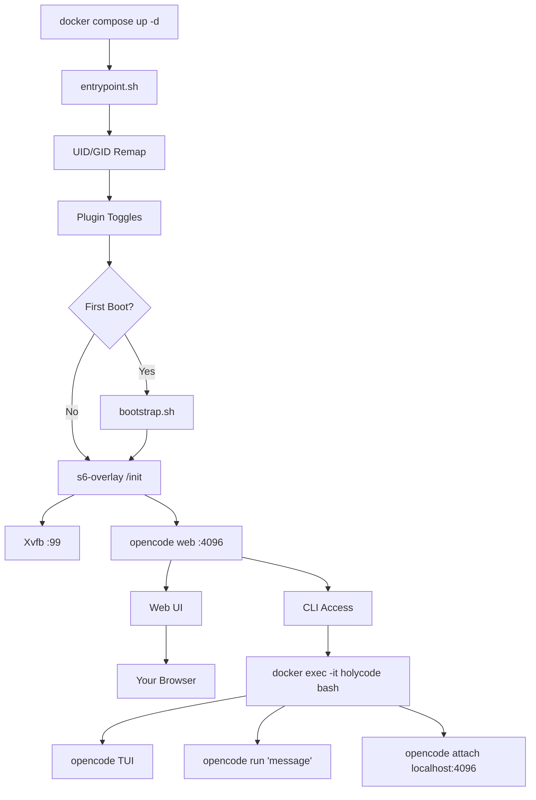

🌍 [English](../../README.md) | [Español](README.es.md) | **Français** | [Italiano](README.it.md) | [Português](README.pt.md) | [Deutsch](README.de.md) | [Русский](README.ru.md) | [हिन्दी](README.hi.md) | [中文](README.zh.md) | [日本語](README.ja.md) | [한국어](README.ko.md)

<a name="top"></a>

#  HolyCode

<div align="center">
  
</div>

<p align="center">

[](https://opensource.org/licenses/MIT)
[](https://hub.docker.com/r/coderluii/holycode)
[](https://hub.docker.com/r/coderluii/holycode)
[](https://github.com/coderluii/holycode)
[](https://x.com/CoderLuii)
[](https://www.paypal.com/donate/?hosted_button_id=PM2UXGVSTHDNL)
[](https://buymeacoffee.com/CoderLuii)
[](https://coderluii.dev)
[](https://github.com/coderluii/holycode/releases)
[](https://github.com/coderluii/holycode/issues)
[](https://github.com/coderluii/holycode/graphs/contributors)

</p>

### Un conteneur. Tous les outils. N'importe quel fournisseur.

OpenCode s'exécutant dans un conteneur avec tout déjà installé. 50+ outils de développement, 10+ fournisseurs IA, navigateur sans affichage, état persistant. Déposez-le sur n'importe quelle machine et reprenez exactement là où vous vous étiez arrêté.

**Fonctionne avec votre abonnement Claude.** Activez le plugin Claude Auth et utilisez votre plan Claude Max/Pro existant. Pas besoin de clé API séparée.

**Orchestration multi-agents intégrée.** Activez oh-my-openagent et transformez OpenCode en un système d'agents coordonnés avec exécution parallèle.

**Vous alliez passer une heure à remettre votre environnement en place. Ou vous pouvez simplement faire `docker compose up`.**
> **Vous ne voulez pas héberger vous-même ?** [HolyCode Cloud](https://holycode.coderluii.dev/cloud) arrive. Les mêmes outils, zéro configuration. L'accès anticipé est gratuit.

---

## Qu'est-ce que c'est ?

Vous connaissez l'histoire. Vous configurez parfaitement votre environnement de développement. Puis vous changez de machine. Ou vous reconstruisez un conteneur. Ou votre système décide qu'aujourd'hui est le jour où il rend l'âme.

Soudain vous réinstallez des outils. Vous cherchez des fichiers de configuration. Vous ressaisissez des clés API. Vous vous demandez pourquoi ripgrep n'est plus dans le PATH. Vous essayez de comprendre pourquoi Chromium ne démarre pas parce que Docker alloue 64 Mo de mémoire partagée aux conteneurs. Puis Xvfb n'est pas configuré. Puis l'UID à l'intérieur du conteneur ne correspond pas à celui de l'hôte et tout donne une erreur de permission refusée.

**HolyCode est le conteneur que j'ai construit après avoir résolu chacun de ces problèmes.**

Il encapsule [OpenCode](https://opencode.ai), un agent de codage IA avec une interface web intégrée. Tous vos paramètres, sessions, configurations MCP, plugins et historique d'outils vivent dans un bind mount en dehors du conteneur. Reconstruisez, mettez à jour ou passez à une nouvelle machine. Votre état revient immédiatement.

C'est la même idée que [HolyClaude](https://github.com/coderluii/holyclaude) mais en encapsulant OpenCode plutôt que Claude Code. Et voici ce qui compte : OpenCode n'est pas lié à un seul fournisseur. Pointez-le vers Anthropic, OpenAI, Google Gemini, Groq, AWS Bedrock ou Azure OpenAI. Le même conteneur, votre choix de modèle.

Plus de 30 outils de développement, deux environnements d'exécution de langages, une pile de navigateur sans affichage et une supervision de processus. Tout configuré, tout prêt au premier démarrage. Je fais tourner ça sur mon propre serveur. Chaque bug a été rencontré, diagnostiqué et corrigé.

Vous le téléchargez. Vous le lancez. Vous ouvrez votre navigateur. Vous codez.

---

## Table des matières

| | Section |
|---|---------|
| 1 | [Démarrage rapide](#-démarrage-rapide) |
| 2 | [HolyCode Cloud](#-holycode-cloud-bientôt-disponible) |
| 3 | [Plateformes supportées](#-plateformes-supportées) |
| 4 | [Pourquoi HolyCode](#-pourquoi-holycode) |
| 5 | [Fournisseurs supportés](#-fournisseurs-supportés) |
| 6 | [Docker Compose - Rapide](#-docker-compose---rapide) |
| 7 | [Docker Compose - Complet](#-docker-compose---complet) |
| 8 | [Variables d'environnement](#-variables-denvironnement) |
| 9 | [Ce qui est inclus](#-ce-qui-est-inclus) |
| 10 | [Services intégrés](#-services-intégrés) |
| 11 | [Architecture](#-architecture) |
| 12 | [Utilisation CLI](#-utilisation-cli) |
| 13 | [Données et persistance](#-données-et-persistance) |
| 14 | [Permissions](#-permissions) |
| 15 | [Mises à jour](#-mises-à-jour) |
| 16 | [Dépannage](#-dépannage) |
| 17 | [Compilation locale](#-compilation-locale) |
| 18 | [Contribuer](#-contribuer) |
| 19 | [Support](#-support) |
| 20 | [Licence](#-licence) |

---

## 🚀 Démarrage rapide

**Étape 1.** Téléchargez l'image.

```bash
docker pull coderluii/holycode:latest
```

**Étape 2.** Créez un `docker-compose.yaml`.

```yaml
services:
  holycode:
    image: coderluii/holycode:latest
    container_name: holycode
    restart: unless-stopped
    shm_size: 2g
    ports:
      - "4096:4096"
    volumes:
      - ./data/opencode:/home/opencode
      - ./local-cache/opencode:/home/opencode/.cache/opencode
      - ./workspace:/workspace
    environment:
      - PUID=1000
      - PGID=1000
      - ANTHROPIC_API_KEY=your-key-here

```

**Étape 3.** Démarrez-le.

```bash
docker compose up -d
```

Ouvrez http://localhost:4096. Vous êtes prêt.

> Le `docker-compose.yaml` fourni utilise la syntaxe `${ANTHROPIC_API_KEY}` qui lit depuis votre environnement shell ou un fichier `.env`. Copiez `.env.example` vers `.env` et renseignez votre clé API.

<p align="right">
  <a href="#top">retour en haut</a>
</p>

---

## ☁ HolyCode Cloud (Bientôt disponible)

Vous ne voulez pas héberger vous-même ? Nous construisons une version gérée de HolyCode.

Les mêmes 50+ outils. Les mêmes 10+ fournisseurs. Le même état persistant. Sans Docker. Sans terminal. Ouvrez simplement votre navigateur et codez.

**Ce que vous obtenez avec Cloud :**
- Configuration zéro. Pas de Docker, pas de fichiers de config, pas de commandes terminal.
- Fonctionne sur n'importe quel appareil. Ordinateur portable, tablette, téléphone. Ouvrez un navigateur et c'est parti.
- Toujours à jour. Dernier OpenCode, derniers outils. Nous nous en occupons.
- Votre état vous suit. Sessions, paramètres, configurations MCP sauvegardés entre les utilisations.

**L'accès anticipé est gratuit.** Aucune carte de crédit requise.

**[Réservez votre place](https://holycode.coderluii.dev/cloud)**

<p align="right">
  <a href="#top">retour en haut</a>
</p>

---

## 💻 Plateformes supportées

| Plateforme | Architecture | Statut |
|------------|-------------|--------|
| Linux | amd64 | Supporté |
| Linux | arm64 | Supporté |
| macOS (Docker Desktop) | amd64 / arm64 | Supporté |
| Windows (WSL2) | amd64 | Supporté |

<p align="right">
  <a href="#top">retour en haut</a>
</p>

---

## ⚡ Pourquoi HolyCode

Je l'ai construit parce que j'en avais assez de refaire la même configuration à chaque fois. Installer OpenCode, connecter un navigateur sans affichage, corriger les problèmes de permissions, déboguer la supervision des processus. À. Chaque. Fois.

Alors j'ai fait un conteneur qui fait tout ça. Et ensuite j'ai rencontré chaque bug possible pour que vous n'ayez pas à le faire.

| | HolyCode | Fait maison |
|---|----------|-----|
| Temps jusqu'à la première session fonctionnelle | Moins de 2 minutes | 30-60 minutes |
| Chromium + Xvfb navigateur sans affichage | Préconfiguré | Recherche, installation, débogage vous-même |
| Suite d'outils de développement (ripgrep, fzf, lazygit, etc.) | Préinstallé | Cherchez et installez un par un |
| Persistance d'état entre les reconstructions | Automatique via bind mount | Bind mounts manuels, facile à mal configurer |
| Remappage des permissions UID/GID | PUID/PGID intégré | Hacks chmod dans le Dockerfile |
| Support multi-architecture | amd64 + arm64 prêt à l'emploi | Compilez et publiez les deux vous-même |
| Mises à jour | `docker pull` + `compose up` | Reconstruire depuis zéro, espérer que rien ne casse |

<p align="right">
  <a href="#top">retour en haut</a>
</p>

---

## 🤖 Fournisseurs supportés

OpenCode est agnostique au fournisseur. Configurez la clé API que vous utilisez et c'est tout.

| Fournisseur | Variable d'environnement | Notes |
|-------------|--------------------------|-------|
| Anthropic | `ANTHROPIC_API_KEY` | Modèles Claude |
| OpenAI | `OPENAI_API_KEY` | Modèles GPT |
| Google Gemini | `GEMINI_API_KEY` | Modèles Gemini |
| Groq | `GROQ_API_KEY` | Inférence rapide |
| AWS Bedrock | `AWS_ACCESS_KEY_ID`, `AWS_SECRET_ACCESS_KEY`, `AWS_REGION` | Définissez les trois |
| Azure OpenAI | `AZURE_OPENAI_ENDPOINT`, `AZURE_OPENAI_API_KEY`, `AZURE_OPENAI_API_VERSION` | Définissez les trois |
| GitHub | `GITHUB_TOKEN` | GitHub Copilot via endpoint compatible OpenAI |
| Vertex AI | (configuré via OpenCode) | Modèles Google Vertex AI |
| GitHub Models | (configuré via OpenCode) | Modèles hébergés sur GitHub |
| Ollama | (configuré via OpenCode) | Modèles locaux via Ollama |

Vous n'avez besoin de configurer des clés que pour les fournisseurs que vous utilisez réellement. Tout le reste est optionnel et ignoré.

Vertex AI, GitHub Models et Ollama sont configurés via le système de fournisseurs d'OpenCode. Exécutez `opencode providers login` à l'intérieur du conteneur.

<p align="right">
  <a href="#top">retour en haut</a>
</p>

---

## 📋 Docker Compose - Rapide

La configuration minimale. Copiez, renseignez votre clé, exécutez.

```yaml
services:
  holycode:
    image: coderluii/holycode:latest
    container_name: holycode
    restart: unless-stopped
    shm_size: 2g              # Requis pour la stabilité de Chromium
    ports:
      - "4096:4096"           # Interface web OpenCode
    volumes:
      - ./data/opencode:/home/opencode
      - ./local-cache/opencode:/home/opencode/.cache/opencode
      - ./workspace:/workspace  # Les fichiers de votre projet
    environment:
      - PUID=1000
      - PGID=1000
      - ANTHROPIC_API_KEY=your-key-here  # Ou remplacez par n'importe quelle clé de fournisseur

```

<p align="right">
  <a href="#top">retour en haut</a>
</p>

---

## 📄 Docker Compose - Complet

Chaque option documentée. Copiez dans `docker-compose.yaml` et décommentez ce dont vous avez besoin.

```yaml
# HolyCode - Full Configuration Reference
# Copy this file to docker-compose.yaml and customize.
# All options documented. Uncomment what you need.

services:
  holycode:
    image: coderluii/holycode:latest
    container_name: holycode
    restart: unless-stopped
    shm_size: 2g

    ports:
      - "4096:4096"   # OpenCode web UI

    volumes:
      # --- Persistent state (all OpenCode data under home dir) ---
      - ./data/opencode:/home/opencode   # Config, sessions, plugins, all XDG paths

      # --- Cache isolation (keeps plugin cache on local disk, avoids CIFS/SMB symlink issues) ---
      - ./local-cache/opencode:/home/opencode/.cache/opencode

      # --- Workspace ---
      - ./workspace:/workspace   # Your project files

    environment:
      # --- Container user ---
      - PUID=1000                # Match your host UID for file permissions
      - PGID=1000                # Match your host GID for file permissions

      # --- Git identity (used on first boot) ---
      # - GIT_USER_NAME=Your Name
      # - GIT_USER_EMAIL=you@example.com

      # --- AI provider API keys (add the ones you use) ---
      - ANTHROPIC_API_KEY=${ANTHROPIC_API_KEY:-}
      # - OPENAI_API_KEY=${OPENAI_API_KEY:-}
      # - GEMINI_API_KEY=${GEMINI_API_KEY:-}
      # - GROQ_API_KEY=${GROQ_API_KEY:-}
      # - GITHUB_TOKEN=${GITHUB_TOKEN:-}

      # --- AWS Bedrock (uncomment all 3 for Bedrock) ---
      # - AWS_ACCESS_KEY_ID=
      # - AWS_SECRET_ACCESS_KEY=
      # - AWS_REGION=us-east-1

      # --- Azure OpenAI (uncomment all 3 for Azure) ---
      # - AZURE_OPENAI_ENDPOINT=
      # - AZURE_OPENAI_API_KEY=
      # - AZURE_OPENAI_API_VERSION=

      # --- OpenCode behavior (set by default in image, override if needed) ---
      # - OPENCODE_DISABLE_AUTOUPDATE=true
      # - OPENCODE_DISABLE_TERMINAL_TITLE=true
      # - OPENCODE_MODEL=claude-sonnet-4-6
      # - OPENCODE_PERMISSION=auto
      # - OPENCODE_DISABLE_LSP_DOWNLOAD=true
      # - OPENCODE_DISABLE_AUTOCOMPACT=true
      # - OPENCODE_ENABLE_EXA=true

      # --- Web UI Security (basic auth for opencode web) ---
      # - OPENCODE_SERVER_PASSWORD=your-password
      # - OPENCODE_SERVER_USERNAME=opencode

      # --- Claude Auth (use Claude subscription instead of API key) ---
      # Reads credentials from ./data/opencode/.claude/.credentials.json
      # NOTE: May violate Anthropic TOS. Use at your own risk.
      # Toggle on/off with docker compose down && up -d
      # - ENABLE_CLAUDE_AUTH=true

      # --- oh-my-openagent (multi-agent orchestration for OpenCode) ---
      # Installs automatically on first boot when enabled
      # Toggle on/off with docker compose down && up -d
      # - ENABLE_OH_MY_OPENAGENT=true

```

<p align="right">
  <a href="#top">retour en haut</a>
</p>

---

## 🔧 Variables d'environnement

| Variable | Valeur par défaut | Rôle |
|----------|---------|---------|
| `PUID` | `1000` | UID de l'utilisateur du conteneur, faites correspondre avec votre hôte pour les permissions de fichiers correctes |
| `PGID` | `1000` | GID de l'utilisateur du conteneur, faites correspondre avec votre hôte pour les permissions de fichiers correctes |
| `GIT_USER_NAME` | `HolyCode User` | Identité Git configurée au premier démarrage |
| `GIT_USER_EMAIL` | `noreply@holycode.local` | Identité Git configurée au premier démarrage |
| `ANTHROPIC_API_KEY` | (aucune) | Anthropic Claude |
| `OPENAI_API_KEY` | (aucune) | Modèles OpenAI GPT |
| `GEMINI_API_KEY` | (aucune) | Google Gemini |
| `GROQ_API_KEY` | (aucune) | Inférence rapide Groq |
| `GITHUB_TOKEN` | (aucune) | Authentification GitHub CLI et Copilot |
| `AWS_ACCESS_KEY_ID` | (aucune) | AWS Bedrock - définissez les trois variables AWS |
| `AWS_SECRET_ACCESS_KEY` | (aucune) | AWS Bedrock |
| `AWS_REGION` | (aucune) | Région AWS Bedrock (ex. `us-east-1`) |
| `AZURE_OPENAI_ENDPOINT` | (aucune) | Azure OpenAI - définissez les trois variables Azure |
| `AZURE_OPENAI_API_KEY` | (aucune) | Azure OpenAI |
| `AZURE_OPENAI_API_VERSION` | (aucune) | Version de l'API Azure OpenAI |
| `OPENCODE_DISABLE_AUTOUPDATE` | `true` | Empêche OpenCode de se mettre à jour automatiquement dans le conteneur |
| `OPENCODE_DISABLE_TERMINAL_TITLE` | `true` | Empêche OpenCode de modifier le titre du terminal |
| `OPENCODE_MODEL` | (aucune) | Remplace le modèle par défaut |
| `OPENCODE_PERMISSION` | (aucune) | Définissez sur `auto` pour ignorer les invites de permission |
| `OPENCODE_DISABLE_LSP_DOWNLOAD` | (aucune) | Désactive les téléchargements automatiques du serveur LSP |
| `OPENCODE_DISABLE_AUTOCOMPACT` | (aucune) | Désactive la compaction automatique du contexte |
| `OPENCODE_ENABLE_EXA` | (aucune) | Active l'intégration de recherche web Exa |
| `OPENCODE_SERVER_PASSWORD` | (aucune) | Protège l'interface web avec une authentification basique |
| `OPENCODE_SERVER_USERNAME` | `opencode` | Nom d'utilisateur pour l'authentification basique de l'interface web |
| `ENABLE_CLAUDE_AUTH` | (aucune) | Définissez sur `true` pour utiliser l'abonnement Claude plutôt qu'une clé API |
| `ENABLE_OH_MY_OPENAGENT` | (aucune) | Définissez sur `true` pour activer le plugin d'orchestration multi-agents |
| `ENABLE_PAPERCLIP` | (aucune) | Définissez sur `true` pour démarrer le tableau de bord et le tableau d'agents Paperclip |
| `PAPERCLIP_PORT` | `3100` | Remplace le port du conteneur utilisé par Paperclip |
| `PAPERCLIP_INSTANCE_ID` | `default` | Nom d'instance Paperclip locale pour un état isolé |
| `ENABLE_HERMES` | (aucune) | Définissez sur `true` pour démarrer Hermes comme API de méta-agent intégrée |
| `HERMES_PORT` | `8642` | Remplace le port du conteneur utilisé par Hermes |
| `HOLYCODE_PLUGIN_UPDATE` | `manual` | Mode de mise à jour des plugins : `manual` (installe si manquant) ou `auto` (installe et met à jour au démarrage) |

> Les bascules de plugins (`ENABLE_CLAUDE_AUTH`, `ENABLE_OH_MY_OPENAGENT`) prennent effet au redémarrage du conteneur. Définissez la variable d'environnement et exécutez `docker compose down && up -d`.

> `HOLYCODE_PLUGIN_UPDATE` contrôle les mises à jour des packages de plugins. `manual` (par défaut) installe les plugins activés uniquement s'ils sont manquants. `auto` installe les plugins manquants et met à jour les plugins activés à chaque démarrage. Ceci est distinct de `OPENCODE_DISABLE_AUTOUPDATE`, qui n'affecte qu'OpenCode.

> `ENABLE_OH_MY_OPENAGENT=true` active le plugin et expose la compétence intégrée `/oh-my-openagent-setup`. La compétence n'apparaît que lorsque le plugin est activé. Utilisez-la pour créer ou mettre à jour le fichier de configuration spécifique au plugin dans `~/.config/opencode/oh-my-openagent.jsonc`.

> La politique de sélecteur par défaut de HolyCode est : visibles : `sisyphus`, `hephaestus`, `prometheus`, `atlas` ; sous-agents cachés : `oracle`, `librarian`, `explore`, `metis`, `momus`, `multimodal-looker`, `sisyphus-junior`. Si vous ajoutez un nouveau fournisseur et que le modèle visible par défaut semble obsolète, relancez `/oh-my-openagent-setup`, puis exécutez : `docker exec -it holycode bash -c "bunx oh-my-opencode doctor"` et `docker exec -it holycode bash -c "bunx oh-my-opencode refresh-model-capabilities"`.

> `ENABLE_PAPERCLIP=true` démarre Paperclip sur le port `3100` dans le conteneur. Ouvrez le tableau de bord, créez une entreprise, puis engagez des agents OpenCode depuis là. Paperclip persiste sous `~/.paperclip` automatiquement.

> `ENABLE_HERMES=true` démarre Hermes sur le port `8642` dans le conteneur. Hermes persiste sous `~/.hermes`, utilise le binaire `opencode` déjà installé et peut exposer une API compatible OpenAI tout en déléguant le travail de code à HolyCode.

> `GIT_USER_NAME` et `GIT_USER_EMAIL` ne sont appliqués qu'au premier démarrage. Pour les réappliquer, supprimez le fichier sentinelle et redémarrez : `docker exec holycode rm /home/opencode/.config/opencode/.holycode-bootstrapped` puis `docker compose restart`.

<p align="right">
  <a href="#top">retour en haut</a>
</p>

---

## 📦 Ce qui est inclus

<details>
<summary><strong>Outils principaux</strong></summary>

| Outil | Rôle |
|------|---------|
| `git` | Contrôle de version |
| `ripgrep` | Recherche rapide dans le contenu des fichiers |
| `fd` | Recherche rapide de fichiers |
| `fzf` | Recherche approximative |
| `bat` | Cat avec coloration syntaxique |
| `eza` | Remplacement moderne de ls |
| `lazygit` | Interface git en terminal |
| `delta` | Meilleurs diffs git |
| `gh` | GitHub CLI |
| `htop` | Moniteur de processus |
| `tar` | Création et extraction d'archives |
| `tree` | Visualisation d'arborescence de répertoires |
| `less` | Visionneuse de fichiers paginée |
| `vim` | Éditeur de texte en terminal |
| `tmux` | Multiplexeur de terminal |

</details>

<details>
<summary><strong>Environnements d'exécution de langages</strong></summary>

| Environnement | Version |
|---------|---------|
| Node.js | 22 (LTS) |
| npm | Inclus avec Node.js 22 |
| Python | 3 (système) |
| pip | Inclus avec Python 3 |

</details>

<details>
<summary><strong>Outils de développement</strong></summary>

| Outil | Rôle |
|------|---------|
| `curl` | Requêtes HTTP |
| `wget` | Téléchargements de fichiers |
| `jq` | Traitement JSON |
| `unzip` / `zip` | Outils d'archive |
| `ssh` | Accès distant |
| `build-essential` + `pkg-config` | Compilation d'addons natifs npm |
| `python3-venv` | Environnements virtuels Python |
| `procps` | Outils de processus : ps, top |
| `iproute2` | Outils réseau : ip, ss |
| `lsof` | Diagnostic des fichiers ouverts |
| OpenSSL | Outils de chiffrement et de certificats (via l'image de base) |

</details>

<details>
<summary><strong>Pile navigateur</strong></summary>

| Composant | Rôle |
|-----------|---------|
| Chromium | Moteur de navigateur sans affichage |
| Xvfb | Serveur d'affichage framebuffer virtuel |
| Playwright | Framework d'automatisation de navigateur |

La pile navigateur fonctionne sans affichage prête à l'emploi. Pas de serveur d'affichage, pas de GPU, pas de configuration supplémentaire. Les scripts Playwright et Puppeteer fonctionnent comme prévu.

Inclut les polices Liberation, DejaVu, Noto et Noto Color Emoji pour un rendu correct des pages et des captures d'écran.

</details>

<details>
<summary><strong>Services intégrés</strong></summary>

| Service | Rôle |
|---------|---------|
| Hermes Agent | Méta-agent auto-améliorant avec MCP, adaptateurs de messagerie et délégation OpenCode |
| Paperclip | Tableau d'agents local qui engage des travailleurs OpenCode et les réveille sur battement |
| Claude Code CLI | Installé pour les flux d'authentification par abonnement Claude via `ENABLE_CLAUDE_AUTH` |

</details>

<details>
<summary><strong>Gestion des processus</strong></summary>

| Composant | Rôle |
|-----------|---------|
| s6-overlay v3 | Superviseur de processus et système d'init |
| Point d'entrée personnalisé | Remappage UID/GID, configuration git, démarrage |

s6-overlay supervise OpenCode et Xvfb. Si un processus plante, il redémarre automatiquement. Les politiques de redémarrage du conteneur restent propres car le superviseur le gère en interne.

</details>

<p align="right">
  <a href="#top">retour en haut</a>
</p>

---

## 🧩 Services intégrés

HolyCode est maintenant livré avec deux couches optionnelles au-dessus d'OpenCode. Vous **n'en avez pas besoin** pour utiliser le conteneur. Activez la variable d'environnement, redémarrez le conteneur et le service démarre aux côtés de l'interface web normale.

### Hermes Agent

Hermes est l'option "cerveau plus intelligent". Il fonctionne comme un méta-agent intégré, expose une API compatible OpenAI sur le port `8642` et délègue le travail de code en appelant le binaire `opencode` local que HolyCode fournit déjà.

Activez-le avec :

```yaml
environment:
  - ENABLE_HERMES=true
  - HERMES_PORT=8642
```

L'état de Hermes vit sous `/home/opencode/.hermes`, suivant la même histoire de persistance que le reste de HolyCode.

### Paperclip

Paperclip est l'option "tableau d'agents". Il vous donne un tableau de bord local sur le port `3100` où vous créez une entreprise, engagez des agents et laissez ces agents se réveiller selon un calendrier. En coulisses, il lance des processus `opencode run`, donc les travailleurs sont toujours HolyCode.

Activez-le avec :

```yaml
environment:
  - ENABLE_PAPERCLIP=true
  - PAPERCLIP_PORT=3100
```

L'état de Paperclip vit sous `/home/opencode/.paperclip`. Ouvrez le tableau de bord, configurez votre entreprise et engagez des employés OpenCode depuis là.

<p align="right">
  <a href="#top">retour en haut</a>
</p>

---

## 🏗 Architecture



Le point d'entrée gère le remappage des utilisateurs, les bascules de plugins, les bascules de services intégrés optionnels et la configuration au premier démarrage. s6-overlay supervise Xvfb, le serveur web OpenCode et tous les services intégrés optionnels activés. En cas de crash d'un processus supervisé, s6 le redémarre automatiquement. Accédez à l'interface web sur le port 4096 ou exécutez des commandes dans le conteneur pour l'expérience CLI complète.

<p align="right">
  <a href="#top">retour en haut</a>
</p>

---

## 💻 Utilisation CLI

L'interface web sur le port 4096 est l'interface principale. Mais vous pouvez aussi utiliser OpenCode directement depuis la ligne de commande à l'intérieur du conteneur.

### TUI interactif

```bash
docker exec -it holycode bash
opencode
```

Cela ouvre l'interface terminal complète d'OpenCode avec toutes les mêmes fonctionnalités que la version web.

### Commandes ponctuelles

Exécutez un seul prompt sans entrer dans le TUI :

```bash
docker exec -it holycode bash -c "opencode run 'explain this codebase'"
```

### Se connecter au serveur en cours d'exécution

Connectez une session TUI locale au serveur web OpenCode déjà en cours d'exécution :

```bash
docker exec -it holycode bash -c "opencode attach http://localhost:4096"
```

Cela partage la même session que l'interface web. Les changements dans l'une apparaissent dans l'autre.

### Gestion des fournisseurs

Listez et configurez les fournisseurs IA depuis l'intérieur du conteneur :

```bash
docker exec -it holycode bash -c "opencode providers list"
docker exec -it holycode bash -c "opencode providers login"
```

### Configuration et reconfiguration de oh-my-openagent

Si vous avez activé `ENABLE_OH_MY_OPENAGENT=true`, la compétence `/oh-my-openagent-setup` devient disponible. Utilisez-la pour créer ou actualiser la configuration spécifique au plugin :

```text
/oh-my-openagent-setup
```

Si vous ajoutez un nouveau fournisseur et que le modèle visible par défaut semble obsolète, relancez `/oh-my-openagent-setup`, puis :

```bash
docker exec -it holycode bash -c "bunx oh-my-opencode doctor"
docker exec -it holycode bash -c "bunx oh-my-opencode refresh-model-capabilities"
```

### Commandes utiles

| Commande | Ce qu'elle fait |
|---------|-------------|
| `opencode` | Lance le TUI |
| `opencode run 'message'` | Prompt ponctuel |
| `opencode attach <url>` | Connecte le TUI au serveur en cours d'exécution |
| `opencode web --port 4096` | Démarre le serveur web (déjà en cours via s6) |
| `opencode serve` | Serveur API sans affichage |
| `opencode providers list` | Affiche les fournisseurs configurés |
| `opencode providers login` | Ajoute ou change de fournisseur |
| `bunx oh-my-opencode doctor` | Diagnostique la configuration oh-my-openagent et la résolution de modèles |
| `bunx oh-my-opencode refresh-model-capabilities` | Actualise le cache de capacités fournisseur/modèle |
| `opencode models` | Liste les modèles disponibles |
| `opencode models <provider>` | Liste les modèles pour un fournisseur spécifique |
| `opencode stats` | Affiche l'utilisation des tokens et les coûts |
| `opencode session list` | Liste les sessions passées |
| `opencode export <sessionID>` | Exporte une session en JSON |
| `opencode plugin <module>` | Installe un plugin |
| `opencode upgrade` | Met à jour OpenCode (désactivé par défaut dans le conteneur) |

<p align="right">
  <a href="#top">retour en haut</a>
</p>

---

## 💾 Données et persistance

Tout l'état d'OpenCode vit dans un unique bind mount sur `./data/opencode`. Le conteneur est sans état. Le bind mount contient tout ce qui compte.

| Chemin hôte | Chemin conteneur | Contenu |
|-----------|---------------|-------------|
| `./data/opencode/.config/opencode` | `/home/opencode/.config/opencode` | Paramètres, agents, configurations MCP, thèmes, plugins |
| `./data/opencode/.local/share/opencode` | `/home/opencode/.local/share/opencode` | Base de données SQLite des sessions, tokens OAuth MCP |
| `./data/opencode/.local/state/opencode` | `/home/opencode/.local/state/opencode` | Données de fréquence, cache de modèles, magasin clé-valeur |
| `./local-cache/opencode` | `/home/opencode/.cache/opencode` | node_modules des plugins, dépendances auto-installées |

Reconstruisez le conteneur quand vous voulez. Exécutez `docker compose pull && docker compose up -d` et vos sessions, paramètres et configurations reviennent automatiquement.

**Note sur SQLite WAL.** La base de données des sessions utilise le Write-Ahead Logging. Ne copiez pas le fichier `.db` pendant que le conteneur est en cours d'exécution. Arrêtez d'abord le conteneur si vous devez sauvegarder ou migrer le fichier de base de données.

**Note sur le stockage réseau.** Si `./data/opencode` se trouve sur un montage réseau CIFS/SMB (NAS, Synology, TrueNAS), le mode WAL de SQLite peut échouer car SMB ne prend pas en charge le verrouillage de plage d'octets par défaut. HolyCode détecte ceci au démarrage et affiche un avertissement avec la correction. Consultez la section Dépannage ci-dessous.

<p align="right">
  <a href="#top">retour en haut</a>
</p>

---

## 🔐 Permissions

HolyCode utilise `PUID` et `PGID` pour remapper l'utilisateur interne du conteneur afin qu'il corresponde à votre utilisateur hôte. Cela signifie que les fichiers écrits dans `./workspace` vous appartiennent, pas à root.

Trouvez vos IDs sur Linux et macOS :

```bash
id -u   # PUID
id -g   # PGID
```

Sur la plupart des systèmes c'est `1000:1000`. Sur macOS c'est souvent `501:20`. Définissez-les dans votre fichier compose :

```yaml
environment:
  - PUID=501
  - PGID=20
```

Si vous omettez cela, les fichiers dans votre espace de travail peuvent appartenir à root et vous aurez besoin de sudo pour les modifier depuis l'hôte.

<p align="right">
  <a href="#top">retour en haut</a>
</p>

---

## ⬆️ Mises à jour

Téléchargez la dernière image et recréez le conteneur. Vos données restent intactes.

```bash
docker compose pull
docker compose up -d
```

C'est tout. Une commande. Vos sessions, paramètres et configurations sont dans le bind mount donc rien n'est perdu.

<p align="right">
  <a href="#top">retour en haut</a>
</p>

---

## 🛠 Dépannage

<details>
<summary><strong>Chromium plante ou l'automatisation du navigateur échoue</strong></summary>

La cause la plus fréquente est un manque de mémoire partagée. Chromium a besoin d'au moins 1-2 Go de `/dev/shm` pour fonctionner de manière fiable.

Assurez-vous que votre fichier compose a `shm_size: 2g` :

```yaml
services:
  holycode:
    shm_size: 2g
```

Sans cela, Chromium plantera silencieusement ou produira des captures d'écran corrompues.

</details>

<details>
<summary><strong>Permission refusée sur les fichiers de l'espace de travail</strong></summary>

Votre `PUID` et `PGID` ne correspondent pas à votre utilisateur hôte. Trouvez vos IDs :

```bash
id -u && id -g
```

Mettez à jour la section environnement de votre compose pour correspondre :

```yaml
environment:
  - PUID=1001   # remplacez par votre UID réel
  - PGID=1001   # remplacez par votre GID réel
```

Puis recréez le conteneur : `docker compose up -d --force-recreate`

</details>

<details>
<summary><strong>Le port 4096 est déjà utilisé</strong></summary>

Quelque chose d'autre sur votre machine utilise le port 4096. Remappez vers un port hôte différent :

```yaml
ports:
  - "4097:4096"   # accès via http://localhost:4097
```

Ou trouvez et arrêtez le processus en conflit :

```bash
# Linux / macOS
lsof -i :4096

# Windows
netstat -ano | findstr :4096
```

</details>

<details>
<summary><strong>Le conteneur démarre mais l'interface web ne charge jamais</strong></summary>

Vérifiez les logs du conteneur :

```bash
docker compose logs -f holycode
```

OpenCode prend quelques secondes à s'initialiser. Attendez 10-15 secondes après `docker compose up -d` avant d'ouvrir le navigateur. S'il n'est toujours pas disponible, les logs vous indiqueront pourquoi.

</details>

<details>
<summary><strong>Pourquoi HolyCode n'a-t-il pas besoin de SYS_ADMIN ou seccomp=unconfined ?</strong></summary>

Chromium s'exécute avec `--no-sandbox` à l'intérieur du conteneur, ce qui est standard pour les configurations de navigateurs conteneurisés. Cela élimine le besoin de capacités `SYS_ADMIN` ou de `seccomp=unconfined` que certaines autres configurations de navigateurs Docker nécessitent. Le conteneur lui-même fournit la frontière d'isolation.

Si vous préférez utiliser le sandbox intégré de Chromium, ajoutez ce qui suit à votre fichier compose et supprimez `--no-sandbox` de la variable d'environnement `CHROMIUM_FLAGS` :

```yaml
cap_add:
  - SYS_ADMIN
security_opt:
  - seccomp=unconfined
```

</details>

<details>
<summary><strong>SQLite WAL échoue sur les montages réseau CIFS/SMB (NAS)</strong></summary>

Si votre répertoire `./data/opencode` se trouve sur un partage réseau CIFS/SMB, OpenCode peut
échouer avec :

```
Failed to run the query 'PRAGMA journal_mode = WAL'
```

OpenCode utilise SQLite avec Write-Ahead Logging (WAL) pour sa base de données de sessions.
WAL nécessite le verrouillage de plage d'octets, CIFS/SMB ne prend pas en charge le verrouillage de plage d'octets par défaut. HolyCode détecte ceci au démarrage.

**Correction :** Ajoutez `nobrl,mfsymlinks` aux options de montage CIFS dans `/etc/fstab` :

```
# Avant
//192.168.1.100/share /mnt/share cifs credentials=/etc/smbcreds,uid=1000,gid=1000 0 0

# Après (ajouter nobrl,mfsymlinks)
//192.168.1.100/share /mnt/share cifs credentials=/etc/smbcreds,uid=1000,gid=1000,nobrl,mfsymlinks 0 0
```

Puis remontez :

```bash
sudo umount /mnt/share
sudo mount /mnt/share
```

Redémarrez HolyCode : `docker compose up -d --force-recreate`

</details>

<p align="right">
  <a href="#top">retour en haut</a>
</p>

---

## 🔨 Compilation locale

Clonez le dépôt, compilez l'image, remplacez-la dans votre fichier compose.

```bash
git clone https://github.com/coderluii/holycode.git
cd holycode
docker build -t holycode:local .
```

Puis dans votre `docker-compose.yaml` remplacez l'image :

```yaml
image: holycode:local
```

<p align="right">
  <a href="#top">retour en haut</a>
</p>

---

## 🤝 Contribuer

1. Forkez le dépôt
2. Créez une branche : `git checkout -b feature/your-feature`
3. Committez vos changements : `git commit -m "feat: your feature"`
4. Poussez : `git push origin feature/your-feature`
5. Ouvrez une pull request

Consultez [CONTRIBUTING.md](.github/CONTRIBUTING.md) pour les lignes directrices complètes.

<p align="right">
  <a href="#top">retour en haut</a>
</p>

---

## ⭐ Support

Si HolyCode vous a épargné une autre heure de configuration d'environnement, voici comment le faire savoir.

- Mettez une étoile au dépôt sur GitHub
- Partagez-le avec quelqu'un qui en aurait besoin
- [Buy Me A Coffee](https://buymeacoffee.com/CoderLuii)
- [PayPal](https://www.paypal.com/donate/?hosted_button_id=PM2UXGVSTHDNL)
- [GitHub Sponsors](https://github.com/sponsors/CoderLuii)

<p align="right">
  <a href="#top">retour en haut</a>
</p>

---

## 📄 Licence

Licence MIT - voir [LICENSE](../../LICENSE).

<p align="right">
  <a href="#top">retour en haut</a>
</p>

---

<div align="center">

Construit par [CoderLuii](https://github.com/coderluii) · [coderluii.dev](https://coderluii.dev)

</div>
