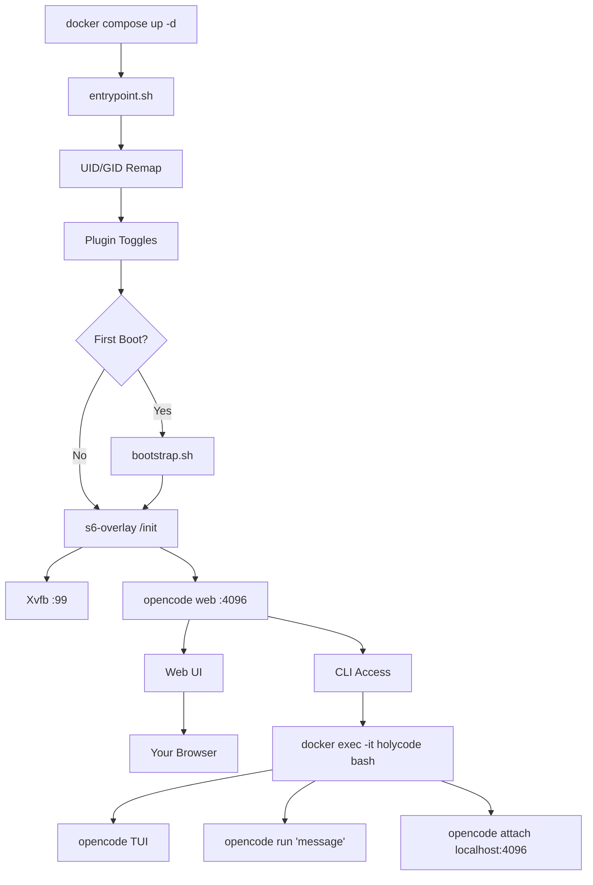

🌍 [English](../../README.md) | [Español](README.es.md) | [Français](README.fr.md) | [Italiano](README.it.md) | [Português](README.pt.md) | [Deutsch](README.de.md) | [Русский](README.ru.md) | **हिन्दी** | [中文](README.zh.md) | [日本語](README.ja.md) | [한국어](README.ko.md)

> **📝 Note:** The [English README](../../README.md) is the canonical version. This translation may lag behind. Check the English version for the most current feature set and configuration options.

<a name="top"></a>

#  HolyCode

<div align="center">
  
</div>

<p align="center">

[](https://opensource.org/licenses/MIT)
[](https://hub.docker.com/r/coderluii/holycode)
[](https://hub.docker.com/r/coderluii/holycode)
[](https://github.com/coderluii/holycode)
[](https://x.com/CoderLuii)
[](https://www.paypal.com/donate/?hosted_button_id=PM2UXGVSTHDNL)
[](https://buymeacoffee.com/CoderLuii)
[](https://coderluii.dev)
[](https://github.com/coderluii/holycode/releases)
[](https://github.com/coderluii/holycode/issues)
[](https://github.com/coderluii/holycode/graphs/contributors)

</p>

### एक कंटेनर। हर टूल। कोई भी प्रोवाइडर।

OpenCode एक कंटेनर में चलता है जिसमें सब कुछ पहले से इंस्टॉल है। 50+ dev टूल, 10+ AI प्रोवाइडर, हेडलेस ब्राउज़र, परसिस्टेंट स्टेट। किसी भी मशीन पर डालें और ठीक वहीं से शुरू करें जहाँ छोड़ा था।

**आप अपना एनवायरनमेंट वापस पाने में एक घंटा लगाने वाले थे। या बस `docker compose up` चला सकते हैं।**
> **सेल्फ-होस्ट नहीं करना चाहते?** [HolyCode Cloud](https://holycode.coderluii.dev/cloud) आ रहा है। वही टूल, ज़ीरो सेटअप। अर्ली एक्सेस फ्री है।

---

## यह क्या है?

आप जानते हैं यह कहानी। आप अपना dev एनवायरनमेंट बिल्कुल सही बनाते हैं। फिर मशीन बदलते हैं। या कंटेनर री-बिल्ड करते हैं। या आपका सिस्टम तय करता है कि आज उसका आखिरी दिन है।

अचानक आप टूल री-इंस्टॉल कर रहे हैं। कॉन्फ़िग फ़ाइलें ढूंढ रहे हैं। API keys दोबारा डाल रहे हैं। सोच रहे हैं कि ripgrep PATH में क्यों नहीं है। पता लगा रहे हैं कि Chromium क्यों लॉन्च नहीं होगा क्योंकि Docker कंटेनरों को 64MB shared memory देता है। फिर Xvfb कॉन्फ़िगर नहीं है। फिर कंटेनर के अंदर UID आपके होस्ट से मेल नहीं खाता और सब कुछ permission denied है।

**HolyCode वह कंटेनर है जो मैंने इन सभी समस्याओं को हल करके बनाया।**

यह [OpenCode](https://opencode.ai) को रैप करता है, एक AI कोडिंग एजेंट जिसमें बिल्ट-इन वेब UI है। आपकी सभी सेटिंग्स, सेशन, MCP कॉन्फ़िग, प्लगइन और टूल हिस्ट्री कंटेनर के बाहर bind mount में रहती है। री-बिल्ड करें, अपडेट करें, या नई मशीन पर जाएं। आपकी स्थिति वापस आ जाती है।

यही विचार [HolyClaude](https://github.com/coderluii/holyclaude) जैसा है लेकिन Claude Code की बजाय OpenCode को रैप करता है। और यहाँ बात यह है: OpenCode एक प्रोवाइडर तक सीमित नहीं है। इसे Anthropic, OpenAI, Google Gemini, Groq, AWS Bedrock, या Azure OpenAI पर पॉइंट करें। एक ही कंटेनर, मॉडल आपकी पसंद का।

50+ dev टूल, दो लैंग्वेज रनटाइम, हेडलेस ब्राउज़र स्टैक और प्रोसेस सुपरविज़न। सब कनेक्टेड, सब पहले बूट पर तैयार। मैं इसे अपने सर्वर पर चला रहा हूँ। हर बग हिट, डायग्नोज़ और फिक्स किया जा चुका है।

आप पुल करते हैं। चलाते हैं। ब्राउज़र खोलते हैं। बनाते हैं।

---

## विषय सूची

| | अनुभाग |
|---|---------|
| 1 | [त्वरित शुरुआत](#-त्वरित-शुरुआत) |
| 2 | [HolyCode Cloud](#-holycode-cloud-जल्द-आ-रहा-है) |
| 3 | [प्लेटफ़ॉर्म सपोर्ट](#-प्लेटफ़ॉर्म-सपोर्ट) |
| 4 | [HolyCode क्यों](#-holycode-क्यों) |
| 5 | [प्रोवाइडर सपोर्ट](#-प्रोवाइडर-सपोर्ट) |
| 6 | [Docker Compose - त्वरित](#-docker-compose---त्वरित) |
| 7 | [Docker Compose - पूर्ण](#-docker-compose---पूर्ण) |
| 8 | [एनवायरनमेंट वेरिएबल](#-एनवायरनमेंट-वेरिएबल) |
| 9 | [अंदर क्या है](#-अंदर-क्या-है) |
| 10 | [बंडल्ड सर्विसेज़](#-बंडल्ड-सर्विसेज़) |
| 11 | [आर्किटेक्चर](#-आर्किटेक्चर) |
| 12 | [CLI उपयोग](#-cli-उपयोग) |
| 13 | [डेटा और परसिस्टेंस](#-डेटा-और-परसिस्टेंस) |
| 14 | [परमिशन](#-परमिशन) |
| 15 | [अपग्रेड करना](#-अपग्रेड-करना) |
| 16 | [समस्या निवारण](#-समस्या-निवारण) |
| 17 | [लोकल बिल्ड](#-लोकल-बिल्ड) |
| 18 | [योगदान](#-योगदान) |
| 19 | [सपोर्ट](#-सपोर्ट) |
| 20 | [लाइसेंस](#-लाइसेंस) |

---

## 🚀 त्वरित शुरुआत

**चरण 1.** इमेज पुल करें।

```bash
docker pull coderluii/holycode:latest
```

**चरण 2.** `docker-compose.yaml` बनाएं।

```yaml
services:
  holycode:
    image: coderluii/holycode:latest
    container_name: holycode
    restart: unless-stopped
    shm_size: 2g
    ports:
      - "4096:4096"
    volumes:
      - ./data/opencode:/home/opencode
      - ./local-cache/opencode:/home/opencode/.cache/opencode
      - ./workspace:/workspace
    environment:
      - PUID=1000
      - PGID=1000
      - ANTHROPIC_API_KEY=your-key-here

```

**चरण 3.** शुरू करें।

```bash
docker compose up -d
```

http://localhost:4096 खोलें। आप तैयार हैं।

> शिप किया गया `docker-compose.yaml` `${ANTHROPIC_API_KEY}` सिंटैक्स का उपयोग करता है जो आपके शेल एनवायरनमेंट या `.env` फ़ाइल से पढ़ता है। `.env.example` को `.env` में कॉपी करें और अपनी API key भरें।

<p align="right">
  <a href="#top">ऊपर जाएं</a>
</p>

---

## ☁ HolyCode Cloud (जल्द आ रहा है)

सेल्फ-होस्ट नहीं करना चाहते? हम HolyCode का मैनेज्ड वर्शन बना रहे हैं।

वही 50+ टूल। वही 10+ प्रोवाइडर। वही परसिस्टेंट स्टेट। कोई Docker नहीं। कोई टर्मिनल नहीं। बस ब्राउज़र खोलें और कोड करें।

**Cloud के साथ आपको क्या मिलता है:**
- ज़ीरो सेटअप। कोई Docker नहीं, कोई कॉन्फ़िग फ़ाइल नहीं, कोई टर्मिनल कमांड नहीं।
- किसी भी डिवाइस पर काम करता है। लैपटॉप, टैबलेट, फ़ोन। ब्राउज़र खोलें और शुरू करें।
- हमेशा अपडेटेड। लेटेस्ट OpenCode, लेटेस्ट टूल। हम संभाल लेते हैं।
- आपकी स्थिति आपके साथ चलती है। सेशन, सेटिंग्स, MCP कॉन्फ़िग उपयोगों के बीच सेव होते हैं।

**अर्ली एक्सेस फ्री है।** कोई क्रेडिट कार्ड नहीं चाहिए।

**[अपनी जगह बुक करें](https://holycode.coderluii.dev/cloud)**

<p align="right">
  <a href="#top">ऊपर जाएं</a>
</p>

---

## 💻 प्लेटफ़ॉर्म सपोर्ट

| प्लेटफ़ॉर्म | आर्किटेक्चर | स्थिति |
|----------|-------------|--------|
| Linux | amd64 | सपोर्टेड |
| Linux | arm64 | सपोर्टेड |
| macOS (Docker Desktop) | amd64 / arm64 | सपोर्टेड |
| Windows (WSL2) | amd64 | सपोर्टेड |

<p align="right">
  <a href="#top">ऊपर जाएं</a>
</p>

---

## ⚡ HolyCode क्यों

मैंने यह इसलिए बनाया क्योंकि मैं हर बार वही सेटअप दोबारा करने से थक गया था। OpenCode इंस्टॉल करना, हेडलेस ब्राउज़र वायर करना, परमिशन इश्यू ठीक करना, प्रोसेस सुपरविज़न डीबग करना। हर। बार।

तो मैंने एक कंटेनर बनाया जो यह सब करता है। और फिर मैंने हर संभावित बग का सामना किया ताकि आपको न करना पड़े।

| | HolyCode | खुद से |
|---|----------|-----|
| पहले काम करने वाले सेशन तक समय | 2 मिनट से कम | 30-60 मिनट |
| Chromium + Xvfb हेडलेस ब्राउज़र | प्री-कॉन्फ़िगर्ड | खुद रिसर्च करें, इंस्टॉल करें, डीबग करें |
| Dev टूल सूट (ripgrep, fzf, lazygit, आदि) | प्री-इंस्टॉल्ड | एक-एक करके ढूंढें और इंस्टॉल करें |
| री-बिल्ड के बीच स्टेट परसिस्टेंस | bind mount के ज़रिए ऑटोमेटिक | मैनुअल bind mounts, गलती आसान |
| UID/GID फ़ाइल परमिशन रीमैपिंग | बिल्ट-इन PUID/PGID | Dockerfile chmod हैक |
| मल्टी-आर्च सपोर्ट | amd64 + arm64 आउट ऑफ बॉक्स | खुद बनाएं और पुश करें |
| अपडेट | `docker pull` + `compose up` | स्क्रैच से री-बिल्ड, उम्मीद करें कुछ न टूटे |

<p align="right">
  <a href="#top">ऊपर जाएं</a>
</p>

---

## 🤖 प्रोवाइडर सपोर्ट

OpenCode प्रोवाइडर-अज्ञेयवादी है। जो API key आप उपयोग करते हैं वह सेट करें और हो गया।

| प्रोवाइडर | एनवायरनमेंट वेरिएबल | नोट्स |
|----------|---------------------|-------|
| Anthropic | `ANTHROPIC_API_KEY` | Claude मॉडल |
| OpenAI | `OPENAI_API_KEY` | GPT मॉडल |
| Google Gemini | `GEMINI_API_KEY` | Gemini मॉडल |
| Groq | `GROQ_API_KEY` | फास्ट इन्फेरेंस |
| AWS Bedrock | `AWS_ACCESS_KEY_ID`, `AWS_SECRET_ACCESS_KEY`, `AWS_REGION` | तीनों सेट करें |
| Azure OpenAI | `AZURE_OPENAI_ENDPOINT`, `AZURE_OPENAI_API_KEY`, `AZURE_OPENAI_API_VERSION` | तीनों सेट करें |
| GitHub | `GITHUB_TOKEN` | OpenAI-कम्पेटिबल एंडपॉइंट के ज़रिए GitHub Copilot |
| Vertex AI | (OpenCode के ज़रिए कॉन्फ़िगर) | Google Vertex AI मॉडल |
| GitHub Models | (OpenCode के ज़रिए कॉन्फ़िगर) | GitHub-होस्टेड मॉडल |
| Ollama | (OpenCode के ज़रिए कॉन्फ़िगर) | Ollama के ज़रिए लोकल मॉडल |

केवल उन प्रोवाइडर की keys सेट करें जो आप वास्तव में उपयोग करते हैं। बाकी सब ऑप्शनल है और इग्नोर होता है।

Vertex AI, GitHub Models और Ollama को OpenCode के प्रोवाइडर सिस्टम के ज़रिए कॉन्फ़िगर किया जाता है। कंटेनर के अंदर `opencode providers login` चलाएं।

<p align="right">
  <a href="#top">ऊपर जाएं</a>
</p>

---

## 📋 Docker Compose - त्वरित

न्यूनतम सेटअप। कॉपी करें, अपनी key भरें, चलाएं।

```yaml
services:
  holycode:
    image: coderluii/holycode:latest
    container_name: holycode
    restart: unless-stopped
    shm_size: 2g              # Required for Chromium stability
    ports:
      - "4096:4096"           # OpenCode web UI
    volumes:
      - ./data/opencode:/home/opencode
      - ./local-cache/opencode:/home/opencode/.cache/opencode
      - ./workspace:/workspace  # Your project files
    environment:
      - PUID=1000
      - PGID=1000
      - ANTHROPIC_API_KEY=your-key-here  # Or swap for any provider key

```

<p align="right">
  <a href="#top">ऊपर जाएं</a>
</p>

---

## 📄 Docker Compose - पूर्ण

हर ऑप्शन डॉक्युमेंटेड। `docker-compose.yaml` में कॉपी करें और जो चाहिए वह अनकमेंट करें।

```yaml
# HolyCode - Full Configuration Reference
# Copy this file to docker-compose.yaml and customize.
# All options documented. Uncomment what you need.

services:
  holycode:
    image: coderluii/holycode:latest
    container_name: holycode
    restart: unless-stopped
    shm_size: 2g

    ports:
      - "4096:4096"   # OpenCode web UI

    volumes:
      # --- Persistent state (all OpenCode data under home dir) ---
      - ./data/opencode:/home/opencode   # Config, sessions, plugins, all XDG paths

      # --- Cache isolation (keeps plugin cache on local disk, avoids CIFS/SMB symlink issues) ---
      - ./local-cache/opencode:/home/opencode/.cache/opencode

      # --- Workspace ---
      - ./workspace:/workspace   # Your project files

    environment:
      # --- Container user ---
      - PUID=1000                # Match your host UID for file permissions
      - PGID=1000                # Match your host GID for file permissions

      # --- Git identity (used on first boot) ---
      # - GIT_USER_NAME=Your Name
      # - GIT_USER_EMAIL=you@example.com

      # --- AI provider API keys (add the ones you use) ---
      - ANTHROPIC_API_KEY=${ANTHROPIC_API_KEY:-}
      # - OPENAI_API_KEY=${OPENAI_API_KEY:-}
      # - GEMINI_API_KEY=${GEMINI_API_KEY:-}
      # - GROQ_API_KEY=${GROQ_API_KEY:-}
      # - GITHUB_TOKEN=${GITHUB_TOKEN:-}

      # --- AWS Bedrock (uncomment all 3 for Bedrock) ---
      # - AWS_ACCESS_KEY_ID=
      # - AWS_SECRET_ACCESS_KEY=
      # - AWS_REGION=us-east-1

      # --- Azure OpenAI (uncomment all 3 for Azure) ---
      # - AZURE_OPENAI_ENDPOINT=
      # - AZURE_OPENAI_API_KEY=
      # - AZURE_OPENAI_API_VERSION=

      # --- OpenCode behavior (set by default in image, override if needed) ---
      # - OPENCODE_DISABLE_AUTOUPDATE=true
      # - OPENCODE_DISABLE_TERMINAL_TITLE=true
      # - OPENCODE_MODEL=claude-sonnet-4-6
      # - OPENCODE_PERMISSION=auto
      # - OPENCODE_DISABLE_LSP_DOWNLOAD=true
      # - OPENCODE_DISABLE_AUTOCOMPACT=true
      # - OPENCODE_ENABLE_EXA=true

      # --- Web UI Security (basic auth for opencode web) ---
      # - OPENCODE_SERVER_PASSWORD=your-password
      # - OPENCODE_SERVER_USERNAME=opencode


```

<p align="right">
  <a href="#top">ऊपर जाएं</a>
</p>

---

## 🔧 एनवायरनमेंट वेरिएबल

| वेरिएबल | डिफ़ॉल्ट | उद्देश्य |
|----------|---------|---------|
| `PUID` | `1000` | कंटेनर यूज़र UID, सही फ़ाइल ओनरशिप के लिए अपने होस्ट से मिलाएं |
| `PGID` | `1000` | कंटेनर यूज़र GID, सही फ़ाइल ओनरशिप के लिए अपने होस्ट से मिलाएं |
| `GIT_USER_NAME` | `HolyCode User` | पहले बूट पर कॉन्फ़िगर की गई Git पहचान |
| `GIT_USER_EMAIL` | `noreply@holycode.local` | पहले बूट पर कॉन्फ़िगर की गई Git पहचान |
| `ANTHROPIC_API_KEY` | (कोई नहीं) | Anthropic Claude |
| `OPENAI_API_KEY` | (कोई नहीं) | OpenAI GPT मॉडल |
| `GEMINI_API_KEY` | (कोई नहीं) | Google Gemini |
| `GROQ_API_KEY` | (कोई नहीं) | Groq फास्ट इन्फेरेंस |
| `GITHUB_TOKEN` | (कोई नहीं) | GitHub CLI ऑथ और Copilot |
| `AWS_ACCESS_KEY_ID` | (कोई नहीं) | AWS Bedrock - तीनों AWS वेरिएबल सेट करें |
| `AWS_SECRET_ACCESS_KEY` | (कोई नहीं) | AWS Bedrock |
| `AWS_REGION` | (कोई नहीं) | AWS Bedrock रीजन (जैसे `us-east-1`) |
| `AZURE_OPENAI_ENDPOINT` | (कोई नहीं) | Azure OpenAI - तीनों Azure वेरिएबल सेट करें |
| `AZURE_OPENAI_API_KEY` | (कोई नहीं) | Azure OpenAI |
| `AZURE_OPENAI_API_VERSION` | (कोई नहीं) | Azure OpenAI API वर्शन |
| `OPENCODE_DISABLE_AUTOUPDATE` | `true` | OpenCode को कंटेनर के अंदर सेल्फ-अपडेट करने से रोकें |
| `OPENCODE_DISABLE_TERMINAL_TITLE` | `true` | OpenCode को टर्मिनल टाइटल बदलने से रोकें |
| `OPENCODE_MODEL` | (कोई नहीं) | डिफ़ॉल्ट मॉडल ओवरराइड करें |
| `OPENCODE_PERMISSION` | (कोई नहीं) | परमिशन प्रॉम्प्ट स्किप करने के लिए `auto` सेट करें |
| `OPENCODE_DISABLE_LSP_DOWNLOAD` | (कोई नहीं) | ऑटोमेटिक LSP सर्वर डाउनलोड डिसेबल करें |
| `OPENCODE_DISABLE_AUTOCOMPACT` | (कोई नहीं) | ऑटोमेटिक कॉन्टेक्स्ट कंपैक्शन डिसेबल करें |
| `OPENCODE_ENABLE_EXA` | (कोई नहीं) | Exa वेब सर्च इंटीग्रेशन इनेबल करें |
| `OPENCODE_SERVER_PASSWORD` | (कोई नहीं) | वेब UI को बेसिक ऑथ से प्रोटेक्ट करें |
| `OPENCODE_SERVER_USERNAME` | `opencode` | वेब UI बेसिक ऑथ के लिए यूज़रनेम |

> `GIT_USER_NAME` और `GIT_USER_EMAIL` केवल पहले बूट पर लागू होते हैं। दोबारा लागू करने के लिए, sentinel फ़ाइल हटाएं और रीस्टार्ट करें: `docker exec holycode rm /home/opencode/.config/opencode/.holycode-bootstrapped` फिर `docker compose restart`।

<p align="right">
  <a href="#top">ऊपर जाएं</a>
</p>

---

## 📦 अंदर क्या है

<details>
<summary><strong>मुख्य टूल</strong></summary>

| टूल | उद्देश्य |
|------|---------|
| `git` | वर्शन कंट्रोल |
| `ripgrep` | फास्ट फ़ाइल कंटेंट सर्च |
| `fd` | फास्ट फ़ाइल फाइंडर |
| `fzf` | फज़ी फाइंडर |
| `bat` | सिंटैक्स हाइलाइटिंग के साथ Cat |
| `eza` | आधुनिक ls रिप्लेसमेंट |
| `lazygit` | टर्मिनल git UI |
| `delta` | बेहतर git diffs |
| `gh` | GitHub CLI |
| `htop` | प्रोसेस मॉनिटर |
| `tar` | आर्काइव बनाना और निकालना |
| `tree` | डायरेक्टरी ट्री विज़ुअलाइज़ेशन |
| `less` | पेज्ड फ़ाइल व्यूअर |
| `vim` | टर्मिनल टेक्स्ट एडिटर |
| `tmux` | टर्मिनल मल्टीप्लेक्सर |

</details>

<details>
<summary><strong>लैंग्वेज रनटाइम</strong></summary>

| रनटाइम | वर्शन |
|---------|---------|
| Node.js | 22 (LTS) |
| npm | Node.js 22 के साथ बंडल्ड |
| Python | 3 (सिस्टम) |
| pip | Python 3 के साथ बंडल्ड |

</details>

<details>
<summary><strong>Dev टूल</strong></summary>

| टूल | उद्देश्य |
|------|---------|
| `curl` | HTTP रिक्वेस्ट |
| `wget` | फ़ाइल डाउनलोड |
| `jq` | JSON प्रोसेसिंग |
| `unzip` / `zip` | आर्काइव टूल |
| `ssh` | रिमोट एक्सेस |
| `build-essential` + `pkg-config` | नेटिव npm addon कंपाइलेशन |
| `python3-venv` | Python वर्चुअल एनवायरनमेंट |
| `procps` | प्रोसेस टूल: ps, top |
| `iproute2` | नेटवर्क टूल: ip, ss |
| `lsof` | ओपन फ़ाइल डायग्नोस्टिक्स |
| OpenSSL | क्रिप्टो और सर्ट टूल (बेस इमेज के ज़रिए) |

</details>

<details>
<summary><strong>ब्राउज़र स्टैक</strong></summary>

| कंपोनेंट | उद्देश्य |
|-----------|---------|
| Chromium | हेडलेस ब्राउज़र इंजन |
| Xvfb | वर्चुअल फ्रेमबफर डिस्प्ले सर्वर |
| Playwright | ब्राउज़र ऑटोमेशन फ्रेमवर्क |

ब्राउज़र स्टैक आउट ऑफ बॉक्स हेडलेस चलता है। कोई डिस्प्ले सर्वर नहीं, कोई GPU नहीं, कोई एक्स्ट्रा कॉन्फ़िग नहीं। Playwright और Puppeteer स्क्रिप्ट उम्मीद के मुताबिक काम करती हैं।

सही पेज रेंडरिंग और स्क्रीनशॉट के लिए Liberation, DejaVu, Noto और Noto Color Emoji फॉन्ट शामिल हैं।

</details>

<details>
<summary><strong>बंडल्ड सर्विसेज़</strong></summary>

| सर्विस | उद्देश्य |
|---------|---------|
| Hermes Agent | MCP, मैसेजिंग एडेप्टर और OpenCode डेलीगेशन के साथ सेल्फ-इम्प्रूविंग मेटा-एजेंट |
| Paperclip | लोकल एजेंट बोर्ड जो OpenCode वर्कर हायर करता है और हार्टबीट पर जगाता है |

</details>

<details>
<summary><strong>प्रोसेस मैनेजमेंट</strong></summary>

| कंपोनेंट | उद्देश्य |
|-----------|---------|
| s6-overlay v3 | प्रोसेस सुपरवाइज़र और इनिट सिस्टम |
| कस्टम एंट्रीपॉइंट | UID/GID रीमैपिंग, git सेटअप, बूटस्ट्रैप |

s6-overlay OpenCode और Xvfb को सुपरवाइज़ करता है। अगर कोई प्रोसेस क्रैश होती है, यह ऑटोमेटिक रीस्टार्ट होती है। कंटेनर रीस्टार्ट पॉलिसी क्लीन रहती हैं क्योंकि सुपरवाइज़र इसे आंतरिक रूप से हैंडल करता है।

</details>

<p align="right">
  <a href="#top">ऊपर जाएं</a>
</p>

---

## 🏗 आर्किटेक्चर



एंट्रीपॉइंट यूज़र रीमैपिंग, प्लगइन टॉगल, ऑप्शनल बंडल्ड-सर्विस टॉगल और फर्स्ट-बूट सेटअप हैंडल करता है। s6-overlay Xvfb, OpenCode वेब सर्वर और आपके इनेबल किए किसी भी ऑप्शनल बंडल्ड सर्विस को सुपरवाइज़ करता है। अगर कोई सुपरवाइज़्ड प्रोसेस क्रैश होती है, s6 ऑटोमेटिक रीस्टार्ट करता है। पोर्ट 4096 पर वेब UI एक्सेस करें या पूर्ण CLI अनुभव के लिए कंटेनर में exec करें।

<p align="right">
  <a href="#top">ऊपर जाएं</a>
</p>

---

## 💻 CLI उपयोग

पोर्ट 4096 पर वेब UI प्राथमिक इंटरफेस है। लेकिन आप कंटेनर के अंदर कमांड लाइन से सीधे OpenCode का उपयोग भी कर सकते हैं।

### इंटरेक्टिव TUI

```bash
docker exec -it holycode bash
opencode
```

यह वेब वर्शन जैसी सभी सुविधाओं के साथ OpenCode का पूरा टर्मिनल UI खोलता है।

### वन-शॉट कमांड

TUI में एंटर किए बिना एक सिंगल प्रॉम्प्ट चलाएं:

```bash
docker exec -it holycode bash -c "opencode run 'explain this codebase'"
```

### चल रहे सर्वर से कनेक्ट करें

पहले से चल रहे OpenCode वेब सर्वर से एक लोकल TUI सेशन कनेक्ट करें:

```bash
docker exec -it holycode bash -c "opencode attach http://localhost:4096"
```

यह वेब UI के समान सेशन शेयर करता है। एक में बदलाव दूसरे में दिखते हैं।

### प्रोवाइडर मैनेजमेंट

कंटेनर के अंदर से AI प्रोवाइडर लिस्ट और कॉन्फ़िगर करें:

```bash
docker exec -it holycode bash -c "opencode providers list"
docker exec -it holycode bash -c "opencode providers login"
```

### उपयोगी कमांड

| कमांड | क्या करती है |
|---------|-------------|
| `opencode` | TUI लॉन्च करें |
| `opencode run 'message'` | वन-शॉट प्रॉम्प्ट |
| `opencode attach <url>` | चल रहे सर्वर से TUI कनेक्ट करें |
| `opencode web --port 4096` | वेब सर्वर शुरू करें (s6 के ज़रिए पहले से चल रहा) |
| `opencode serve` | हेडलेस API सर्वर |
| `opencode providers list` | कॉन्फ़िगर्ड प्रोवाइडर दिखाएं |
| `opencode providers login` | प्रोवाइडर जोड़ें या बदलें |
| `opencode models` | उपलब्ध मॉडल लिस्ट करें |
| `opencode models <provider>` | किसी प्रोवाइडर के लिए मॉडल लिस्ट करें |
| `opencode stats` | टोकन उपयोग और लागत दिखाएं |
| `opencode session list` | पिछले सेशन लिस्ट करें |
| `opencode export <sessionID>` | सेशन को JSON के रूप में एक्सपोर्ट करें |
| `opencode plugin <module>` | प्लगइन इंस्टॉल करें |
| `opencode upgrade` | OpenCode अपग्रेड करें (कंटेनर में डिफ़ॉल्ट रूप से डिसेबल्ड) |

<p align="right">
  <a href="#top">ऊपर जाएं</a>
</p>

---

## 💾 डेटा और परसिस्टेंस

सभी OpenCode स्टेट `./data/opencode` पर एक bind mount में रहती है। कंटेनर स्टेटलेस है। bind mount में वह सब है जो मायने रखता है।

| होस्ट पाथ | कंटेनर पाथ | अंदर क्या है |
|-----------|---------------|-------------|
| `./data/opencode/.config/opencode` | `/home/opencode/.config/opencode` | सेटिंग्स, एजेंट, MCP कॉन्फ़िग, थीम, प्लगइन |
| `./data/opencode/.local/share/opencode` | `/home/opencode/.local/share/opencode` | SQLite सेशन डेटाबेस, MCP OAuth टोकन |
| `./data/opencode/.local/state/opencode` | `/home/opencode/.local/state/opencode` | Frecency डेटा, मॉडल कैश, की-वैल्यू स्टोर |
| `./local-cache/opencode` | `/home/opencode/.cache/opencode` | प्लगइन node_modules, ऑटो-इंस्टॉल्ड डिपेंडेंसी |

कभी भी कंटेनर री-बिल्ड करें। `docker compose pull && docker compose up -d` चलाएं और आपके सेशन, सेटिंग्स और कॉन्फ़िग ऑटोमेटिक वापस आ जाएंगे।

**SQLite WAL नोट।** सेशन डेटाबेस Write-Ahead Logging उपयोग करता है। कंटेनर चलते समय `.db` फ़ाइल कॉपी न करें। डेटाबेस फ़ाइल बैकअप या माइग्रेट करने से पहले कंटेनर बंद करें।

**नेटवर्क स्टोरेज नोट।** यदि `./data/opencode` CIFS/SMB नेटवर्क माउंट (NAS, Synology, TrueNAS) पर है, तो SQLite WAL मोड विफल हो सकता है क्योंकि SMB डिफ़ॉल्ट रूप से बाइट-रेंज लॉकिंग का समर्थन नहीं करता। HolyCode स्टार्टअप पर इसका पता लगाता है और फिक्स के साथ चेतावनी दिखाता है। नीचे ट्रबलशूटिंग सेक्शन देखें।

<p align="right">
  <a href="#top">ऊपर जाएं</a>
</p>

---

## 🔐 परमिशन

HolyCode आंतरिक कंटेनर यूज़र को आपके होस्ट यूज़र से मैच करने के लिए `PUID` और `PGID` उपयोग करता है। इसका मतलब है `./workspace` में लिखी गई फ़ाइलें आपकी हैं, root की नहीं।

Linux और macOS पर अपने IDs खोजें:

```bash
id -u   # PUID
id -g   # PGID
```

ज़्यादातर सिस्टम पर यह `1000:1000` है। macOS पर अक्सर `501:20` है। अपने compose फ़ाइल में सेट करें:

```yaml
environment:
  - PUID=501
  - PGID=20
```

अगर यह छोड़ देते हैं, तो आपके workspace में फ़ाइलें root की हो सकती हैं और होस्ट से एडिट करने के लिए sudo चाहिए होगा।

<p align="right">
  <a href="#top">ऊपर जाएं</a>
</p>

---

## ⬆️ अपग्रेड करना

लेटेस्ट इमेज पुल करें और कंटेनर री-क्रिएट करें। आपका डेटा अनटच्ड रहता है।

```bash
docker compose pull
docker compose up -d
```

बस। एक कमांड। आपके सेशन, सेटिंग्स और कॉन्फ़िग bind mount में हैं इसलिए कुछ नहीं खोता।

<p align="right">
  <a href="#top">ऊपर जाएं</a>
</p>

---

## 🛠 समस्या निवारण

<details>
<summary><strong>Chromium क्रैश होता है या ब्राउज़र ऑटोमेशन फेल होती है</strong></summary>

सबसे आम कारण पर्याप्त shared memory नहीं है। Chromium को विश्वसनीय रूप से चलने के लिए कम से कम 1-2 GB `/dev/shm` चाहिए।

सुनिश्चित करें कि आपके compose फ़ाइल में `shm_size: 2g` है:

```yaml
services:
  holycode:
    shm_size: 2g
```

इसके बिना, Chromium चुपचाप क्रैश होगा या टूटे हुए स्क्रीनशॉट बनाएगा।

</details>

<details>
<summary><strong>Workspace फ़ाइलों पर Permission denied</strong></summary>

आपके `PUID` और `PGID` होस्ट यूज़र से मेल नहीं खाते। अपने IDs खोजें:

```bash
id -u && id -g
```

मेल खाने के लिए compose environment सेक्शन अपडेट करें:

```yaml
environment:
  - PUID=1001   # replace with your actual UID
  - PGID=1001   # replace with your actual GID
```

फिर कंटेनर री-क्रिएट करें: `docker compose up -d --force-recreate`

</details>

<details>
<summary><strong>पोर्ट 4096 पहले से उपयोग में है</strong></summary>

आपकी मशीन पर कुछ और पोर्ट 4096 उपयोग कर रहा है। दूसरे होस्ट पोर्ट पर रीमैप करें:

```yaml
ports:
  - "4097:4096"   # access via http://localhost:4097
```

या कॉन्फ्लिक्टिंग प्रोसेस ढूंढें और बंद करें:

```bash
# Linux / macOS
lsof -i :4096

# Windows
netstat -ano | findstr :4096
```

</details>

<details>
<summary><strong>कंटेनर शुरू होता है लेकिन वेब UI कभी लोड नहीं होता</strong></summary>

कंटेनर लॉग चेक करें:

```bash
docker compose logs -f holycode
```

OpenCode को इनिशियलाइज़ होने में कुछ सेकंड लगते हैं। `docker compose up -d` के बाद ब्राउज़र खोलने से पहले 10-15 सेकंड रुकें। अगर अभी भी नहीं आया, लॉग बताएंगे क्यों।

</details>

<details>
<summary><strong>HolyCode को SYS_ADMIN या seccomp=unconfined की ज़रूरत क्यों नहीं?</strong></summary>

Chromium कंटेनर के अंदर `--no-sandbox` के साथ चलता है, जो कंटेनराइज़्ड ब्राउज़र सेटअप के लिए स्टैंडर्ड है। यह `SYS_ADMIN` कैपेबिलिटी या `seccomp=unconfined` की ज़रूरत खत्म करता है जो कुछ अन्य Docker ब्राउज़र सेटअप को चाहिए। कंटेनर खुद इज़ोलेशन बाउंड्री प्रोवाइड करता है।

अगर आप Chromium का बिल्ट-इन सैंडबॉक्स उपयोग करना चाहते हैं, तो अपने compose फ़ाइल में यह जोड़ें और `CHROMIUM_FLAGS` एनवायरनमेंट वेरिएबल से `--no-sandbox` हटाएं:

```yaml
cap_add:
  - SYS_ADMIN
security_opt:
  - seccomp=unconfined
```

</details>

<details>
<summary><strong>SQLite WAL CIFS/SMB नेटवर्क माउंट पर विफल होता है (NAS)</strong></summary>

यदि आपकी `./data/opencode` निर्देशिका CIFS/SMB नेटवर्क शेयर पर है, तो OpenCode
निम्न त्रुटि के साथ विफल हो सकता है:

 
```
Failed to run the query 'PRAGMA journal_mode = WAL'
```

OpenCode अपने सेशन डेटाबेस के लिए SQLite Write-Ahead Logging (WAL) का उपयोग करता है।
WAL को बाइट-रेंज लॉकिंग की आवश्यकता होती है, जो CIFS/SMB डिफ़ॉल्ट रूप से समर्थन नहीं करता। HolyCode स्टार्टअप पर इसका पता लगाता है।

समाधान:`/etc/fstab` में CIFS माउंट विकल्पों में `nobrl,mfsymlinks` जोड़ें:

```
# पहले
//192.168.1.100/share /mnt/share cifs credentials=/etc/smbcreds,uid=1000,gid=1000 0 0

# बाद में (nobrl,mfsymlinks जोड़ें)
//192.168.1.100/share /mnt/share cifs credentials=/etc/smbcreds,uid=1000,gid=1000,nobrl,mfsymlinks 0 0
```

फिर रीमाउंट करें:

```bash
sudo umount /mnt/share
sudo mount /mnt/share
```

HolyCode पुनः आरंभ करें: `docker compose up -d --force-recreate`

</details>

<p align="right">
  <a href="#top">ऊपर जाएं</a>
</p>

---

## 🔨 लोकल बिल्ड

रेपो क्लोन करें, इमेज बिल्ड करें, अपने compose फ़ाइल में स्वैप करें।

```bash
git clone https://github.com/coderluii/holycode.git
cd holycode
docker build -t holycode:local .
```

फिर अपने `docker-compose.yaml` में इमेज स्वैप करें:

```yaml
image: holycode:local
```

<p align="right">
  <a href="#top">ऊपर जाएं</a>
</p>

---

## 🤝 योगदान

1. रेपो फोर्क करें
2. एक ब्रांच बनाएं: `git checkout -b feature/your-feature`
3. अपने बदलाव कमिट करें: `git commit -m "feat: your feature"`
4. पुश करें: `git push origin feature/your-feature`
5. एक pull request खोलें


<p align="right">
  <a href="#top">ऊपर जाएं</a>
</p>

---

## ⭐ सपोर्ट

अगर HolyCode ने आपको एनवायरनमेंट सेटअप के एक और घंटे से बचाया, तो यहाँ वापस देने का तरीका है।

- GitHub पर रेपो को स्टार करें
- इसे किसी ऐसे व्यक्ति के साथ शेयर करें जिसे उपयोगी लगे
- [Buy Me A Coffee](https://buymeacoffee.com/CoderLuii)
- [PayPal](https://www.paypal.com/donate/?hosted_button_id=PM2UXGVSTHDNL)
- [GitHub Sponsors](https://github.com/sponsors/CoderLuii)

<p align="right">
  <a href="#top">ऊपर जाएं</a>
</p>

---

## 📄 लाइसेंस

MIT लाइसेंस - [LICENSE](../../LICENSE) देखें।

<p align="right">
  <a href="#top">ऊपर जाएं</a>
</p>

---

<div align="center">

[CoderLuii](https://github.com/coderluii) द्वारा निर्मित · [coderluii.dev](https://coderluii.dev)

</div>
