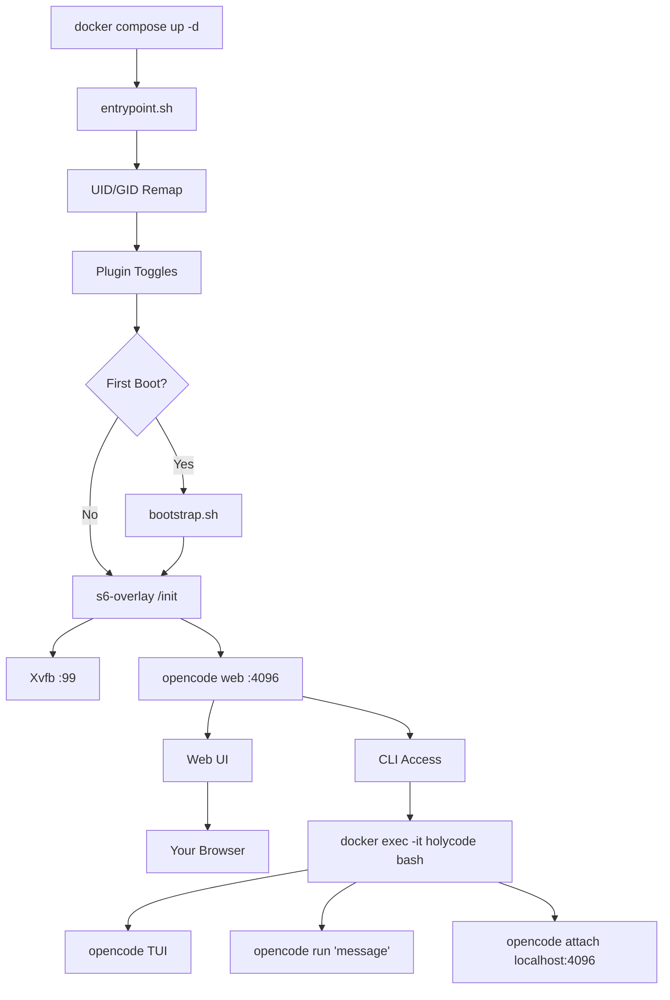

🌍 [English](../../README.md) | [Español](README.es.md) | [Français](README.fr.md) | **Italiano** | [Português](README.pt.md) | [Deutsch](README.de.md) | [Русский](README.ru.md) | [हिन्दी](README.hi.md) | [中文](README.zh.md) | [日本語](README.ja.md) | [한국어](README.ko.md)

> **📝 Note:** The [English README](../../README.md) is the canonical version. This translation may lag behind. Check the English version for the most current feature set and configuration options.

<a name="top"></a>

#  HolyCode

<div align="center">
  
</div>

<p align="center">

[](https://opensource.org/licenses/MIT)
[](https://hub.docker.com/r/coderluii/holycode)
[](https://hub.docker.com/r/coderluii/holycode)
[](https://github.com/coderluii/holycode)
[](https://x.com/CoderLuii)
[](https://www.paypal.com/donate/?hosted_button_id=PM2UXGVSTHDNL)
[](https://buymeacoffee.com/CoderLuii)
[](https://coderluii.dev)
[](https://github.com/coderluii/holycode/releases)
[](https://github.com/coderluii/holycode/issues)
[](https://github.com/coderluii/holycode/graphs/contributors)

</p>

### Un container. Tutti gli strumenti. Qualsiasi provider.

OpenCode in esecuzione in un container con tutto già installato. 50+ strumenti di sviluppo, 10+ provider AI, browser headless, stato persistente. Portalo su qualsiasi macchina e riprendi esattamente da dove avevi lasciato.

**Stavi per passare un'ora a ripristinare il tuo ambiente. Oppure puoi semplicemente eseguire `docker compose up`.**
> **Non vuoi fare self-hosting?** [HolyCode Cloud](https://holycode.coderluii.dev/cloud) sta arrivando. Gli stessi strumenti, zero configurazione. L'accesso anticipato è gratuito.

---

## Cos'è questo?

Conosci la storia. Configuri perfettamente il tuo ambiente di sviluppo. Poi cambi macchina. O ricostruisci un container. O il tuo sistema decide che oggi è il giorno in cui si rompe.

All'improvviso stai reinstallando strumenti. Cercando file di configurazione. Reinserendo chiavi API. Chiedendoti perché ripgrep non è più nel PATH. Cercando di capire perché Chromium non si avvia perché Docker assegna ai container 64 MB di memoria condivisa. Poi Xvfb non è configurato. Poi l'UID all'interno del container non corrisponde a quello dell'host e tutto restituisce permission denied.

**HolyCode è il container che ho costruito dopo aver risolto ognuno di quei problemi.**

Racchiude [OpenCode](https://opencode.ai), un agente di programmazione AI con un'interfaccia web integrata. Tutte le tue impostazioni, sessioni, configurazioni MCP, plugin e cronologia degli strumenti vivono in un bind mount esterno al container. Ricostruisci, aggiorna o passa a una nuova macchina. Il tuo stato torna immediatamente.

È la stessa idea di [HolyClaude](https://github.com/coderluii/holyclaude) ma che racchiude OpenCode invece di Claude Code. E questo è il punto: OpenCode non è vincolato a un solo provider. Puntalo su Anthropic, OpenAI, Google Gemini, Groq, AWS Bedrock o Azure OpenAI. Lo stesso container, la tua scelta di modello.

Oltre 30 strumenti di sviluppo, due runtime di linguaggio, uno stack browser headless e supervisione dei processi. Tutto configurato, tutto pronto al primo avvio. Lo eseguo sul mio server. Ogni bug è stato incontrato, diagnosticato e corretto.

Lo scarichi. Lo avvii. Apri il browser. Costruisci.

---

## Indice

| | Sezione |
|---|---------|
| 1 | [Avvio rapido](#-avvio-rapido) |
| 2 | [HolyCode Cloud](#-holycode-cloud-in-arrivo) |
| 3 | [Piattaforme supportate](#-piattaforme-supportate) |
| 4 | [Perché HolyCode](#-perché-holycode) |
| 5 | [Provider supportati](#-provider-supportati) |
| 6 | [Docker Compose - Rapido](#-docker-compose---rapido) |
| 7 | [Docker Compose - Completo](#-docker-compose---completo) |
| 8 | [Variabili d'ambiente](#-variabili-dambiente) |
| 9 | [Cosa è incluso](#-cosa-è-incluso) |
| 10 | [Servizi integrati](#-servizi-integrati) |
| 11 | [Architettura](#-architettura) |
| 12 | [Utilizzo CLI](#-utilizzo-cli) |
| 13 | [Dati e persistenza](#-dati-e-persistenza) |
| 14 | [Permessi](#-permessi) |
| 15 | [Aggiornamenti](#-aggiornamenti) |
| 16 | [Risoluzione dei problemi](#-risoluzione-dei-problemi) |
| 17 | [Compilazione locale](#-compilazione-locale) |
| 18 | [Contribuire](#-contribuire) |
| 19 | [Supporto](#-supporto) |
| 20 | [Licenza](#-licenza) |

---

## 🚀 Avvio rapido

**Passo 1.** Scarica l'immagine.

```bash
docker pull coderluii/holycode:latest
```

**Passo 2.** Crea un `docker-compose.yaml`.

```yaml
services:
  holycode:
    image: coderluii/holycode:latest
    container_name: holycode
    restart: unless-stopped
    shm_size: 2g
    ports:
      - "4096:4096"
    volumes:
      - ./data/opencode:/home/opencode
      - ./local-cache/opencode:/home/opencode/.cache/opencode
      - ./workspace:/workspace
    environment:
      - PUID=1000
      - PGID=1000
      - ANTHROPIC_API_KEY=your-key-here

```

**Passo 3.** Avvialo.

```bash
docker compose up -d
```

Apri http://localhost:4096. Sei dentro.

> Il `docker-compose.yaml` incluso usa la sintassi `${ANTHROPIC_API_KEY}` che legge dall'ambiente shell o da un file `.env`. Copia `.env.example` in `.env` e inserisci la tua chiave API.

<p align="right">
  <a href="#top">torna su</a>
</p>

---

## ☁ HolyCode Cloud (In arrivo)

Non vuoi fare self-hosting? Stiamo costruendo una versione gestita di HolyCode.

Gli stessi 50+ strumenti. Gli stessi 10+ provider. Lo stesso stato persistente. Senza Docker. Senza terminale. Apri semplicemente il browser e programma.

**Cosa ottieni con Cloud:**
- Configurazione zero. Niente Docker, niente file di configurazione, niente comandi da terminale.
- Funziona su qualsiasi dispositivo. Laptop, tablet, telefono. Apri un browser e vai.
- Sempre aggiornato. Ultimo OpenCode, ultimi strumenti. Ci pensiamo noi.
- Il tuo stato ti segue. Sessioni, impostazioni, configurazioni MCP salvate tra un utilizzo e l'altro.

**L'accesso anticipato è gratuito.** Nessuna carta di credito richiesta.

**[Prenota il tuo posto](https://holycode.coderluii.dev/cloud)**

<p align="right">
  <a href="#top">torna su</a>
</p>

---

## 💻 Piattaforme supportate

| Piattaforma | Architettura | Stato |
|-------------|-------------|-------|
| Linux | amd64 | Supportata |
| Linux | arm64 | Supportata |
| macOS (Docker Desktop) | amd64 / arm64 | Supportata |
| Windows (WSL2) | amd64 | Supportata |

<p align="right">
  <a href="#top">torna su</a>
</p>

---

## ⚡ Perché HolyCode

L'ho costruito perché ero stanco di rifare la stessa configurazione ogni volta. Installare OpenCode, collegare un browser headless, correggere problemi di permessi, fare il debug della supervisione dei processi. Ogni. Volta.

Quindi ho creato un container che fa tutto questo. E poi ho incontrato ogni possibile bug in modo che tu non debba farlo.

| | HolyCode | Fai da te |
|---|----------|-----|
| Tempo alla prima sessione funzionante | Meno di 2 minuti | 30-60 minuti |
| Chromium + Xvfb browser headless | Preconfigurato | Ricerca, installazione, debug da solo |
| Suite di strumenti di sviluppo (ripgrep, fzf, lazygit, ecc.) | Preinstallato | Cerca e installa uno per uno |
| Persistenza dello stato tra le ricostruzioni | Automatica tramite bind mount | Bind mount manuali, facile da configurare male |
| Rimappatura dei permessi UID/GID | PUID/PGID integrato | Hack chmod nel Dockerfile |
| Supporto multi-architettura | amd64 + arm64 pronto all'uso | Compila e pubblica entrambi da solo |
| Aggiornamenti | `docker pull` + `compose up` | Ricostruire da zero, sperare che nulla si rompa |

<p align="right">
  <a href="#top">torna su</a>
</p>

---

## 🤖 Provider supportati

OpenCode è indipendente dal provider. Imposta la chiave API che usi e hai finito.

| Provider | Variabile d'ambiente | Note |
|----------|---------------------|------|
| Anthropic | `ANTHROPIC_API_KEY` | Modelli Claude |
| OpenAI | `OPENAI_API_KEY` | Modelli GPT |
| Google Gemini | `GEMINI_API_KEY` | Modelli Gemini |
| Groq | `GROQ_API_KEY` | Inferenza rapida |
| AWS Bedrock | `AWS_ACCESS_KEY_ID`, `AWS_SECRET_ACCESS_KEY`, `AWS_REGION` | Imposta tutte e tre |
| Azure OpenAI | `AZURE_OPENAI_ENDPOINT`, `AZURE_OPENAI_API_KEY`, `AZURE_OPENAI_API_VERSION` | Imposta tutte e tre |
| GitHub | `GITHUB_TOKEN` | GitHub Copilot tramite endpoint compatibile OpenAI |
| Vertex AI | (configurato tramite OpenCode) | Modelli Google Vertex AI |
| GitHub Models | (configurato tramite OpenCode) | Modelli ospitati su GitHub |
| Ollama | (configurato tramite OpenCode) | Modelli locali tramite Ollama |

Devi impostare chiavi solo per i provider che usi effettivamente. Tutto il resto è opzionale e ignorato.

Vertex AI, GitHub Models e Ollama sono configurati tramite il sistema di provider di OpenCode. Esegui `opencode providers login` all'interno del container.

<p align="right">
  <a href="#top">torna su</a>
</p>

---

## 📋 Docker Compose - Rapido

La configurazione minima. Copia, inserisci la tua chiave, esegui.

```yaml
services:
  holycode:
    image: coderluii/holycode:latest
    container_name: holycode
    restart: unless-stopped
    shm_size: 2g              # Necessario per la stabilità di Chromium
    ports:
      - "4096:4096"           # Interfaccia web OpenCode
    volumes:
      - ./data/opencode:/home/opencode
      - ./local-cache/opencode:/home/opencode/.cache/opencode
      - ./workspace:/workspace  # I file del tuo progetto
    environment:
      - PUID=1000
      - PGID=1000
      - ANTHROPIC_API_KEY=your-key-here  # O sostituisci con qualsiasi chiave provider

```

<p align="right">
  <a href="#top">torna su</a>
</p>

---

## 📄 Docker Compose - Completo

Ogni opzione documentata. Copia in `docker-compose.yaml` e decommenta ciò di cui hai bisogno.

```yaml
# HolyCode - Full Configuration Reference
# Copy this file to docker-compose.yaml and customize.
# All options documented. Uncomment what you need.

services:
  holycode:
    image: coderluii/holycode:latest
    container_name: holycode
    restart: unless-stopped
    shm_size: 2g

    ports:
      - "4096:4096"   # OpenCode web UI

    volumes:
      # --- Persistent state (all OpenCode data under home dir) ---
      - ./data/opencode:/home/opencode   # Config, sessions, plugins, all XDG paths

      # --- Cache isolation (keeps plugin cache on local disk, avoids CIFS/SMB symlink issues) ---
      - ./local-cache/opencode:/home/opencode/.cache/opencode

      # --- Workspace ---
      - ./workspace:/workspace   # Your project files

    environment:
      # --- Container user ---
      - PUID=1000                # Match your host UID for file permissions
      - PGID=1000                # Match your host GID for file permissions

      # --- Git identity (used on first boot) ---
      # - GIT_USER_NAME=Your Name
      # - GIT_USER_EMAIL=you@example.com

      # --- AI provider API keys (add the ones you use) ---
      - ANTHROPIC_API_KEY=${ANTHROPIC_API_KEY:-}
      # - OPENAI_API_KEY=${OPENAI_API_KEY:-}
      # - GEMINI_API_KEY=${GEMINI_API_KEY:-}
      # - GROQ_API_KEY=${GROQ_API_KEY:-}
      # - GITHUB_TOKEN=${GITHUB_TOKEN:-}

      # --- AWS Bedrock (uncomment all 3 for Bedrock) ---
      # - AWS_ACCESS_KEY_ID=
      # - AWS_SECRET_ACCESS_KEY=
      # - AWS_REGION=us-east-1

      # --- Azure OpenAI (uncomment all 3 for Azure) ---
      # - AZURE_OPENAI_ENDPOINT=
      # - AZURE_OPENAI_API_KEY=
      # - AZURE_OPENAI_API_VERSION=

      # --- OpenCode behavior (set by default in image, override if needed) ---
      # - OPENCODE_DISABLE_AUTOUPDATE=true
      # - OPENCODE_DISABLE_TERMINAL_TITLE=true
      # - OPENCODE_MODEL=claude-sonnet-4-6
      # - OPENCODE_PERMISSION=auto
      # - OPENCODE_DISABLE_LSP_DOWNLOAD=true
      # - OPENCODE_DISABLE_AUTOCOMPACT=true
      # - OPENCODE_ENABLE_EXA=true

      # --- Web UI Security (basic auth for opencode web) ---
      # - OPENCODE_SERVER_PASSWORD=your-password
      # - OPENCODE_SERVER_USERNAME=opencode


```

<p align="right">
  <a href="#top">torna su</a>
</p>

---

## 🔧 Variabili d'ambiente

| Variabile | Valore predefinito | Scopo |
|----------|---------|---------|
| `PUID` | `1000` | UID dell'utente del container, corrispondente all'host per la corretta proprietà dei file |
| `PGID` | `1000` | GID dell'utente del container, corrispondente all'host per la corretta proprietà dei file |
| `GIT_USER_NAME` | `HolyCode User` | Identità Git configurata al primo avvio |
| `GIT_USER_EMAIL` | `noreply@holycode.local` | Identità Git configurata al primo avvio |
| `ANTHROPIC_API_KEY` | (nessuna) | Anthropic Claude |
| `OPENAI_API_KEY` | (nessuna) | Modelli OpenAI GPT |
| `GEMINI_API_KEY` | (nessuna) | Google Gemini |
| `GROQ_API_KEY` | (nessuna) | Inferenza rapida Groq |
| `GITHUB_TOKEN` | (nessuna) | Autenticazione GitHub CLI e Copilot |
| `AWS_ACCESS_KEY_ID` | (nessuna) | AWS Bedrock - imposta tutte e tre le variabili AWS |
| `AWS_SECRET_ACCESS_KEY` | (nessuna) | AWS Bedrock |
| `AWS_REGION` | (nessuna) | Regione AWS Bedrock (es. `us-east-1`) |
| `AZURE_OPENAI_ENDPOINT` | (nessuna) | Azure OpenAI - imposta tutte e tre le variabili Azure |
| `AZURE_OPENAI_API_KEY` | (nessuna) | Azure OpenAI |
| `AZURE_OPENAI_API_VERSION` | (nessuna) | Versione API Azure OpenAI |
| `OPENCODE_DISABLE_AUTOUPDATE` | `true` | Impedisce ad OpenCode di aggiornarsi automaticamente nel container |
| `OPENCODE_DISABLE_TERMINAL_TITLE` | `true` | Impedisce ad OpenCode di modificare il titolo del terminale |
| `OPENCODE_MODEL` | (nessuna) | Sovrascrive il modello predefinito |
| `OPENCODE_PERMISSION` | (nessuna) | Imposta su `auto` per saltare i prompt di permesso |
| `OPENCODE_DISABLE_LSP_DOWNLOAD` | (nessuna) | Disabilita i download automatici del server LSP |
| `OPENCODE_DISABLE_AUTOCOMPACT` | (nessuna) | Disabilita la compattazione automatica del contesto |
| `OPENCODE_ENABLE_EXA` | (nessuna) | Abilita l'integrazione di ricerca web Exa |
| `OPENCODE_SERVER_PASSWORD` | (nessuna) | Protegge l'interfaccia web con autenticazione di base |
| `OPENCODE_SERVER_USERNAME` | `opencode` | Nome utente per l'autenticazione di base dell'interfaccia web |

> `GIT_USER_NAME` e `GIT_USER_EMAIL` vengono applicati solo al primo avvio. Per riapplicarli, elimina il file sentinel e riavvia: `docker exec holycode rm /home/opencode/.config/opencode/.holycode-bootstrapped` poi `docker compose restart`.

<p align="right">
  <a href="#top">torna su</a>
</p>

---

## 📦 Cosa è incluso

<details>
<summary><strong>Strumenti principali</strong></summary>

| Strumento | Scopo |
|------|---------|
| `git` | Controllo versione |
| `ripgrep` | Ricerca rapida nel contenuto dei file |
| `fd` | Ricerca rapida di file |
| `fzf` | Ricerca fuzzy |
| `bat` | Cat con evidenziazione della sintassi |
| `eza` | Sostituto moderno di ls |
| `lazygit` | Interfaccia git nel terminale |
| `delta` | Diff git migliorati |
| `gh` | GitHub CLI |
| `htop` | Monitor dei processi |
| `tar` | Creazione ed estrazione di archivi |
| `tree` | Visualizzazione ad albero delle directory |
| `less` | Visualizzatore di file paginato |
| `vim` | Editor di testo nel terminale |
| `tmux` | Multiplexer di terminale |

</details>

<details>
<summary><strong>Runtime di linguaggio</strong></summary>

| Runtime | Versione |
|---------|---------|
| Node.js | 22 (LTS) |
| npm | Incluso con Node.js 22 |
| Python | 3 (sistema) |
| pip | Incluso con Python 3 |

</details>

<details>
<summary><strong>Strumenti di sviluppo</strong></summary>

| Strumento | Scopo |
|------|---------|
| `curl` | Richieste HTTP |
| `wget` | Download di file |
| `jq` | Elaborazione JSON |
| `unzip` / `zip` | Strumenti di archiviazione |
| `ssh` | Accesso remoto |
| `build-essential` + `pkg-config` | Compilazione di addon nativi npm |
| `python3-venv` | Ambienti virtuali Python |
| `procps` | Strumenti di processo: ps, top |
| `iproute2` | Strumenti di rete: ip, ss |
| `lsof` | Diagnostica dei file aperti |
| OpenSSL | Strumenti di crittografia e certificati (tramite immagine base) |

</details>

<details>
<summary><strong>Stack browser</strong></summary>

| Componente | Scopo |
|-----------|---------|
| Chromium | Motore browser headless |
| Xvfb | Server di visualizzazione framebuffer virtuale |
| Playwright | Framework di automazione browser |

Lo stack browser funziona in modalità headless pronto all'uso. Nessun server di visualizzazione, nessuna GPU, nessuna configurazione aggiuntiva. Gli script Playwright e Puppeteer funzionano come previsto.

Include i font Liberation, DejaVu, Noto e Noto Color Emoji per il corretto rendering delle pagine e degli screenshot.

</details>

<details>
<summary><strong>Servizi integrati</strong></summary>

| Servizio | Scopo |
|---------|---------|
| Hermes Agent | Meta-agente auto-migliorante con MCP, adattatori di messaggistica e delega OpenCode |
| Paperclip | Tabellone agenti locale che assume lavoratori OpenCode e li sveglia su heartbeat |

</details>

<details>
<summary><strong>Gestione dei processi</strong></summary>

| Componente | Scopo |
|-----------|---------|
| s6-overlay v3 | Supervisore di processi e sistema di init |
| Entrypoint personalizzato | Rimappatura UID/GID, configurazione git, bootstrap |

s6-overlay supervisiona OpenCode e Xvfb. Se un processo va in crash, si riavvia automaticamente. Le politiche di riavvio del container rimangono pulite perché il supervisore lo gestisce internamente.

</details>

<p align="right">
  <a href="#top">torna su</a>
</p>

---

## 🏗 Architettura



L'entrypoint gestisce la rimappatura degli utenti e la configurazione al primo avvio. s6-overlay supervisiona Xvfb, il server web OpenCode e qualsiasi servizio integrato opzionale abilitato. Se un processo supervisionato va in crash, s6 lo riavvia automaticamente. Accedi all'interfaccia web sulla porta 4096 o esegui comandi nel container per l'esperienza CLI completa.

<p align="right">
  <a href="#top">torna su</a>
</p>

---

## 💻 Utilizzo CLI

L'interfaccia web sulla porta 4096 è l'interfaccia principale. Ma puoi anche usare OpenCode direttamente dalla riga di comando all'interno del container.

### TUI interattivo

```bash
docker exec -it holycode bash
opencode
```

Questo apre l'interfaccia terminale completa di OpenCode con tutte le stesse funzionalità della versione web.

### Comandi one-shot

Esegui un singolo prompt senza entrare nel TUI:

```bash
docker exec -it holycode bash -c "opencode run 'explain this codebase'"
```

### Connettersi al server in esecuzione

Connetti una sessione TUI locale al server web OpenCode già in esecuzione:

```bash
docker exec -it holycode bash -c "opencode attach http://localhost:4096"
```

Questo condivide la stessa sessione dell'interfaccia web. Le modifiche in uno appaiono nell'altro.

### Gestione dei provider

Elenca e configura i provider AI dall'interno del container:

```bash
docker exec -it holycode bash -c "opencode providers list"
docker exec -it holycode bash -c "opencode providers login"
```

### Comandi utili

| Comando | Cosa fa |
|---------|-------------|
| `opencode` | Avvia il TUI |
| `opencode run 'message'` | Prompt one-shot |
| `opencode attach <url>` | Connette il TUI al server in esecuzione |
| `opencode web --port 4096` | Avvia il server web (già in esecuzione tramite s6) |
| `opencode serve` | Server API headless |
| `opencode providers list` | Mostra i provider configurati |
| `opencode providers login` | Aggiunge o cambia provider |
| `opencode models` | Elenca i modelli disponibili |
| `opencode models <provider>` | Elenca i modelli per un provider specifico |
| `opencode stats` | Mostra l'utilizzo dei token e i costi |
| `opencode session list` | Elenca le sessioni passate |
| `opencode export <sessionID>` | Esporta una sessione come JSON |
| `opencode plugin <module>` | Installa un plugin |
| `opencode upgrade` | Aggiorna OpenCode (disabilitato per impostazione predefinita nel container) |

<p align="right">
  <a href="#top">torna su</a>
</p>

---

## 💾 Dati e persistenza

Tutto lo stato di OpenCode vive in un singolo bind mount su `./data/opencode`. Il container è stateless. Il bind mount contiene tutto ciò che conta.

| Percorso host | Percorso container | Contenuto |
|-----------|---------------|-------------|
| `./data/opencode/.config/opencode` | `/home/opencode/.config/opencode` | Impostazioni, agenti, configurazioni MCP, temi, plugin |
| `./data/opencode/.local/share/opencode` | `/home/opencode/.local/share/opencode` | Database SQLite delle sessioni, token OAuth MCP |
| `./data/opencode/.local/state/opencode` | `/home/opencode/.local/state/opencode` | Dati di frequenza, cache dei modelli, archivio chiave-valore |
| `./local-cache/opencode` | `/home/opencode/.cache/opencode` | node_modules dei plugin, dipendenze installate automaticamente |

Ricostruisci il container quando vuoi. Esegui `docker compose pull && docker compose up -d` e le tue sessioni, impostazioni e configurazioni tornano automaticamente.

**Nota su SQLite WAL.** Il database delle sessioni usa il Write-Ahead Logging. Non copiare il file `.db` mentre il container è in esecuzione. Ferma prima il container se devi fare il backup o migrare il file del database.

**Nota sullo storage di rete.** Se `./data/opencode` si trova su un mount di rete CIFS/SMB (NAS, Synology, TrueNAS), la modalità WAL di SQLite potrebbe fallire perché SMB non supporta il byte-range locking per impostazione predefinita. HolyCode rileva questo all'avvio e stampa un avviso con la soluzione. Consulta la sezione Risoluzione dei problemi qui sotto.

<p align="right">
  <a href="#top">torna su</a>
</p>

---

## 🔐 Permessi

HolyCode usa `PUID` e `PGID` per rimappare l'utente interno del container in modo che corrisponda all'utente dell'host. Questo significa che i file scritti in `./workspace` sono di tua proprietà, non di root.

Trova i tuoi ID su Linux e macOS:

```bash
id -u   # PUID
id -g   # PGID
```

Sulla maggior parte dei sistemi è `1000:1000`. Su macOS è spesso `501:20`. Impostali nel tuo file compose:

```yaml
environment:
  - PUID=501
  - PGID=20
```

Se ometti questo, i file nel tuo workspace potrebbero essere di proprietà di root e avrai bisogno di sudo per modificarli dall'host.

<p align="right">
  <a href="#top">torna su</a>
</p>

---

## ⬆️ Aggiornamenti

Scarica l'ultima immagine e ricrea il container. I tuoi dati rimangono intatti.

```bash
docker compose pull
docker compose up -d
```

Tutto qui. Un comando. Le tue sessioni, impostazioni e configurazioni sono nel bind mount quindi nulla viene perso.

<p align="right">
  <a href="#top">torna su</a>
</p>

---

## 🛠 Risoluzione dei problemi

<details>
<summary><strong>Chromium va in crash o l'automazione del browser fallisce</strong></summary>

La causa più comune è la mancanza di memoria condivisa. Chromium ha bisogno di almeno 1-2 GB di `/dev/shm` per funzionare in modo affidabile.

Assicurati che il tuo file compose abbia `shm_size: 2g`:

```yaml
services:
  holycode:
    shm_size: 2g
```

Senza questo, Chromium andrà in crash silenziosamente o produrrà screenshot corrotti.

</details>

<details>
<summary><strong>Permission denied sui file del workspace</strong></summary>

Il tuo `PUID` e `PGID` non corrispondono al tuo utente host. Trova i tuoi ID:

```bash
id -u && id -g
```

Aggiorna la sezione environment del tuo compose per corrispondere:

```yaml
environment:
  - PUID=1001   # sostituisci con il tuo UID reale
  - PGID=1001   # sostituisci con il tuo GID reale
```

Poi ricrea il container: `docker compose up -d --force-recreate`

</details>

<details>
<summary><strong>La porta 4096 è già in uso</strong></summary>

Qualcos'altro sulla tua macchina sta usando la porta 4096. Rimappa su una porta host diversa:

```yaml
ports:
  - "4097:4096"   # accesso tramite http://localhost:4097
```

O trova e ferma il processo in conflitto:

```bash
# Linux / macOS
lsof -i :4096

# Windows
netstat -ano | findstr :4096
```

</details>

<details>
<summary><strong>Il container si avvia ma l'interfaccia web non carica mai</strong></summary>

Controlla i log del container:

```bash
docker compose logs -f holycode
```

OpenCode impiega qualche secondo per inizializzarsi. Aspetta 10-15 secondi dopo `docker compose up -d` prima di aprire il browser. Se non è ancora disponibile, i log ti diranno perché.

</details>

<details>
<summary><strong>Perché HolyCode non ha bisogno di SYS_ADMIN o seccomp=unconfined?</strong></summary>

Chromium viene eseguito con `--no-sandbox` all'interno del container, che è lo standard per le configurazioni di browser containerizzati. Questo elimina la necessità di capacità `SYS_ADMIN` o `seccomp=unconfined` che alcune altre configurazioni di browser Docker richiedono. Il container stesso fornisce il confine di isolamento.

Se preferisci usare il sandbox integrato di Chromium, aggiungi quanto segue al tuo file compose e rimuovi `--no-sandbox` dalla variabile d'ambiente `CHROMIUM_FLAGS`:

```yaml
cap_add:
  - SYS_ADMIN
security_opt:
  - seccomp=unconfined
```

</details>

<details>
<summary><strong>SQLite WAL non funziona su mount di rete CIFS/SMB (NAS)</strong></summary>

Se la directory `./data/opencode` si trova su una condivisione di rete CIFS/SMB, OpenCode potrebbe
fallire con:

```
Failed to run the query 'PRAGMA journal_mode = WAL'
```

OpenCode usa SQLite con Write-Ahead Logging (WAL) per il database delle sessioni.
WAL richiede il byte-range locking, che CIFS/SMB non supporta per impostazione predefinita. HolyCode rileva questo all'avvio.

**Soluzione:** Aggiungi `nobrl,mfsymlinks` alle opzioni di montaggio CIFS in `/etc/fstab`:

```
# Prima
//192.168.1.100/share /mnt/share cifs credentials=/etc/smbcreds,uid=1000,gid=1000 0 0

# Dopo (aggiungi nobrl,mfsymlinks)
//192.168.1.100/share /mnt/share cifs credentials=/etc/smbcreds,uid=1000,gid=1000,nobrl,mfsymlinks 0 0
```

Poi rimonta:

```bash
sudo umount /mnt/share
sudo mount /mnt/share
```

Riavvia HolyCode: `docker compose up -d --force-recreate`

</details>

<p align="right">
  <a href="#top">torna su</a>
</p>

---

## 🔨 Compilazione locale

Clona il repository, compila l'immagine, sostituiscila nel tuo file compose.

```bash
git clone https://github.com/coderluii/holycode.git
cd holycode
docker build -t holycode:local .
```

Poi nel tuo `docker-compose.yaml` sostituisci l'immagine:

```yaml
image: holycode:local
```

<p align="right">
  <a href="#top">torna su</a>
</p>

---

## 🤝 Contribuire

1. Fai un fork del repository
2. Crea un branch: `git checkout -b feature/your-feature`
3. Fai il commit delle tue modifiche: `git commit -m "feat: your feature"`
4. Fai il push: `git push origin feature/your-feature`
5. Apri una pull request


<p align="right">
  <a href="#top">torna su</a>
</p>

---

## ⭐ Supporto

Se HolyCode ti ha risparmiato un'altra ora di configurazione dell'ambiente, ecco come restituire il favore.

- Metti una stella al repository su GitHub
- Condividilo con qualcuno che lo troverebbe utile
- [Buy Me A Coffee](https://buymeacoffee.com/CoderLuii)
- [PayPal](https://www.paypal.com/donate/?hosted_button_id=PM2UXGVSTHDNL)
- [GitHub Sponsors](https://github.com/sponsors/CoderLuii)

<p align="right">
  <a href="#top">torna su</a>
</p>

---

## 📄 Licenza

Licenza MIT - vedi [LICENSE](../../LICENSE).

<p align="right">
  <a href="#top">torna su</a>
</p>

---

<div align="center">

Costruito da [CoderLuii](https://github.com/coderluii) · [coderluii.dev](https://coderluii.dev)

</div>
