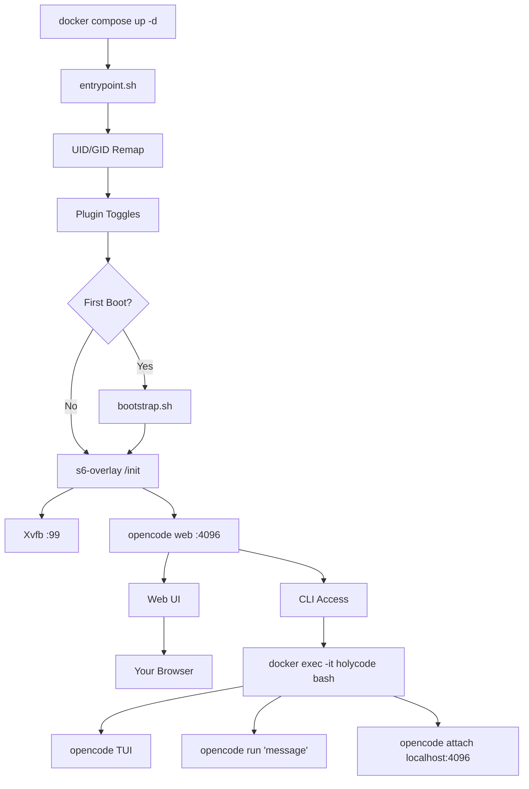

🌍 [English](../../README.md) | [Español](README.es.md) | [Français](README.fr.md) | [Italiano](README.it.md) | [Português](README.pt.md) | [Deutsch](README.de.md) | [Русский](README.ru.md) | [हिन्दी](README.hi.md) | [中文](README.zh.md) | **日本語** | [한국어](README.ko.md)

> **📝 Note:** The [English README](../../README.md) is the canonical version. This translation may lag behind. Check the English version for the most current feature set and configuration options.

<a name="top"></a>

#  HolyCode

<div align="center">
  
</div>

<p align="center">

[](https://opensource.org/licenses/MIT)
[](https://hub.docker.com/r/coderluii/holycode)
[](https://hub.docker.com/r/coderluii/holycode)
[](https://github.com/coderluii/holycode)
[](https://x.com/CoderLuii)
[](https://www.paypal.com/donate/?hosted_button_id=PM2UXGVSTHDNL)
[](https://buymeacoffee.com/CoderLuii)
[](https://coderluii.dev)
[](https://github.com/coderluii/holycode/releases)
[](https://github.com/coderluii/holycode/issues)
[](https://github.com/coderluii/holycode/graphs/contributors)

</p>

### ひとつのコンテナ。すべてのツール。あらゆるプロバイダー。

OpenCode がコンテナ内で動作し、すべてが事前にインストール済み。50以上の開発ツール、10以上のAIプロバイダー、ヘッドレスブラウザ、永続状態。どのマシンにでも展開して、止めたところから正確に再開できます。

**環境の復元に1時間かけるつもりだったはずです。それとも `docker compose up` を実行するだけにしますか。**
> **セルフホストしたくない場合は？** [HolyCode Cloud](https://holycode.coderluii.dev/cloud) が登場します。同じツール、ゼロセットアップ。アーリーアクセスは無料です。

---

## これは何ですか？

おなじみの流れです。開発環境を完璧に整えます。そして別のマシンに移ります。あるいはコンテナを再構築します。あるいはシステムが今日で終わりと判断します。

突然、ツールを再インストールしています。設定ファイルを探しています。APIキーを再入力しています。なぜ ripgrep が PATH にないのか首をかしげています。Docker がコンテナに 64MB の共有メモリしか与えないから Chromium が起動しない理由を調べています。次に Xvfb が設定されていません。次にコンテナ内の UID がホストと一致せず、あちこちで permission denied になります。

**HolyCode は、これらすべての問題を解決した上で構築したコンテナです。**

[OpenCode](https://opencode.ai) をラップしています。OpenCode は組み込み Web UI を持つ AI コーディングエージェントです。設定、セッション、MCP 設定、プラグイン、ツール履歴はすべてコンテナ外のバインドマウントに保存されます。再構築、更新、新しいマシンへの移行。状態はすぐに戻ります。

[HolyClaude](https://github.com/coderluii/holyclaude) と同じコンセプトですが、Claude Code の代わりに OpenCode をラップしています。そして重要な点として、OpenCode は特定のプロバイダーに縛られていません。Anthropic、OpenAI、Google Gemini、Groq、AWS Bedrock、Azure OpenAI に向けることができます。同じコンテナで、モデルはあなたが選びます。

30以上の開発ツール、2つの言語ランタイム、ヘッドレスブラウザスタック、プロセス監視。すべて配線済み、初回起動から使用可能。私は自分のサーバーで動かし続けています。すべてのバグはすでに踏んで、診断して、修正済みです。

プルします。実行します。ブラウザを開きます。構築します。

---

## 目次

| | セクション |
|---|---------|
| 1 | [クイックスタート](#-クイックスタート) |
| 2 | [HolyCode Cloud](#-holycode-cloud近日公開) |
| 3 | [プラットフォームサポート](#-プラットフォームサポート) |
| 4 | [なぜ HolyCode か](#-なぜ-holycode-か) |
| 5 | [プロバイダーサポート](#-プロバイダーサポート) |
| 6 | [Docker Compose - クイック](#-docker-compose---クイック) |
| 7 | [Docker Compose - フル](#-docker-compose---フル) |
| 8 | [環境変数](#-環境変数) |
| 9 | [中身は何か](#-中身は何か) |
| 10 | [バンドルサービス](#-バンドルサービス) |
| 11 | [アーキテクチャ](#-アーキテクチャ) |
| 12 | [CLI の使い方](#-cli-の使い方) |
| 13 | [データと永続化](#-データと永続化) |
| 14 | [パーミッション](#-パーミッション) |
| 15 | [アップグレード](#-アップグレード) |
| 16 | [トラブルシューティング](#-トラブルシューティング) |
| 17 | [ローカルビルド](#-ローカルビルド) |
| 18 | [コントリビュート](#-コントリビュート) |
| 19 | [サポート](#-サポート) |
| 20 | [ライセンス](#-ライセンス) |

---

## 🚀 クイックスタート

**ステップ 1.** イメージをプルします。

```bash
docker pull coderluii/holycode:latest
```

**ステップ 2.** `docker-compose.yaml` を作成します。

```yaml
services:
  holycode:
    image: coderluii/holycode:latest
    container_name: holycode
    restart: unless-stopped
    shm_size: 2g
    ports:
      - "4096:4096"
    volumes:
      - ./data/opencode:/home/opencode
      - ./local-cache/opencode:/home/opencode/.cache/opencode
      - ./workspace:/workspace
    environment:
      - PUID=1000
      - PGID=1000
      - ANTHROPIC_API_KEY=your-key-here

```

**ステップ 3.** 起動します。

```bash
docker compose up -d
```

http://localhost:4096 を開きます。準備完了です。

> 同梱の `docker-compose.yaml` は `${ANTHROPIC_API_KEY}` 構文を使用しており、シェル環境または `.env` ファイルから読み込みます。`.env.example` を `.env` にコピーして API キーを入力してください。

<p align="right">
  <a href="#top">トップへ戻る</a>
</p>

---

## ☁ HolyCode Cloud（近日公開）

セルフホストしたくない場合は？HolyCode のマネージドバージョンを構築中です。

同じ 30以上のツール。同じ 10以上のプロバイダー。同じ永続状態。Docker 不要。ターミナル不要。ブラウザを開くだけでコーディングできます。

**Cloud で得られるもの：**
- ゼロセットアップ。Docker も設定ファイルもターミナルコマンドも不要。
- あらゆるデバイスで動作。ラップトップ、タブレット、スマートフォン。ブラウザを開くだけ。
- 常に最新。最新の OpenCode、最新のツール。私たちが管理します。
- 状態がついてきます。セッション、設定、MCP 設定が使用間で保存されます。

**アーリーアクセスは無料。** クレジットカード不要。

**[スポットを確保する](https://holycode.coderluii.dev/cloud)**

<p align="right">
  <a href="#top">トップへ戻る</a>
</p>

---

## 💻 プラットフォームサポート

| プラットフォーム | アーキテクチャ | ステータス |
|----------|-------------|--------|
| Linux | amd64 | サポート済み |
| Linux | arm64 | サポート済み |
| macOS (Docker Desktop) | amd64 / arm64 | サポート済み |
| Windows (WSL2) | amd64 | サポート済み |

<p align="right">
  <a href="#top">トップへ戻る</a>
</p>

---

## ⚡ なぜ HolyCode か

毎回同じセットアップを繰り返すことに疲れたので作りました。OpenCode のインストール、ヘッドレスブラウザの配線、パーミッション問題の修正、プロセス監視のデバッグ。毎。回。

だからすべてをこなすコンテナを作りました。そして可能なすべてのバグを踏んだので、あなたが踏まなくて済むようになっています。

| | HolyCode | 自分でやる場合 |
|---|----------|-----|
| 最初の作業セッションまでの時間 | 2分以内 | 30〜60分 |
| Chromium + Xvfb ヘッドレスブラウザ | 事前設定済み | 自分で調査、インストール、デバッグ |
| 開発ツール一式（ripgrep、fzf、lazygit など） | 事前インストール済み | 一つずつ探してインストール |
| 再構築をまたいだ状態の永続化 | バインドマウントで自動 | 手動のバインドマウント、設定ミスしやすい |
| UID/GID ファイルパーミッションのリマッピング | 組み込み PUID/PGID | Dockerfile での chmod ハック |
| マルチアーキテクチャサポート | amd64 + arm64 をそのまま | 自分でビルドしてプッシュ |
| アップデート | `docker pull` + `compose up` | スクラッチから再構築、何も壊れないことを祈る |

<p align="right">
  <a href="#top">トップへ戻る</a>
</p>

---

## 🤖 プロバイダーサポート

OpenCode はプロバイダーに依存しません。使用する API キーを設定するだけです。

| プロバイダー | 環境変数 | 備考 |
|----------|---------------------|-------|
| Anthropic | `ANTHROPIC_API_KEY` | Claude モデル |
| OpenAI | `OPENAI_API_KEY` | GPT モデル |
| Google Gemini | `GEMINI_API_KEY` | Gemini モデル |
| Groq | `GROQ_API_KEY` | 高速推論 |
| AWS Bedrock | `AWS_ACCESS_KEY_ID`, `AWS_SECRET_ACCESS_KEY`, `AWS_REGION` | 3つすべて設定 |
| Azure OpenAI | `AZURE_OPENAI_ENDPOINT`, `AZURE_OPENAI_API_KEY`, `AZURE_OPENAI_API_VERSION` | 3つすべて設定 |
| GitHub | `GITHUB_TOKEN` | OpenAI 互換エンドポイント経由の GitHub Copilot |
| Vertex AI | （OpenCode 経由で設定） | Google Vertex AI モデル |
| GitHub Models | （OpenCode 経由で設定） | GitHub ホスティングのモデル |
| Ollama | （OpenCode 経由で設定） | Ollama 経由のローカルモデル |

実際に使用するプロバイダーのキーだけ設定すればOKです。それ以外はオプションで無視されます。

Vertex AI、GitHub Models、Ollama は OpenCode のプロバイダーシステムで設定します。コンテナ内で `opencode providers login` を実行してください。

<p align="right">
  <a href="#top">トップへ戻る</a>
</p>

---

## 📋 Docker Compose - クイック

最小限の設定。コピーして、キーを入れて、実行するだけ。

```yaml
services:
  holycode:
    image: coderluii/holycode:latest
    container_name: holycode
    restart: unless-stopped
    shm_size: 2g              # Required for Chromium stability
    ports:
      - "4096:4096"           # OpenCode web UI
    volumes:
      - ./data/opencode:/home/opencode
      - ./local-cache/opencode:/home/opencode/.cache/opencode
      - ./workspace:/workspace  # Your project files
    environment:
      - PUID=1000
      - PGID=1000
      - ANTHROPIC_API_KEY=your-key-here  # Or swap for any provider key

```

<p align="right">
  <a href="#top">トップへ戻る</a>
</p>

---

## 📄 Docker Compose - フル

すべてのオプションが文書化されています。`docker-compose.yaml` にコピーして必要なものをコメント解除してください。

```yaml
# HolyCode - Full Configuration Reference
# Copy this file to docker-compose.yaml and customize.
# All options documented. Uncomment what you need.

services:
  holycode:
    image: coderluii/holycode:latest
    container_name: holycode
    restart: unless-stopped
    shm_size: 2g

    ports:
      - "4096:4096"   # OpenCode web UI

    volumes:
      # --- Persistent state (all OpenCode data under home dir) ---
      - ./data/opencode:/home/opencode   # Config, sessions, plugins, all XDG paths

      # --- Cache isolation (keeps plugin cache on local disk, avoids CIFS/SMB symlink issues) ---
      - ./local-cache/opencode:/home/opencode/.cache/opencode

      # --- Workspace ---
      - ./workspace:/workspace   # Your project files

    environment:
      # --- Container user ---
      - PUID=1000                # Match your host UID for file permissions
      - PGID=1000                # Match your host GID for file permissions

      # --- Git identity (used on first boot) ---
      # - GIT_USER_NAME=Your Name
      # - GIT_USER_EMAIL=you@example.com

      # --- AI provider API keys (add the ones you use) ---
      - ANTHROPIC_API_KEY=${ANTHROPIC_API_KEY:-}
      # - OPENAI_API_KEY=${OPENAI_API_KEY:-}
      # - GEMINI_API_KEY=${GEMINI_API_KEY:-}
      # - GROQ_API_KEY=${GROQ_API_KEY:-}
      # - GITHUB_TOKEN=${GITHUB_TOKEN:-}

      # --- AWS Bedrock (uncomment all 3 for Bedrock) ---
      # - AWS_ACCESS_KEY_ID=
      # - AWS_SECRET_ACCESS_KEY=
      # - AWS_REGION=us-east-1

      # --- Azure OpenAI (uncomment all 3 for Azure) ---
      # - AZURE_OPENAI_ENDPOINT=
      # - AZURE_OPENAI_API_KEY=
      # - AZURE_OPENAI_API_VERSION=

      # --- OpenCode behavior (set by default in image, override if needed) ---
      # - OPENCODE_DISABLE_AUTOUPDATE=true
      # - OPENCODE_DISABLE_TERMINAL_TITLE=true
      # - OPENCODE_MODEL=claude-sonnet-4-6
      # - OPENCODE_PERMISSION=auto
      # - OPENCODE_DISABLE_LSP_DOWNLOAD=true
      # - OPENCODE_DISABLE_AUTOCOMPACT=true
      # - OPENCODE_ENABLE_EXA=true

      # --- Web UI Security (basic auth for opencode web) ---
      # - OPENCODE_SERVER_PASSWORD=your-password
      # - OPENCODE_SERVER_USERNAME=opencode


```

<p align="right">
  <a href="#top">トップへ戻る</a>
</p>

---

## 🔧 環境変数

| 変数 | デフォルト | 目的 |
|----------|---------|---------|
| `PUID` | `1000` | コンテナユーザーUID、正しいファイル所有権のためホストと一致させる |
| `PGID` | `1000` | コンテナユーザーGID、正しいファイル所有権のためホストと一致させる |
| `GIT_USER_NAME` | `HolyCode User` | 初回起動時に設定される Git ID |
| `GIT_USER_EMAIL` | `noreply@holycode.local` | 初回起動時に設定される Git ID |
| `ANTHROPIC_API_KEY` | （なし） | Anthropic Claude |
| `OPENAI_API_KEY` | （なし） | OpenAI GPT モデル |
| `GEMINI_API_KEY` | （なし） | Google Gemini |
| `GROQ_API_KEY` | （なし） | Groq 高速推論 |
| `GITHUB_TOKEN` | （なし） | GitHub CLI 認証と Copilot |
| `AWS_ACCESS_KEY_ID` | （なし） | AWS Bedrock - 3つの AWS 変数をすべて設定 |
| `AWS_SECRET_ACCESS_KEY` | （なし） | AWS Bedrock |
| `AWS_REGION` | （なし） | AWS Bedrock リージョン（例：`us-east-1`） |
| `AZURE_OPENAI_ENDPOINT` | （なし） | Azure OpenAI - 3つの Azure 変数をすべて設定 |
| `AZURE_OPENAI_API_KEY` | （なし） | Azure OpenAI |
| `AZURE_OPENAI_API_VERSION` | （なし） | Azure OpenAI API バージョン |
| `OPENCODE_DISABLE_AUTOUPDATE` | `true` | OpenCode がコンテナ内で自己更新するのを防止 |
| `OPENCODE_DISABLE_TERMINAL_TITLE` | `true` | OpenCode がターミナルタイトルを変更するのを防止 |
| `OPENCODE_MODEL` | （なし） | デフォルトモデルを上書き |
| `OPENCODE_PERMISSION` | （なし） | パーミッションプロンプトをスキップするには `auto` に設定 |
| `OPENCODE_DISABLE_LSP_DOWNLOAD` | （なし） | LSP サーバーの自動ダウンロードを無効化 |
| `OPENCODE_DISABLE_AUTOCOMPACT` | （なし） | コンテキストの自動圧縮を無効化 |
| `OPENCODE_ENABLE_EXA` | （なし） | Exa Web 検索統合を有効化 |
| `OPENCODE_SERVER_PASSWORD` | （なし） | Basic 認証で Web UI を保護 |
| `OPENCODE_SERVER_USERNAME` | `opencode` | Web UI の Basic 認証ユーザー名 |

> `GIT_USER_NAME` と `GIT_USER_EMAIL` は初回起動時のみ適用されます。再適用するにはセンチネルファイルを削除して再起動してください：`docker exec holycode rm /home/opencode/.config/opencode/.holycode-bootstrapped` の後 `docker compose restart`。

<p align="right">
  <a href="#top">トップへ戻る</a>
</p>

---

## 📦 中身は何か

<details>
<summary><strong>コアツール</strong></summary>

| ツール | 目的 |
|------|---------|
| `git` | バージョン管理 |
| `ripgrep` | 高速ファイル内容検索 |
| `fd` | 高速ファイル検索 |
| `fzf` | ファジーファインダー |
| `bat` | シンタックスハイライト付き Cat |
| `eza` | モダンな ls の代替 |
| `lazygit` | ターミナル git UI |
| `delta` | より良い git diff |
| `gh` | GitHub CLI |
| `htop` | プロセスモニター |
| `tar` | アーカイブの作成と展開 |
| `tree` | ディレクトリツリーの可視化 |
| `less` | ページ付きファイルビューアー |
| `vim` | ターミナルテキストエディター |
| `tmux` | ターミナルマルチプレクサー |

</details>

<details>
<summary><strong>言語ランタイム</strong></summary>

| ランタイム | バージョン |
|---------|---------|
| Node.js | 22 (LTS) |
| npm | Node.js 22 にバンドル |
| Python | 3（システム） |
| pip | Python 3 にバンドル |

</details>

<details>
<summary><strong>開発ツール</strong></summary>

| ツール | 目的 |
|------|---------|
| `curl` | HTTP リクエスト |
| `wget` | ファイルダウンロード |
| `jq` | JSON 処理 |
| `unzip` / `zip` | アーカイブツール |
| `ssh` | リモートアクセス |
| `build-essential` + `pkg-config` | ネイティブ npm アドオンのコンパイル |
| `python3-venv` | Python 仮想環境 |
| `procps` | プロセスツール：ps、top |
| `iproute2` | ネットワークツール：ip、ss |
| `lsof` | 開いているファイルの診断 |
| OpenSSL | 暗号化と証明書ツール（ベースイメージ経由） |

</details>

<details>
<summary><strong>ブラウザスタック</strong></summary>

| コンポーネント | 目的 |
|-----------|---------|
| Chromium | ヘッドレスブラウザエンジン |
| Xvfb | 仮想フレームバッファディスプレイサーバー |
| Playwright | ブラウザ自動化フレームワーク |

ブラウザスタックはそのままヘッドレスモードで動作します。ディスプレイサーバー不要、GPU 不要、追加設定不要。Playwright と Puppeteer のスクリプトは期待通りに動作します。

正しいページレンダリングとスクリーンショットのために Liberation、DejaVu、Noto、Noto Color Emoji フォントを含みます。

</details>

<details>
<summary><strong>バンドルサービス</strong></summary>

| サービス | 目的 |
|---------|---------|
| Hermes Agent | MCP、メッセージングアダプター、OpenCode 委任を備えた自己改善型メタエージェント |
| Paperclip | OpenCode ワーカーを雇用してハートビートで起動するローカルエージェントボード |

</details>

<details>
<summary><strong>プロセス管理</strong></summary>

| コンポーネント | 目的 |
|-----------|---------|
| s6-overlay v3 | プロセススーパーバイザーと init システム |
| カスタムエントリーポイント | UID/GID リマッピング、git 設定、ブートストラップ |

s6-overlay が OpenCode と Xvfb を監視します。プロセスがクラッシュすると自動的に再起動します。スーパーバイザーが内部で処理するため、コンテナの再起動ポリシーは クリーンに保たれます。

</details>

<p align="right">
  <a href="#top">トップへ戻る</a>
</p>

---

## 🏗 アーキテクチャ



エントリーポイントはユーザーリマッピング、初回起動セットアップを処理します。s6-overlay が Xvfb、OpenCode Web サーバーを監視します。監視対象のプロセスがクラッシュすると、s6 が自動的に再起動します。ポート 4096 で Web UI にアクセスするか、コンテナに exec してフル CLI 体験を得てください。

<p align="right">
  <a href="#top">トップへ戻る</a>
</p>

---

## 💻 CLI の使い方

ポート 4096 の Web UI がメインインターフェースです。ただし、コンテナ内のコマンドラインから直接 OpenCode を使用することもできます。

### インタラクティブ TUI

```bash
docker exec -it holycode bash
opencode
```

Web バージョンと同じ機能を持つ OpenCode のフルターミナル UI が開きます。

### ワンショットコマンド

TUI に入らずに単一プロンプトを実行：

```bash
docker exec -it holycode bash -c "opencode run 'explain this codebase'"
```

### 実行中のサーバーへのアタッチ

すでに実行中の OpenCode Web サーバーにローカル TUI セッションを接続：

```bash
docker exec -it holycode bash -c "opencode attach http://localhost:4096"
```

Web UI と同じセッションを共有します。一方での変更は他方にも反映されます。

### プロバイダー管理

コンテナ内から AI プロバイダーを一覧表示・設定：

```bash
docker exec -it holycode bash -c "opencode providers list"
docker exec -it holycode bash -c "opencode providers login"
```

### 便利なコマンド

| コマンド | 機能 |
|---------|-------------|
| `opencode` | TUI を起動 |
| `opencode run 'message'` | ワンショットプロンプト |
| `opencode attach <url>` | 実行中のサーバーに TUI をアタッチ |
| `opencode web --port 4096` | Web サーバーを起動（s6 経由で既に実行中） |
| `opencode serve` | ヘッドレス API サーバー |
| `opencode providers list` | 設定済みプロバイダーを表示 |
| `opencode providers login` | プロバイダーを追加または切り替え |
| `opencode models` | 利用可能なモデルを一覧表示 |
| `opencode models <provider>` | 特定プロバイダーのモデルを一覧表示 |
| `opencode stats` | トークン使用量とコストを表示 |
| `opencode session list` | 過去のセッションを一覧表示 |
| `opencode export <sessionID>` | セッションを JSON でエクスポート |
| `opencode plugin <module>` | プラグインをインストール |
| `opencode upgrade` | OpenCode をアップグレード（コンテナでデフォルト無効） |

<p align="right">
  <a href="#top">トップへ戻る</a>
</p>

---

## 💾 データと永続化

すべての OpenCode の状態は `./data/opencode` の単一バインドマウントに保存されます。コンテナはステートレスです。バインドマウントに重要なものがすべて入っています。

| ホストパス | コンテナパス | 内容 |
|-----------|---------------|-------------|
| `./data/opencode/.config/opencode` | `/home/opencode/.config/opencode` | 設定、エージェント、MCP 設定、テーマ、プラグイン |
| `./data/opencode/.local/share/opencode` | `/home/opencode/.local/share/opencode` | SQLite セッションデータベース、MCP OAuth トークン |
| `./data/opencode/.local/state/opencode` | `/home/opencode/.local/state/opencode` | Frecency データ、モデルキャッシュ、キーバリューストア |
| `./local-cache/opencode` | `/home/opencode/.cache/opencode` | プラグインの node_modules、自動インストール済み依存関係 |

いつでもコンテナを再構築できます。`docker compose pull && docker compose up -d` を実行すれば、セッション、設定、設定ファイルが自動的に戻ります。

**SQLite WAL に関する注意。** セッションデータベースは Write-Ahead Logging を使用しています。コンテナが実行中に `.db` ファイルをコピーしないでください。データベースファイルのバックアップや移行が必要な場合は、先にコンテナを停止してください。

**ネットワークストレージに関する注意。** `./data/opencode` が CIFS/SMB ネットワークマウント（NAS、Synology、TrueNAS）上にある場合、SMB がデフォルトでバイトレンジロックをサポートしていないため、SQLite WAL モードが失敗する可能性があります。HolyCode は起動時にこれを検出し、修正方法を警告として表示します。以下のトラブルシューティングセクションを参照してください。

<p align="right">
  <a href="#top">トップへ戻る</a>
</p>

---

## 🔐 パーミッション

HolyCode は `PUID` と `PGID` を使用して、コンテナ内部のユーザーをホストユーザーに合わせてリマッピングします。これにより、`./workspace` に書き込まれたファイルは root ではなくあなたが所有します。

Linux と macOS で ID を確認：

```bash
id -u   # PUID
id -g   # PGID
```

ほとんどのシステムでは `1000:1000` です。macOS では `501:20` が多いです。compose ファイルで設定：

```yaml
environment:
  - PUID=501
  - PGID=20
```

これをスキップすると、ワークスペースのファイルが root 所有になり、ホストから編集するには sudo が必要になる場合があります。

<p align="right">
  <a href="#top">トップへ戻る</a>
</p>

---

## ⬆️ アップグレード

最新イメージをプルしてコンテナを再作成します。データはそのまま残ります。

```bash
docker compose pull
docker compose up -d
```

以上です。ワンコマンド。セッション、設定、設定ファイルはバインドマウントにあるので何も失われません。

<p align="right">
  <a href="#top">トップへ戻る</a>
</p>

---

## 🛠 トラブルシューティング

<details>
<summary><strong>Chromium がクラッシュするかブラウザ自動化が失敗する</strong></summary>

最も一般的な原因は共有メモリの不足です。Chromium が安定して動作するには少なくとも 1-2 GB の `/dev/shm` が必要です。

compose ファイルに `shm_size: 2g` があることを確認してください：

```yaml
services:
  holycode:
    shm_size: 2g
```

これがないと、Chromium はサイレントにクラッシュするか、壊れたスクリーンショットを生成します。

</details>

<details>
<summary><strong>ワークスペースファイルで Permission denied</strong></summary>

`PUID` と `PGID` がホストユーザーと一致していません。ID を確認：

```bash
id -u && id -g
```

一致するように compose の environment セクションを更新：

```yaml
environment:
  - PUID=1001   # replace with your actual UID
  - PGID=1001   # replace with your actual GID
```

コンテナを再作成：`docker compose up -d --force-recreate`

</details>

<details>
<summary><strong>ポート 4096 がすでに使用中</strong></summary>

マシン上の別のプロセスがポート 4096 を使用しています。別のホストポートにリマップ：

```yaml
ports:
  - "4097:4096"   # access via http://localhost:4097
```

または競合するプロセスを見つけて停止：

```bash
# Linux / macOS
lsof -i :4096

# Windows
netstat -ano | findstr :4096
```

</details>

<details>
<summary><strong>コンテナが起動するが Web UI がロードされない</strong></summary>

コンテナのログを確認：

```bash
docker compose logs -f holycode
```

OpenCode は初期化に数秒かかります。`docker compose up -d` 後、ブラウザを開く前に 10-15 秒待ってください。それでもダメな場合、ログが理由を教えてくれます。

</details>

<details>
<summary><strong>HolyCode に SYS_ADMIN や seccomp=unconfined が不要な理由</strong></summary>

Chromium はコンテナ内で `--no-sandbox` で実行されますが、これはコンテナ化されたブラウザセットアップの標準です。これにより、他の Docker ブラウザセットアップが必要とする `SYS_ADMIN` 機能や `seccomp=unconfined` が不要になります。コンテナ自体が隔離の境界を提供します。

Chromium の組み込みサンドボックスを使用したい場合は、compose ファイルに以下を追加し、`CHROMIUM_FLAGS` 環境変数から `--no-sandbox` を削除してください：

```yaml
cap_add:
  - SYS_ADMIN
security_opt:
  - seccomp=unconfined
```

</details>

<details>
<summary><strong>SQLite WAL が CIFS/SMB ネットワークマウントで失敗する（NAS）</strong></summary>

`./data/opencode` ディレクトリが CIFS/SMB ネットワーク共有にある場合、OpenCode が
次のエラーで失敗する可能性があります：

```
Failed to run the query 'PRAGMA journal_mode = WAL'
```

OpenCode はセッションデータベースに SQLite の Write-Ahead Logging（WAL）を使用します。
WAL にはバイトレンジロックが必要ですが、CIFS/SMB はデフォルトでこれをサポートしていません。HolyCode は起動時にこれを検出します。

**修正:** `/etc/fstab` の CIFS マウントオプションに `nobrl,mfsymlinks` を追加してください：

```
# 修正前
//192.168.1.100/share /mnt/share cifs credentials=/etc/smbcreds,uid=1000,gid=1000 0 0

# 修正後（nobrl,mfsymlinks を追加）
//192.168.1.100/share /mnt/share cifs credentials=/etc/smbcreds,uid=1000,gid=1000,nobrl,mfsymlinks 0 0
```

その後、再マウント：

```bash
sudo umount /mnt/share
sudo mount /mnt/share
```

HolyCode を再起動: `docker compose up -d --force-recreate`

</details>

<p align="right">
  <a href="#top">トップへ戻る</a>
</p>

---

## 🔨 ローカルビルド

リポジトリをクローンし、イメージをビルドし、compose ファイルで差し替えます。

```bash
git clone https://github.com/coderluii/holycode.git
cd holycode
docker build -t holycode:local .
```

`docker-compose.yaml` でイメージを差し替え：

```yaml
image: holycode:local
```

<p align="right">
  <a href="#top">トップへ戻る</a>
</p>

---

## 🤝 コントリビュート

1. リポジトリをフォーク
2. ブランチを作成：`git checkout -b feature/your-feature`
3. 変更をコミット：`git commit -m "feat: your feature"`
4. プッシュ：`git push origin feature/your-feature`
5. プルリクエストを開く


<p align="right">
  <a href="#top">トップへ戻る</a>
</p>

---

## ⭐ サポート

HolyCode が環境設定のもう1時間を節約してくれたなら、ここに恩返しの方法があります。

- GitHub でリポジトリにスターを付ける
- 役立ちそうな人にシェアする
- [Buy Me A Coffee](https://buymeacoffee.com/CoderLuii)
- [PayPal](https://www.paypal.com/donate/?hosted_button_id=PM2UXGVSTHDNL)
- [GitHub Sponsors](https://github.com/sponsors/CoderLuii)

<p align="right">
  <a href="#top">トップへ戻る</a>
</p>

---

## 📄 ライセンス

MIT ライセンス - [LICENSE](../../LICENSE) を参照。

<p align="right">
  <a href="#top">トップへ戻る</a>
</p>

---

<div align="center">

[CoderLuii](https://github.com/coderluii) 作 · [coderluii.dev](https://coderluii.dev)

</div>
