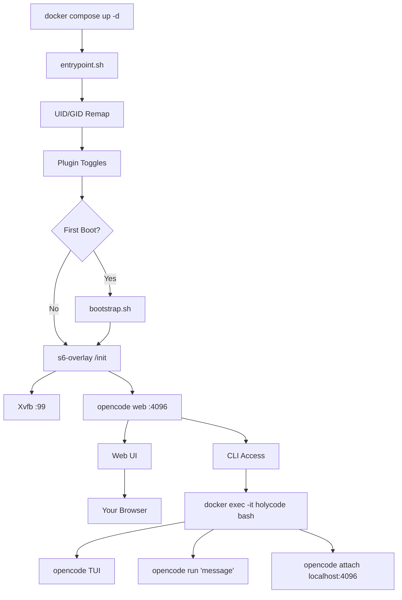

🌍 [English](../../README.md) | [Español](README.es.md) | [Français](README.fr.md) | [Italiano](README.it.md) | [Português](README.pt.md) | [Deutsch](README.de.md) | [Русский](README.ru.md) | [हिन्दी](README.hi.md) | [中文](README.zh.md) | [日本語](README.ja.md) | **한국어**

> **📝 Note:** The [English README](../../README.md) is the canonical version. This translation may lag behind. Check the English version for the most current feature set and configuration options.

<a name="top"></a>

#  HolyCode

<div align="center">
  
</div>

<p align="center">

[](https://opensource.org/licenses/MIT)
[](https://hub.docker.com/r/coderluii/holycode)
[](https://hub.docker.com/r/coderluii/holycode)
[](https://github.com/coderluii/holycode)
[](https://x.com/CoderLuii)
[](https://www.paypal.com/donate/?hosted_button_id=PM2UXGVSTHDNL)
[](https://buymeacoffee.com/CoderLuii)
[](https://coderluii.dev)
[](https://github.com/coderluii/holycode/releases)
[](https://github.com/coderluii/holycode/issues)
[](https://github.com/coderluii/holycode/graphs/contributors)

</p>

### 하나의 컨테이너. 모든 도구. 어떤 프로바이더든.

OpenCode가 컨테이너 안에서 실행되며 모든 것이 이미 설치되어 있습니다. 50개 이상의 개발 도구, 10개 이상의 AI 프로바이더, 헤드리스 브라우저, 영속 상태. 어떤 머신에든 배포하고 정확히 멈춘 곳에서 다시 시작하세요.

**환경을 복구하는 데 한 시간을 쓸 뻔했습니다. 아니면 그냥 `docker compose up`을 실행하세요.**
> **셀프 호스팅을 원하지 않으시나요?** [HolyCode Cloud](https://holycode.coderluii.dev/cloud)가 출시됩니다. 동일한 도구, 제로 설정. 얼리 액세스는 무료입니다.

---

## 이게 뭔가요?

익숙한 상황입니다. 개발 환경을 완벽하게 구성합니다. 그런 다음 머신을 바꿉니다. 또는 컨테이너를 다시 빌드합니다. 또는 시스템이 오늘이 마지막 날이라고 결정합니다.

갑자기 도구를 다시 설치하고 있습니다. 설정 파일을 찾고 있습니다. API 키를 다시 입력하고 있습니다. 왜 ripgrep이 PATH에 없는지 의아해하고 있습니다. Docker가 컨테이너에 64MB의 공유 메모리만 할당하기 때문에 Chromium이 실행되지 않는 이유를 파악하고 있습니다. 그런 다음 Xvfb가 설정되지 않았습니다. 그런 다음 컨테이너 내부의 UID가 호스트와 일치하지 않아 모든 곳에서 permission denied가 발생합니다.

**HolyCode는 이 모든 문제를 해결한 후에 제가 만든 컨테이너입니다.**

[OpenCode](https://opencode.ai)를 래핑합니다. OpenCode는 내장 웹 UI를 갖춘 AI 코딩 에이전트입니다. 모든 설정, 세션, MCP 설정, 플러그인, 도구 히스토리가 컨테이너 외부의 바인드 마운트에 저장됩니다. 다시 빌드하거나, 업데이트하거나, 새 머신으로 이동하세요. 상태가 바로 돌아옵니다.

[HolyClaude](https://github.com/coderluii/holyclaude)와 동일한 아이디어이지만 Claude Code 대신 OpenCode를 래핑합니다. 중요한 점은 OpenCode가 하나의 프로바이더에 고정되어 있지 않다는 것입니다. Anthropic, OpenAI, Google Gemini, Groq, AWS Bedrock, 또는 Azure OpenAI로 지정하세요. 같은 컨테이너, 모델은 당신이 선택합니다.

30개 이상의 개발 도구, 두 가지 언어 런타임, 헤드리스 브라우저 스택, 프로세스 감독. 모두 연결되어 있고, 첫 번째 부팅부터 사용 준비 완료. 제 서버에서 이것을 실행하고 있습니다. 모든 버그가 발생하고, 진단하고, 수정되었습니다.

당신은 풀합니다. 실행합니다. 브라우저를 엽니다. 빌드합니다.

---

## 목차

| | 섹션 |
|---|---------|
| 1 | [빠른 시작](#-빠른-시작) |
| 2 | [HolyCode Cloud](#-holycode-cloud곧-출시) |
| 3 | [플랫폼 지원](#-플랫폼-지원) |
| 4 | [왜 HolyCode인가](#-왜-holycode인가) |
| 5 | [프로바이더 지원](#-프로바이더-지원) |
| 6 | [Docker Compose - 빠른 버전](#-docker-compose---빠른-버전) |
| 7 | [Docker Compose - 전체 버전](#-docker-compose---전체-버전) |
| 8 | [환경 변수](#-환경-변수) |
| 9 | [내부 구성](#-내부-구성) |
| 10 | [번들 서비스](#-번들-서비스) |
| 11 | [아키텍처](#-아키텍처) |
| 12 | [CLI 사용법](#-cli-사용법) |
| 13 | [데이터와 영속성](#-데이터와-영속성) |
| 14 | [권한](#-권한) |
| 15 | [업그레이드](#-업그레이드) |
| 16 | [문제 해결](#-문제-해결) |
| 17 | [로컬 빌드](#-로컬-빌드) |
| 18 | [기여하기](#-기여하기) |
| 19 | [지원](#-지원) |
| 20 | [라이선스](#-라이선스) |

---

## 🚀 빠른 시작

**1단계.** 이미지를 풀합니다.

```bash
docker pull coderluii/holycode:latest
```

**2단계.** `docker-compose.yaml`을 만듭니다.

```yaml
services:
  holycode:
    image: coderluii/holycode:latest
    container_name: holycode
    restart: unless-stopped
    shm_size: 2g
    ports:
      - "4096:4096"
    volumes:
      - ./data/opencode:/home/opencode
      - ./local-cache/opencode:/home/opencode/.cache/opencode
      - ./workspace:/workspace
    environment:
      - PUID=1000
      - PGID=1000
      - ANTHROPIC_API_KEY=your-key-here

```

**3단계.** 시작합니다.

```bash
docker compose up -d
```

http://localhost:4096을 엽니다. 준비 완료입니다.

> 제공된 `docker-compose.yaml`은 쉘 환경 또는 `.env` 파일에서 읽는 `${ANTHROPIC_API_KEY}` 구문을 사용합니다. `.env.example`을 `.env`로 복사하고 API 키를 입력하세요.

<p align="right">
  <a href="#top">맨 위로</a>
</p>

---

## ☁ HolyCode Cloud（곧 출시）

셀프 호스팅을 원하지 않으시나요? HolyCode의 관리형 버전을 구축 중입니다.

동일한 30개 이상의 도구. 동일한 10개 이상의 프로바이더. 동일한 영속 상태. Docker 없음. 터미널 없음. 브라우저를 열고 코딩하세요.

**Cloud로 얻을 수 있는 것:**
- 제로 설정. Docker 없음, 설정 파일 없음, 터미널 명령어 없음.
- 모든 기기에서 작동. 노트북, 태블릿, 스마트폰. 브라우저를 열고 시작하세요.
- 항상 업데이트됨. 최신 OpenCode, 최신 도구. 저희가 처리합니다.
- 상태가 따라다닙니다. 세션, 설정, MCP 설정이 사용 간에 저장됩니다.

**얼리 액세스는 무료입니다.** 신용카드 불필요.

**[자리를 확보하세요](https://holycode.coderluii.dev/cloud)**

<p align="right">
  <a href="#top">맨 위로</a>
</p>

---

## 💻 플랫폼 지원

| 플랫폼 | 아키텍처 | 상태 |
|----------|-------------|--------|
| Linux | amd64 | 지원됨 |
| Linux | arm64 | 지원됨 |
| macOS (Docker Desktop) | amd64 / arm64 | 지원됨 |
| Windows (WSL2) | amd64 | 지원됨 |

<p align="right">
  <a href="#top">맨 위로</a>
</p>

---

## ⚡ 왜 HolyCode인가

매번 같은 설정을 반복하는 것에 지쳐서 만들었습니다. OpenCode 설치, 헤드리스 브라우저 연결, 권한 문제 수정, 프로세스 감독 디버깅. 매. 번.

그래서 이 모든 것을 처리하는 컨테이너를 만들었습니다. 그리고 가능한 모든 버그를 미리 겪었으니 여러분은 겪지 않아도 됩니다.

| | HolyCode | 직접 구성 |
|---|----------|-----|
| 첫 작업 세션까지 걸리는 시간 | 2분 이내 | 30-60분 |
| Chromium + Xvfb 헤드리스 브라우저 | 사전 설정됨 | 직접 조사, 설치, 디버그 |
| 개발 도구 모음 (ripgrep, fzf, lazygit 등) | 사전 설치됨 | 하나씩 찾아서 설치 |
| 재빌드 간 상태 영속성 | 바인드 마운트를 통해 자동 | 수동 바인드 마운트, 잘못 설정하기 쉬움 |
| UID/GID 파일 권한 리매핑 | 내장 PUID/PGID | Dockerfile chmod 핵 |
| 멀티 아키텍처 지원 | amd64 + arm64 바로 사용 가능 | 직접 빌드하고 푸시 |
| 업데이트 | `docker pull` + `compose up` | 처음부터 다시 빌드, 아무것도 안 깨지길 바람 |

<p align="right">
  <a href="#top">맨 위로</a>
</p>

---

## 🤖 프로바이더 지원

OpenCode는 프로바이더에 구애받지 않습니다. 사용하는 API 키를 설정하면 끝입니다.

| 프로바이더 | 환경 변수 | 비고 |
|----------|---------------------|-------|
| Anthropic | `ANTHROPIC_API_KEY` | Claude 모델 |
| OpenAI | `OPENAI_API_KEY` | GPT 모델 |
| Google Gemini | `GEMINI_API_KEY` | Gemini 모델 |
| Groq | `GROQ_API_KEY` | 빠른 추론 |
| AWS Bedrock | `AWS_ACCESS_KEY_ID`, `AWS_SECRET_ACCESS_KEY`, `AWS_REGION` | 세 개 모두 설정 |
| Azure OpenAI | `AZURE_OPENAI_ENDPOINT`, `AZURE_OPENAI_API_KEY`, `AZURE_OPENAI_API_VERSION` | 세 개 모두 설정 |
| GitHub | `GITHUB_TOKEN` | OpenAI 호환 엔드포인트를 통한 GitHub Copilot |
| Vertex AI | (OpenCode를 통해 설정) | Google Vertex AI 모델 |
| GitHub Models | (OpenCode를 통해 설정) | GitHub 호스팅 모델 |
| Ollama | (OpenCode를 통해 설정) | Ollama를 통한 로컬 모델 |

실제로 사용하는 프로바이더의 키만 설정하면 됩니다. 나머지는 선택 사항이며 무시됩니다.

Vertex AI, GitHub Models, Ollama는 OpenCode의 프로바이더 시스템을 통해 설정합니다. 컨테이너 내에서 `opencode providers login`을 실행하세요.

<p align="right">
  <a href="#top">맨 위로</a>
</p>

---

## 📋 Docker Compose - 빠른 버전

최소한의 설정. 복사하고, 키를 입력하고, 실행하세요.

```yaml
services:
  holycode:
    image: coderluii/holycode:latest
    container_name: holycode
    restart: unless-stopped
    shm_size: 2g              # Required for Chromium stability
    ports:
      - "4096:4096"           # OpenCode web UI
    volumes:
      - ./data/opencode:/home/opencode
      - ./local-cache/opencode:/home/opencode/.cache/opencode
      - ./workspace:/workspace  # Your project files
    environment:
      - PUID=1000
      - PGID=1000
      - ANTHROPIC_API_KEY=your-key-here  # Or swap for any provider key

```

<p align="right">
  <a href="#top">맨 위로</a>
</p>

---

## 📄 Docker Compose - 전체 버전

모든 옵션이 문서화되어 있습니다. `docker-compose.yaml`에 복사하고 필요한 것의 주석을 해제하세요.

```yaml
# HolyCode - Full Configuration Reference
# Copy this file to docker-compose.yaml and customize.
# All options documented. Uncomment what you need.

services:
  holycode:
    image: coderluii/holycode:latest
    container_name: holycode
    restart: unless-stopped
    shm_size: 2g

    ports:
      - "4096:4096"   # OpenCode web UI

    volumes:
      # --- Persistent state (all OpenCode data under home dir) ---
      - ./data/opencode:/home/opencode   # Config, sessions, plugins, all XDG paths

      # --- Cache isolation (keeps plugin cache on local disk, avoids CIFS/SMB symlink issues) ---
      - ./local-cache/opencode:/home/opencode/.cache/opencode

      # --- Workspace ---
      - ./workspace:/workspace   # Your project files

    environment:
      # --- Container user ---
      - PUID=1000                # Match your host UID for file permissions
      - PGID=1000                # Match your host GID for file permissions

      # --- Git identity (used on first boot) ---
      # - GIT_USER_NAME=Your Name
      # - GIT_USER_EMAIL=you@example.com

      # --- AI provider API keys (add the ones you use) ---
      - ANTHROPIC_API_KEY=${ANTHROPIC_API_KEY:-}
      # - OPENAI_API_KEY=${OPENAI_API_KEY:-}
      # - GEMINI_API_KEY=${GEMINI_API_KEY:-}
      # - GROQ_API_KEY=${GROQ_API_KEY:-}
      # - GITHUB_TOKEN=${GITHUB_TOKEN:-}

      # --- AWS Bedrock (uncomment all 3 for Bedrock) ---
      # - AWS_ACCESS_KEY_ID=
      # - AWS_SECRET_ACCESS_KEY=
      # - AWS_REGION=us-east-1

      # --- Azure OpenAI (uncomment all 3 for Azure) ---
      # - AZURE_OPENAI_ENDPOINT=
      # - AZURE_OPENAI_API_KEY=
      # - AZURE_OPENAI_API_VERSION=

      # --- OpenCode behavior (set by default in image, override if needed) ---
      # - OPENCODE_DISABLE_AUTOUPDATE=true
      # - OPENCODE_DISABLE_TERMINAL_TITLE=true
      # - OPENCODE_MODEL=claude-sonnet-4-6
      # - OPENCODE_PERMISSION=auto
      # - OPENCODE_DISABLE_LSP_DOWNLOAD=true
      # - OPENCODE_DISABLE_AUTOCOMPACT=true
      # - OPENCODE_ENABLE_EXA=true

      # --- Web UI Security (basic auth for opencode web) ---
      # - OPENCODE_SERVER_PASSWORD=your-password
      # - OPENCODE_SERVER_USERNAME=opencode


```

<p align="right">
  <a href="#top">맨 위로</a>
</p>

---

## 🔧 환경 변수

| 변수 | 기본값 | 용도 |
|----------|---------|---------|
| `PUID` | `1000` | 컨테이너 사용자 UID, 올바른 파일 소유권을 위해 호스트와 일치시킴 |
| `PGID` | `1000` | 컨테이너 사용자 GID, 올바른 파일 소유권을 위해 호스트와 일치시킴 |
| `GIT_USER_NAME` | `HolyCode User` | 첫 번째 부팅 시 설정되는 Git ID |
| `GIT_USER_EMAIL` | `noreply@holycode.local` | 첫 번째 부팅 시 설정되는 Git ID |
| `ANTHROPIC_API_KEY` | (없음) | Anthropic Claude |
| `OPENAI_API_KEY` | (없음) | OpenAI GPT 모델 |
| `GEMINI_API_KEY` | (없음) | Google Gemini |
| `GROQ_API_KEY` | (없음) | Groq 빠른 추론 |
| `GITHUB_TOKEN` | (없음) | GitHub CLI 인증 및 Copilot |
| `AWS_ACCESS_KEY_ID` | (없음) | AWS Bedrock - AWS 변수 세 개 모두 설정 |
| `AWS_SECRET_ACCESS_KEY` | (없음) | AWS Bedrock |
| `AWS_REGION` | (없음) | AWS Bedrock 리전 (예: `us-east-1`) |
| `AZURE_OPENAI_ENDPOINT` | (없음) | Azure OpenAI - Azure 변수 세 개 모두 설정 |
| `AZURE_OPENAI_API_KEY` | (없음) | Azure OpenAI |
| `AZURE_OPENAI_API_VERSION` | (없음) | Azure OpenAI API 버전 |
| `OPENCODE_DISABLE_AUTOUPDATE` | `true` | OpenCode가 컨테이너 내에서 자체 업데이트하는 것을 방지 |
| `OPENCODE_DISABLE_TERMINAL_TITLE` | `true` | OpenCode가 터미널 제목을 변경하는 것을 방지 |
| `OPENCODE_MODEL` | (없음) | 기본 모델 재정의 |
| `OPENCODE_PERMISSION` | (없음) | 권한 프롬프트를 건너뛰려면 `auto`로 설정 |
| `OPENCODE_DISABLE_LSP_DOWNLOAD` | (없음) | 자동 LSP 서버 다운로드 비활성화 |
| `OPENCODE_DISABLE_AUTOCOMPACT` | (없음) | 자동 컨텍스트 압축 비활성화 |
| `OPENCODE_ENABLE_EXA` | (없음) | Exa 웹 검색 통합 활성화 |
| `OPENCODE_SERVER_PASSWORD` | (없음) | 기본 인증으로 웹 UI 보호 |
| `OPENCODE_SERVER_USERNAME` | `opencode` | 웹 UI 기본 인증 사용자 이름 |

> `GIT_USER_NAME`과 `GIT_USER_EMAIL`은 첫 번째 부팅 시에만 적용됩니다. 재적용하려면 센티넬 파일을 삭제하고 재시작하세요: `docker exec holycode rm /home/opencode/.config/opencode/.holycode-bootstrapped` 그런 다음 `docker compose restart`.

<p align="right">
  <a href="#top">맨 위로</a>
</p>

---

## 📦 내부 구성

<details>
<summary><strong>핵심 도구</strong></summary>

| 도구 | 용도 |
|------|---------|
| `git` | 버전 관리 |
| `ripgrep` | 빠른 파일 내용 검색 |
| `fd` | 빠른 파일 검색 |
| `fzf` | 퍼지 파인더 |
| `bat` | 구문 강조 기능이 있는 Cat |
| `eza` | 현대적인 ls 대체품 |
| `lazygit` | 터미널 git UI |
| `delta` | 더 나은 git diff |
| `gh` | GitHub CLI |
| `htop` | 프로세스 모니터 |
| `tar` | 아카이브 생성 및 추출 |
| `tree` | 디렉터리 트리 시각화 |
| `less` | 페이지 파일 뷰어 |
| `vim` | 터미널 텍스트 에디터 |
| `tmux` | 터미널 멀티플렉서 |

</details>

<details>
<summary><strong>언어 런타임</strong></summary>

| 런타임 | 버전 |
|---------|---------|
| Node.js | 22 (LTS) |
| npm | Node.js 22에 번들됨 |
| Python | 3 (시스템) |
| pip | Python 3에 번들됨 |

</details>

<details>
<summary><strong>개발 도구</strong></summary>

| 도구 | 용도 |
|------|---------|
| `curl` | HTTP 요청 |
| `wget` | 파일 다운로드 |
| `jq` | JSON 처리 |
| `unzip` / `zip` | 아카이브 도구 |
| `ssh` | 원격 접근 |
| `build-essential` + `pkg-config` | 네이티브 npm 애드온 컴파일 |
| `python3-venv` | Python 가상 환경 |
| `procps` | 프로세스 도구: ps, top |
| `iproute2` | 네트워크 도구: ip, ss |
| `lsof` | 열린 파일 진단 |
| OpenSSL | 암호화 및 인증서 도구 (베이스 이미지를 통해) |

</details>

<details>
<summary><strong>브라우저 스택</strong></summary>

| 컴포넌트 | 용도 |
|-----------|---------|
| Chromium | 헤드리스 브라우저 엔진 |
| Xvfb | 가상 프레임버퍼 디스플레이 서버 |
| Playwright | 브라우저 자동화 프레임워크 |

브라우저 스택은 기본적으로 헤드리스 모드로 실행됩니다. 디스플레이 서버 없음, GPU 없음, 추가 설정 없음. Playwright와 Puppeteer 스크립트가 예상대로 작동합니다.

올바른 페이지 렌더링과 스크린샷을 위해 Liberation, DejaVu, Noto, Noto Color Emoji 폰트가 포함되어 있습니다.

</details>

<details>
<summary><strong>번들 서비스</strong></summary>

| 서비스 | 용도 |
|---------|---------|
| Hermes Agent | MCP, 메시징 어댑터, OpenCode 위임을 갖춘 자기 개선형 메타 에이전트 |
| Paperclip | OpenCode 워커를 고용하고 하트비트로 깨우는 로컬 에이전트 보드 |

</details>

<details>
<summary><strong>프로세스 관리</strong></summary>

| 컴포넌트 | 용도 |
|-----------|---------|
| s6-overlay v3 | 프로세스 슈퍼바이저 및 init 시스템 |
| 커스텀 엔트리포인트 | UID/GID 리매핑, git 설정, 부트스트랩 |

s6-overlay가 OpenCode와 Xvfb를 감독합니다. 프로세스가 크래시하면 자동으로 재시작됩니다. 슈퍼바이저가 내부적으로 처리하기 때문에 컨테이너 재시작 정책이 깔끔하게 유지됩니다.

</details>

<p align="right">
  <a href="#top">맨 위로</a>
</p>

---

## 🏗 아키텍처



엔트리포인트가 사용자 리매핑, 첫 번째 부팅 설정을 처리합니다. s6-overlay가 Xvfb, OpenCode 웹 서버, 그리고 활성화한 선택적 번들 서비스를 감독합니다. 감독되는 프로세스가 크래시하면 s6가 자동으로 재시작합니다. 포트 4096에서 웹 UI에 접근하거나 컨테이너로 exec하여 전체 CLI 경험을 얻으세요.

<p align="right">
  <a href="#top">맨 위로</a>
</p>

---

## 💻 CLI 사용법

포트 4096의 웹 UI가 기본 인터페이스입니다. 하지만 컨테이너 내부의 커맨드 라인에서 직접 OpenCode를 사용할 수도 있습니다.

### 인터랙티브 TUI

```bash
docker exec -it holycode bash
opencode
```

웹 버전과 동일한 기능을 갖춘 OpenCode의 전체 터미널 UI가 열립니다.

### 원샷 명령어

TUI에 진입하지 않고 단일 프롬프트를 실행:

```bash
docker exec -it holycode bash -c "opencode run 'explain this codebase'"
```

### 실행 중인 서버에 연결

이미 실행 중인 OpenCode 웹 서버에 로컬 TUI 세션 연결:

```bash
docker exec -it holycode bash -c "opencode attach http://localhost:4096"
```

웹 UI와 동일한 세션을 공유합니다. 한쪽의 변경 사항이 다른 쪽에도 나타납니다.

### 프로바이더 관리

컨테이너 내부에서 AI 프로바이더를 나열하고 설정:

```bash
docker exec -it holycode bash -c "opencode providers list"
docker exec -it holycode bash -c "opencode providers login"
```

### 유용한 명령어

| 명령어 | 기능 |
|---------|-------------|
| `opencode` | TUI 실행 |
| `opencode run 'message'` | 원샷 프롬프트 |
| `opencode attach <url>` | 실행 중인 서버에 TUI 연결 |
| `opencode web --port 4096` | 웹 서버 시작 (이미 s6를 통해 실행 중) |
| `opencode serve` | 헤드리스 API 서버 |
| `opencode providers list` | 설정된 프로바이더 표시 |
| `opencode providers login` | 프로바이더 추가 또는 전환 |
| `opencode models` | 사용 가능한 모델 나열 |
| `opencode models <provider>` | 특정 프로바이더의 모델 나열 |
| `opencode stats` | 토큰 사용량 및 비용 표시 |
| `opencode session list` | 과거 세션 나열 |
| `opencode export <sessionID>` | 세션을 JSON으로 내보내기 |
| `opencode plugin <module>` | 플러그인 설치 |
| `opencode upgrade` | OpenCode 업그레이드 (컨테이너에서 기본적으로 비활성화) |

<p align="right">
  <a href="#top">맨 위로</a>
</p>

---

## 💾 데이터와 영속성

모든 OpenCode 상태가 `./data/opencode`의 단일 바인드 마운트에 저장됩니다. 컨테이너는 상태를 갖지 않습니다. 바인드 마운트에 중요한 것이 모두 있습니다.

| 호스트 경로 | 컨테이너 경로 | 내용 |
|-----------|---------------|-------------|
| `./data/opencode/.config/opencode` | `/home/opencode/.config/opencode` | 설정, 에이전트, MCP 설정, 테마, 플러그인 |
| `./data/opencode/.local/share/opencode` | `/home/opencode/.local/share/opencode` | SQLite 세션 데이터베이스, MCP OAuth 토큰 |
| `./data/opencode/.local/state/opencode` | `/home/opencode/.local/state/opencode` | 빈도 데이터, 모델 캐시, 키-값 저장소 |
| `./local-cache/opencode` | `/home/opencode/.cache/opencode` | 플러그인 node_modules, 자동 설치된 의존성 |

언제든지 컨테이너를 다시 빌드하세요. `docker compose pull && docker compose up -d`를 실행하면 세션, 설정, 설정 파일이 자동으로 돌아옵니다.

**SQLite WAL 참고 사항.** 세션 데이터베이스는 Write-Ahead Logging을 사용합니다. 컨테이너가 실행 중일 때 `.db` 파일을 복사하지 마세요. 데이터베이스 파일을 백업하거나 마이그레이션해야 하는 경우 먼저 컨테이너를 중지하세요.

**네트워크 스토리지 참고 사항.** `./data/opencode`가 CIFS/SMB 네트워크 마운트(NAS, Synology, TrueNAS)에 있는 경우, SMB가 기본적으로 바이트 범위 잠금을 지원하지 않아 SQLite WAL 모드가 실패할 수 있습니다. HolyCode는 시작 시 이를 감지하고 해결 방법과 함께 경고를 표시합니다. 아래 문제 해결 섹션을 참조하세요.

<p align="right">
  <a href="#top">맨 위로</a>
</p>

---

## 🔐 권한

HolyCode는 `PUID`와 `PGID`를 사용하여 컨테이너 내부 사용자를 호스트 사용자와 일치하도록 리매핑합니다. 이는 `./workspace`에 작성된 파일이 root가 아닌 여러분의 소유임을 의미합니다.

Linux와 macOS에서 ID 확인:

```bash
id -u   # PUID
id -g   # PGID
```

대부분의 시스템에서 이는 `1000:1000`입니다. macOS에서는 종종 `501:20`입니다. compose 파일에서 설정:

```yaml
environment:
  - PUID=501
  - PGID=20
```

이를 건너뛰면 워크스페이스의 파일이 root 소유가 될 수 있으며 호스트에서 편집하려면 sudo가 필요합니다.

<p align="right">
  <a href="#top">맨 위로</a>
</p>

---

## ⬆️ 업그레이드

최신 이미지를 풀하고 컨테이너를 재생성합니다. 데이터는 그대로 유지됩니다.

```bash
docker compose pull
docker compose up -d
```

끝입니다. 단 하나의 명령어. 세션, 설정, 설정 파일이 바인드 마운트에 있으므로 아무것도 손실되지 않습니다.

<p align="right">
  <a href="#top">맨 위로</a>
</p>

---

## 🛠 문제 해결

<details>
<summary><strong>Chromium이 크래시하거나 브라우저 자동화가 실패함</strong></summary>

가장 일반적인 원인은 공유 메모리 부족입니다. Chromium이 안정적으로 실행되려면 최소 1-2 GB의 `/dev/shm`이 필요합니다.

compose 파일에 `shm_size: 2g`가 있는지 확인하세요:

```yaml
services:
  holycode:
    shm_size: 2g
```

이것 없이는 Chromium이 자동으로 크래시하거나 손상된 스크린샷을 생성합니다.

</details>

<details>
<summary><strong>워크스페이스 파일에 Permission denied</strong></summary>

`PUID`와 `PGID`가 호스트 사용자와 일치하지 않습니다. ID를 찾으세요:

```bash
id -u && id -g
```

일치하도록 compose environment 섹션 업데이트:

```yaml
environment:
  - PUID=1001   # replace with your actual UID
  - PGID=1001   # replace with your actual GID
```

그런 다음 컨테이너 재생성: `docker compose up -d --force-recreate`

</details>

<details>
<summary><strong>포트 4096이 이미 사용 중</strong></summary>

머신의 다른 프로세스가 포트 4096을 사용하고 있습니다. 다른 호스트 포트로 리매핑:

```yaml
ports:
  - "4097:4096"   # access via http://localhost:4097
```

또는 충돌하는 프로세스를 찾아서 중지:

```bash
# Linux / macOS
lsof -i :4096

# Windows
netstat -ano | findstr :4096
```

</details>

<details>
<summary><strong>컨테이너가 시작하지만 웹 UI가 로드되지 않음</strong></summary>

컨테이너 로그를 확인하세요:

```bash
docker compose logs -f holycode
```

OpenCode는 초기화하는 데 몇 초가 걸립니다. `docker compose up -d` 후 브라우저를 열기 전에 10-15초 기다리세요. 여전히 작동하지 않으면 로그가 이유를 알려줄 것입니다.

</details>

<details>
<summary><strong>HolyCode에 SYS_ADMIN이나 seccomp=unconfined가 필요 없는 이유</strong></summary>

Chromium은 컨테이너 내에서 `--no-sandbox`로 실행되는데, 이는 컨테이너화된 브라우저 설정의 표준입니다. 이는 다른 Docker 브라우저 설정에서 필요한 `SYS_ADMIN` 기능이나 `seccomp=unconfined`의 필요성을 제거합니다. 컨테이너 자체가 격리 경계를 제공합니다.

Chromium의 내장 샌드박스를 사용하려면 compose 파일에 다음을 추가하고 `CHROMIUM_FLAGS` 환경 변수에서 `--no-sandbox`를 제거하세요:

```yaml
cap_add:
  - SYS_ADMIN
security_opt:
  - seccomp=unconfined
```

</details>

<details>
<summary><strong>SQLite WAL이 CIFS/SMB 네트워크 마운트에서 실패함 (NAS)</strong></summary>

`./data/opencode` 디렉토리가 CIFS/SMB 네트워크 공유에 있는 경우, OpenCode가
다음 오류와 함께 실패할 수 있습니다:

```
Failed to run the query 'PRAGMA journal_mode = WAL'
```

OpenCode는 세션 데이터베이스에 SQLite Write-Ahead Logging(WAL)을 사용합니다.
WAL은 바이트 범위 잠금이 필요하지만, CIFS/SMB는 기본적으로 이를 지원하지 않습니다. HolyCode는 시작 시 이를 감지합니다.

**해결 방법:** `/etc/fstab`의 CIFS 마운트 옵션에 `nobrl,mfsymlinks`를 추가하세요:

```
# 변경 전
//192.168.1.100/share /mnt/share cifs credentials=/etc/smbcreds,uid=1000,gid=1000 0 0

# 변경 후 (nobrl,mfsymlinks 추가)
//192.168.1.100/share /mnt/share cifs credentials=/etc/smbcreds,uid=1000,gid=1000,nobrl,mfsymlinks 0 0
```

그런 다음 다시 마운트:

```bash
sudo umount /mnt/share
sudo mount /mnt/share
```

HolyCode 재시작: `docker compose up -d --force-recreate`

</details>

<p align="right">
  <a href="#top">맨 위로</a>
</p>

---

## 🔨 로컬 빌드

저장소를 클론하고, 이미지를 빌드하고, compose 파일에서 교체합니다.

```bash
git clone https://github.com/coderluii/holycode.git
cd holycode
docker build -t holycode:local .
```

그런 다음 `docker-compose.yaml`에서 이미지 교체:

```yaml
image: holycode:local
```

<p align="right">
  <a href="#top">맨 위로</a>
</p>

---

## 🤝 기여하기

1. 저장소를 포크
2. 브랜치 생성: `git checkout -b feature/your-feature`
3. 변경 사항 커밋: `git commit -m "feat: your feature"`
4. 푸시: `git push origin feature/your-feature`
5. 풀 리퀘스트 열기


<p align="right">
  <a href="#top">맨 위로</a>
</p>

---

## ⭐ 지원

HolyCode가 환경 설정에 드는 또 한 시간을 절약해줬다면, 보답하는 방법이 있습니다.

- GitHub에서 저장소에 별 달기
- 유용하게 쓸 수 있는 사람과 공유하기
- [Buy Me A Coffee](https://buymeacoffee.com/CoderLuii)
- [PayPal](https://www.paypal.com/donate/?hosted_button_id=PM2UXGVSTHDNL)
- [GitHub Sponsors](https://github.com/sponsors/CoderLuii)

<p align="right">
  <a href="#top">맨 위로</a>
</p>

---

## 📄 라이선스

MIT 라이선스 - [LICENSE](../../LICENSE) 참조.

<p align="right">
  <a href="#top">맨 위로</a>
</p>

---

<div align="center">

[CoderLuii](https://github.com/coderluii) 제작 · [coderluii.dev](https://coderluii.dev)

</div>
