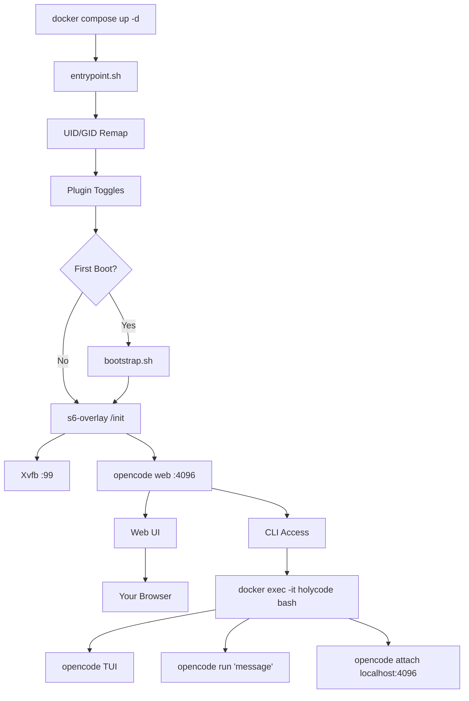

🌍 [English](../../README.md) | [Español](README.es.md) | [Français](README.fr.md) | [Italiano](README.it.md) | **Português** | [Deutsch](README.de.md) | [Русский](README.ru.md) | [हिन्दी](README.hi.md) | [中文](README.zh.md) | [日本語](README.ja.md) | [한국어](README.ko.md)

<a name="top"></a>

#  HolyCode

<div align="center">
  
</div>

<p align="center">

[](https://opensource.org/licenses/MIT)
[](https://hub.docker.com/r/coderluii/holycode)
[](https://hub.docker.com/r/coderluii/holycode)
[](https://github.com/coderluii/holycode)
[](https://x.com/CoderLuii)
[](https://www.paypal.com/donate/?hosted_button_id=PM2UXGVSTHDNL)
[](https://buymeacoffee.com/CoderLuii)
[](https://coderluii.dev)
[](https://github.com/coderluii/holycode/releases)
[](https://github.com/coderluii/holycode/issues)
[](https://github.com/coderluii/holycode/graphs/contributors)

</p>

### Um container. Todas as ferramentas. Qualquer provedor.

OpenCode rodando em um container com tudo já instalado. 50+ ferramentas de desenvolvimento, 10+ provedores de IA, browser headless, estado persistente. Coloque em qualquer máquina e continue exatamente de onde parou.

**Funciona com sua assinatura Claude.** Ative o plugin Claude Auth e use seu plano Claude Max/Pro existente. Sem necessidade de chave de API separada.

**Orquestração multi-agente integrada.** Ative oh-my-openagent e transforme o OpenCode em um sistema de agentes coordenados com execução paralela.

**Você ia gastar uma hora recuperando seu ambiente. Ou pode simplesmente executar `docker compose up`.**
> **Não quer fazer self-hosting?** [HolyCode Cloud](https://holycode.coderluii.dev/cloud) está chegando. As mesmas ferramentas, zero configuração. O acesso antecipado é gratuito.

---

## O que é isso?

Você conhece a história. Você configura seu ambiente de desenvolvimento perfeitamente. Depois troca de máquina. Ou reconstrói um container. Ou seu sistema decide que hoje é o dia em que vai morrer.

De repente você está reinstalando ferramentas. Procurando arquivos de configuração. Reinserindo chaves de API. Perguntando por que o ripgrep não está mais no PATH. Descobrindo por que o Chromium não inicia porque o Docker aloca 64 MB de memória compartilhada para containers. Depois o Xvfb não está configurado. Depois o UID dentro do container não corresponde ao do host e tudo dá permission denied.

**HolyCode é o container que construí depois de resolver cada um desses problemas.**

Ele encapsula o [OpenCode](https://opencode.ai), um agente de programação com IA com interface web integrada. Todas as suas configurações, sessões, configurações MCP, plugins e histórico de ferramentas vivem em um bind mount fora do container. Reconstrua, atualize ou mude para uma nova máquina. Seu estado volta imediatamente.

É a mesma ideia que o [HolyClaude](https://github.com/coderluii/holyclaude) mas encapsulando o OpenCode em vez do Claude Code. E o ponto importante: o OpenCode não está preso a um único provedor. Aponte para Anthropic, OpenAI, Google Gemini, Groq, AWS Bedrock ou Azure OpenAI. O mesmo container, sua escolha de modelo.

Mais de 30 ferramentas de desenvolvimento, dois runtimes de linguagem, uma pilha de browser headless e supervisão de processos. Tudo configurado, tudo pronto na primeira inicialização. Tenho rodado isso no meu próprio servidor. Cada bug foi encontrado, diagnosticado e corrigido.

Você baixa. Você executa. Abre o navegador. Constrói.

---

## Índice

| | Seção |
|---|---------|
| 1 | [Início rápido](#-início-rápido) |
| 2 | [HolyCode Cloud](#-holycode-cloud-em-breve) |
| 3 | [Plataformas suportadas](#-plataformas-suportadas) |
| 4 | [Por que HolyCode](#-por-que-holycode) |
| 5 | [Provedores suportados](#-provedores-suportados) |
| 6 | [Docker Compose - Rápido](#-docker-compose---rápido) |
| 7 | [Docker Compose - Completo](#-docker-compose---completo) |
| 8 | [Variáveis de ambiente](#-variáveis-de-ambiente) |
| 9 | [O que está dentro](#-o-que-está-dentro) |
| 10 | [Serviços integrados](#-serviços-integrados) |
| 11 | [Arquitetura](#-arquitetura) |
| 12 | [Uso de CLI](#-uso-de-cli) |
| 13 | [Dados e persistência](#-dados-e-persistência) |
| 14 | [Permissões](#-permissões) |
| 15 | [Atualizações](#-atualizações) |
| 16 | [Solução de problemas](#-solução-de-problemas) |
| 17 | [Compilação local](#-compilação-local) |
| 18 | [Contribuindo](#-contribuindo) |
| 19 | [Suporte](#-suporte) |
| 20 | [Licença](#-licença) |

---

## 🚀 Início rápido

**Passo 1.** Baixe a imagem.

```bash
docker pull coderluii/holycode:latest
```

**Passo 2.** Crie um `docker-compose.yaml`.

```yaml
services:
  holycode:
    image: coderluii/holycode:latest
    container_name: holycode
    restart: unless-stopped
    shm_size: 2g
    ports:
      - "4096:4096"
    volumes:
      - ./data/opencode:/home/opencode
      - ./local-cache/opencode:/home/opencode/.cache/opencode
      - ./workspace:/workspace
    environment:
      - PUID=1000
      - PGID=1000
      - ANTHROPIC_API_KEY=your-key-here

```

**Passo 3.** Inicie.

```bash
docker compose up -d
```

Abra http://localhost:4096. Você está dentro.

> O `docker-compose.yaml` incluído usa a sintaxe `${ANTHROPIC_API_KEY}` que lê do seu ambiente shell ou de um arquivo `.env`. Copie `.env.example` para `.env` e preencha sua chave de API.

<p align="right">
  <a href="#top">voltar ao topo</a>
</p>

---

## ☁ HolyCode Cloud (Em breve)

Não quer fazer self-hosting? Estamos construindo uma versão gerenciada do HolyCode.

As mesmas 50+ ferramentas. Os mesmos 10+ provedores. O mesmo estado persistente. Sem Docker. Sem terminal. Basta abrir o navegador e programar.

**O que você ganha com o Cloud:**
- Configuração zero. Sem Docker, sem arquivos de configuração, sem comandos de terminal.
- Funciona em qualquer dispositivo. Laptop, tablet, celular. Abra um navegador e vá.
- Sempre atualizado. Último OpenCode, últimas ferramentas. Nós cuidamos disso.
- Seu estado te acompanha. Sessões, configurações, configs MCP salvas entre os usos.

**O acesso antecipado é gratuito.** Nenhum cartão de crédito necessário.

**[Garanta sua vaga](https://holycode.coderluii.dev/cloud)**

<p align="right">
  <a href="#top">voltar ao topo</a>
</p>

---

## 💻 Plataformas suportadas

| Plataforma | Arquitetura | Status |
|------------|-------------|--------|
| Linux | amd64 | Suportada |
| Linux | arm64 | Suportada |
| macOS (Docker Desktop) | amd64 / arm64 | Suportada |
| Windows (WSL2) | amd64 | Suportada |

<p align="right">
  <a href="#top">voltar ao topo</a>
</p>

---

## ⚡ Por que HolyCode

Construí isso porque estava cansado de refazer a mesma configuração toda vez. Instalar OpenCode, conectar um browser headless, corrigir problemas de permissão, depurar a supervisão de processos. Toda. Vez.

Então fiz um container que faz tudo isso. E depois encontrei cada possível bug para que você não precise fazer isso.

| | HolyCode | Faça você mesmo |
|---|----------|-----|
| Tempo até a primeira sessão funcionando | Menos de 2 minutos | 30-60 minutos |
| Chromium + Xvfb browser headless | Pré-configurado | Pesquise, instale, depure você mesmo |
| Suite de ferramentas de desenvolvimento (ripgrep, fzf, lazygit, etc.) | Pré-instalado | Procure e instale um por um |
| Persistência de estado entre reconstruções | Automática via bind mount | Bind mounts manuais, fácil de configurar errado |
| Remapeamento de permissões UID/GID | PUID/PGID integrado | Hacks de chmod no Dockerfile |
| Suporte multi-arquitetura | amd64 + arm64 pronto para uso | Compile e publique ambos você mesmo |
| Atualizações | `docker pull` + `compose up` | Reconstruir do zero, torcer para nada quebrar |

<p align="right">
  <a href="#top">voltar ao topo</a>
</p>

---

## 🤖 Provedores suportados

O OpenCode é agnóstico ao provedor. Configure a chave de API que você usa e pronto.

| Provedor | Variável de ambiente | Notas |
|----------|---------------------|-------|
| Anthropic | `ANTHROPIC_API_KEY` | Modelos Claude |
| OpenAI | `OPENAI_API_KEY` | Modelos GPT |
| Google Gemini | `GEMINI_API_KEY` | Modelos Gemini |
| Groq | `GROQ_API_KEY` | Inferência rápida |
| AWS Bedrock | `AWS_ACCESS_KEY_ID`, `AWS_SECRET_ACCESS_KEY`, `AWS_REGION` | Configure as três |
| Azure OpenAI | `AZURE_OPENAI_ENDPOINT`, `AZURE_OPENAI_API_KEY`, `AZURE_OPENAI_API_VERSION` | Configure as três |
| GitHub | `GITHUB_TOKEN` | GitHub Copilot via endpoint compatível com OpenAI |
| Vertex AI | (configurado via OpenCode) | Modelos Google Vertex AI |
| GitHub Models | (configurado via OpenCode) | Modelos hospedados no GitHub |
| Ollama | (configurado via OpenCode) | Modelos locais via Ollama |

Você só precisa configurar chaves para os provedores que realmente usa. Todo o resto é opcional e ignorado.

Vertex AI, GitHub Models e Ollama são configurados através do sistema de provedores do OpenCode. Execute `opencode providers login` dentro do container.

<p align="right">
  <a href="#top">voltar ao topo</a>
</p>

---

## 📋 Docker Compose - Rápido

A configuração mínima. Copie, preencha sua chave, execute.

```yaml
services:
  holycode:
    image: coderluii/holycode:latest
    container_name: holycode
    restart: unless-stopped
    shm_size: 2g              # Necessário para a estabilidade do Chromium
    ports:
      - "4096:4096"           # Interface web OpenCode
    volumes:
      - ./data/opencode:/home/opencode
      - ./local-cache/opencode:/home/opencode/.cache/opencode
      - ./workspace:/workspace  # Os arquivos do seu projeto
    environment:
      - PUID=1000
      - PGID=1000
      - ANTHROPIC_API_KEY=your-key-here  # Ou troque por qualquer chave de provedor

```

<p align="right">
  <a href="#top">voltar ao topo</a>
</p>

---

## 📄 Docker Compose - Completo

Cada opção documentada. Copie para `docker-compose.yaml` e descomente o que precisar.

```yaml
# HolyCode - Full Configuration Reference
# Copy this file to docker-compose.yaml and customize.
# All options documented. Uncomment what you need.

services:
  holycode:
    image: coderluii/holycode:latest
    container_name: holycode
    restart: unless-stopped
    shm_size: 2g

    ports:
      - "4096:4096"   # OpenCode web UI

    volumes:
      # --- Persistent state (all OpenCode data under home dir) ---
      - ./data/opencode:/home/opencode   # Config, sessions, plugins, all XDG paths

      # --- Cache isolation (keeps plugin cache on local disk, avoids CIFS/SMB symlink issues) ---
      - ./local-cache/opencode:/home/opencode/.cache/opencode

      # --- Workspace ---
      - ./workspace:/workspace   # Your project files

    environment:
      # --- Container user ---
      - PUID=1000                # Match your host UID for file permissions
      - PGID=1000                # Match your host GID for file permissions

      # --- Git identity (used on first boot) ---
      # - GIT_USER_NAME=Your Name
      # - GIT_USER_EMAIL=you@example.com

      # --- AI provider API keys (add the ones you use) ---
      - ANTHROPIC_API_KEY=${ANTHROPIC_API_KEY:-}
      # - OPENAI_API_KEY=${OPENAI_API_KEY:-}
      # - GEMINI_API_KEY=${GEMINI_API_KEY:-}
      # - GROQ_API_KEY=${GROQ_API_KEY:-}
      # - GITHUB_TOKEN=${GITHUB_TOKEN:-}

      # --- AWS Bedrock (uncomment all 3 for Bedrock) ---
      # - AWS_ACCESS_KEY_ID=
      # - AWS_SECRET_ACCESS_KEY=
      # - AWS_REGION=us-east-1

      # --- Azure OpenAI (uncomment all 3 for Azure) ---
      # - AZURE_OPENAI_ENDPOINT=
      # - AZURE_OPENAI_API_KEY=
      # - AZURE_OPENAI_API_VERSION=

      # --- OpenCode behavior (set by default in image, override if needed) ---
      # - OPENCODE_DISABLE_AUTOUPDATE=true
      # - OPENCODE_DISABLE_TERMINAL_TITLE=true
      # - OPENCODE_MODEL=claude-sonnet-4-6
      # - OPENCODE_PERMISSION=auto
      # - OPENCODE_DISABLE_LSP_DOWNLOAD=true
      # - OPENCODE_DISABLE_AUTOCOMPACT=true
      # - OPENCODE_ENABLE_EXA=true

      # --- Web UI Security (basic auth for opencode web) ---
      # - OPENCODE_SERVER_PASSWORD=your-password
      # - OPENCODE_SERVER_USERNAME=opencode

      # --- Claude Auth (use Claude subscription instead of API key) ---
      # Reads credentials from ./data/opencode/.claude/.credentials.json
      # NOTE: May violate Anthropic TOS. Use at your own risk.
      # Toggle on/off with docker compose down && up -d
      # - ENABLE_CLAUDE_AUTH=true

      # --- oh-my-openagent (multi-agent orchestration for OpenCode) ---
      # Installs automatically on first boot when enabled
      # Toggle on/off with docker compose down && up -d
      # - ENABLE_OH_MY_OPENAGENT=true

```

<p align="right">
  <a href="#top">voltar ao topo</a>
</p>

---

## 🔧 Variáveis de ambiente

| Variável | Padrão | Propósito |
|----------|---------|---------|
| `PUID` | `1000` | UID do usuário do container, combine com o host para a propriedade correta de arquivos |
| `PGID` | `1000` | GID do usuário do container, combine com o host para a propriedade correta de arquivos |
| `GIT_USER_NAME` | `HolyCode User` | Identidade Git configurada na primeira inicialização |
| `GIT_USER_EMAIL` | `noreply@holycode.local` | Identidade Git configurada na primeira inicialização |
| `ANTHROPIC_API_KEY` | (nenhuma) | Anthropic Claude |
| `OPENAI_API_KEY` | (nenhuma) | Modelos OpenAI GPT |
| `GEMINI_API_KEY` | (nenhuma) | Google Gemini |
| `GROQ_API_KEY` | (nenhuma) | Inferência rápida Groq |
| `GITHUB_TOKEN` | (nenhuma) | Autenticação GitHub CLI e Copilot |
| `AWS_ACCESS_KEY_ID` | (nenhuma) | AWS Bedrock - configure as três variáveis AWS |
| `AWS_SECRET_ACCESS_KEY` | (nenhuma) | AWS Bedrock |
| `AWS_REGION` | (nenhuma) | Região AWS Bedrock (ex. `us-east-1`) |
| `AZURE_OPENAI_ENDPOINT` | (nenhuma) | Azure OpenAI - configure as três variáveis Azure |
| `AZURE_OPENAI_API_KEY` | (nenhuma) | Azure OpenAI |
| `AZURE_OPENAI_API_VERSION` | (nenhuma) | Versão da API Azure OpenAI |
| `OPENCODE_DISABLE_AUTOUPDATE` | `true` | Impede o OpenCode de se atualizar automaticamente dentro do container |
| `OPENCODE_DISABLE_TERMINAL_TITLE` | `true` | Impede o OpenCode de alterar o título do terminal |
| `OPENCODE_MODEL` | (nenhuma) | Substitui o modelo padrão |
| `OPENCODE_PERMISSION` | (nenhuma) | Configure como `auto` para ignorar prompts de permissão |
| `OPENCODE_DISABLE_LSP_DOWNLOAD` | (nenhuma) | Desativa downloads automáticos do servidor LSP |
| `OPENCODE_DISABLE_AUTOCOMPACT` | (nenhuma) | Desativa a compactação automática de contexto |
| `OPENCODE_ENABLE_EXA` | (nenhuma) | Ativa a integração de pesquisa web Exa |
| `OPENCODE_SERVER_PASSWORD` | (nenhuma) | Protege a interface web com autenticação básica |
| `OPENCODE_SERVER_USERNAME` | `opencode` | Nome de usuário para autenticação básica da interface web |
| `ENABLE_CLAUDE_AUTH` | (nenhuma) | Configure como `true` para usar assinatura Claude em vez de chave de API |
| `ENABLE_OH_MY_OPENAGENT` | (nenhuma) | Configure como `true` para ativar o plugin de orquestração multi-agente |
| `ENABLE_PAPERCLIP` | (nenhuma) | Configure como `true` para iniciar o painel e o quadro de agentes do Paperclip |
| `PAPERCLIP_PORT` | `3100` | Substitui a porta do container usada pelo Paperclip |
| `PAPERCLIP_INSTANCE_ID` | `default` | Nome da instância local do Paperclip para estado isolado |
| `ENABLE_HERMES` | (nenhuma) | Configure como `true` para iniciar o Hermes como API de meta-agente integrada |
| `HERMES_PORT` | `8642` | Substitui a porta do container usada pelo Hermes |
| `HOLYCODE_PLUGIN_UPDATE` | `manual` | Modo de atualização de plugins: `manual` (instala se ausente) ou `auto` (instala e atualiza na inicialização) |

> Os toggles de plugins (`ENABLE_CLAUDE_AUTH`, `ENABLE_OH_MY_OPENAGENT`) têm efeito ao reiniciar o container. Configure a variável de ambiente e execute `docker compose down && up -d`.

> `HOLYCODE_PLUGIN_UPDATE` controla as atualizações de pacotes de plugins. `manual` (padrão) instala plugins habilitados apenas se estiverem ausentes. `auto` instala plugins ausentes e atualiza plugins habilitados em cada inicialização. Isso é separado de `OPENCODE_DISABLE_AUTOUPDATE`, que afeta apenas o OpenCode.

> `ENABLE_OH_MY_OPENAGENT=true` ativa o plugin e expõe a skill integrada `/oh-my-openagent-setup`. A skill só aparece quando o plugin está habilitado. Use-a para criar ou atualizar o arquivo de configuração específico do plugin em `~/.config/opencode/oh-my-openagent.jsonc`.

> A política padrão do seletor do HolyCode é: visíveis: `sisyphus`, `hephaestus`, `prometheus`, `atlas`; subagentes ocultos: `oracle`, `librarian`, `explore`, `metis`, `momus`, `multimodal-looker`, `sisyphus-junior`. Se você adicionar um novo provedor e o modelo visível padrão parecer desatualizado, execute novamente `/oh-my-openagent-setup` e depois: `docker exec -it holycode bash -c "bunx oh-my-opencode doctor"` e `docker exec -it holycode bash -c "bunx oh-my-opencode refresh-model-capabilities"`.

> `ENABLE_PAPERCLIP=true` inicia o Paperclip na porta `3100` dentro do container. Abra o painel, crie uma empresa e contrate agentes OpenCode de lá. O Paperclip persiste automaticamente em `~/.paperclip`.

> `ENABLE_HERMES=true` inicia o Hermes na porta `8642` dentro do container. O Hermes persiste em `~/.hermes`, usa o binário `opencode` já instalado e pode expor uma API compatível com OpenAI enquanto delega o trabalho de código de volta ao HolyCode.

> `GIT_USER_NAME` e `GIT_USER_EMAIL` são aplicados apenas na primeira inicialização. Para reaplicar, exclua o arquivo sentinela e reinicie: `docker exec holycode rm /home/opencode/.config/opencode/.holycode-bootstrapped` depois `docker compose restart`.

<p align="right">
  <a href="#top">voltar ao topo</a>
</p>

---

## 📦 O que está dentro

<details>
<summary><strong>Ferramentas principais</strong></summary>

| Ferramenta | Propósito |
|------|---------|
| `git` | Controle de versão |
| `ripgrep` | Pesquisa rápida de conteúdo em arquivos |
| `fd` | Localizador rápido de arquivos |
| `fzf` | Pesquisa fuzzy |
| `bat` | Cat com destaque de sintaxe |
| `eza` | Substituto moderno do ls |
| `lazygit` | Interface git no terminal |
| `delta` | Melhores diffs do git |
| `gh` | GitHub CLI |
| `htop` | Monitor de processos |
| `tar` | Criação e extração de arquivos |
| `tree` | Visualização de árvore de diretórios |
| `less` | Visualizador de arquivos paginado |
| `vim` | Editor de texto no terminal |
| `tmux` | Multiplexador de terminal |

</details>

<details>
<summary><strong>Runtimes de linguagem</strong></summary>

| Runtime | Versão |
|---------|---------|
| Node.js | 22 (LTS) |
| npm | Incluído com Node.js 22 |
| Python | 3 (sistema) |
| pip | Incluído com Python 3 |

</details>

<details>
<summary><strong>Ferramentas de desenvolvimento</strong></summary>

| Ferramenta | Propósito |
|------|---------|
| `curl` | Requisições HTTP |
| `wget` | Downloads de arquivos |
| `jq` | Processamento JSON |
| `unzip` / `zip` | Ferramentas de arquivo |
| `ssh` | Acesso remoto |
| `build-essential` + `pkg-config` | Compilação de addons nativos npm |
| `python3-venv` | Ambientes virtuais Python |
| `procps` | Ferramentas de processo: ps, top |
| `iproute2` | Ferramentas de rede: ip, ss |
| `lsof` | Diagnóstico de arquivos abertos |
| OpenSSL | Ferramentas de criptografia e certificados (via imagem base) |

</details>

<details>
<summary><strong>Pilha de browser</strong></summary>

| Componente | Propósito |
|-----------|---------|
| Chromium | Motor de browser headless |
| Xvfb | Servidor de display framebuffer virtual |
| Playwright | Framework de automação de browser |

A pilha de browser roda em modo headless pronta para uso. Sem servidor de display, sem GPU, sem configuração extra. Scripts Playwright e Puppeteer funcionam como esperado.

Inclui fontes Liberation, DejaVu, Noto e Noto Color Emoji para renderização correta de páginas e capturas de tela.

</details>

<details>
<summary><strong>Serviços integrados</strong></summary>

| Serviço | Propósito |
|---------|---------|
| Hermes Agent | Meta-agente auto-aprimorável com MCP, adaptadores de mensagens e delegação ao OpenCode |
| Paperclip | Quadro de agentes local que contrata trabalhadores OpenCode e os acorda por heartbeat |
| Claude Code CLI | Instalado para fluxos de autenticação de assinatura Claude via `ENABLE_CLAUDE_AUTH` |

</details>

<details>
<summary><strong>Gerenciamento de processos</strong></summary>

| Componente | Propósito |
|-----------|---------|
| s6-overlay v3 | Supervisor de processos e sistema de init |
| Entrypoint personalizado | Remapeamento UID/GID, configuração git, bootstrap |

O s6-overlay supervisiona OpenCode e Xvfb. Se um processo travar, ele reinicia automaticamente. As políticas de reinicialização do container permanecem limpas porque o supervisor cuida disso internamente.

</details>

<p align="right">
  <a href="#top">voltar ao topo</a>
</p>

---

## 🧩 Serviços integrados

O HolyCode agora vem com duas camadas opcionais sobre o OpenCode. Você **não precisa delas** para usar o container. Ative a variável de ambiente, reinicie o container e o serviço sobe junto com a interface web normal.

### Hermes Agent

O Hermes é a opção de "cérebro mais inteligente". Ele roda como um meta-agente integrado, expõe uma API compatível com OpenAI na porta `8642` e delega o trabalho de código chamando o binário `opencode` local que o HolyCode já inclui.

Ative com:

```yaml
environment:
  - ENABLE_HERMES=true
  - HERMES_PORT=8642
```

O estado do Hermes vive em `/home/opencode/.hermes`, seguindo a mesma história de persistência do resto do HolyCode.

### Paperclip

O Paperclip é a opção de "quadro de agentes". Ele dá um painel local na porta `3100` onde você cria uma empresa, contrata agentes e deixa esses agentes acordarem conforme um cronograma. Por baixo dos panos, ele lança processos `opencode run`, então os trabalhadores ainda são HolyCode.

Ative com:

```yaml
environment:
  - ENABLE_PAPERCLIP=true
  - PAPERCLIP_PORT=3100
```

O estado do Paperclip vive em `/home/opencode/.paperclip`. Abra o painel, configure sua empresa e contrate funcionários OpenCode de lá.

<p align="right">
  <a href="#top">voltar ao topo</a>
</p>

---

## 🏗 Arquitetura



O entrypoint cuida do remapeamento de usuários, toggles de plugins, toggles de serviços integrados opcionais e configuração da primeira inicialização. O s6-overlay supervisiona o Xvfb, o servidor web OpenCode e quaisquer serviços integrados opcionais habilitados. Se um processo supervisionado travar, o s6 reinicia automaticamente. Acesse a interface web na porta 4096 ou execute comandos no container para a experiência CLI completa.

<p align="right">
  <a href="#top">voltar ao topo</a>
</p>

---

## 💻 Uso de CLI

A interface web na porta 4096 é a interface principal. Mas você também pode usar o OpenCode diretamente da linha de comando dentro do container.

### TUI interativo

```bash
docker exec -it holycode bash
opencode
```

Isso abre a interface de terminal completa do OpenCode com todos os mesmos recursos da versão web.

### Comandos pontuais

Execute um único prompt sem entrar no TUI:

```bash
docker exec -it holycode bash -c "opencode run 'explain this codebase'"
```

### Conectar ao servidor em execução

Conecte uma sessão TUI local ao servidor web OpenCode já em execução:

```bash
docker exec -it holycode bash -c "opencode attach http://localhost:4096"
```

Isso compartilha a mesma sessão da interface web. Mudanças em um aparecem no outro.

### Gerenciamento de provedores

Liste e configure provedores de IA de dentro do container:

```bash
docker exec -it holycode bash -c "opencode providers list"
docker exec -it holycode bash -c "opencode providers login"
```

### Configuração e reconfiguração do oh-my-openagent

Se você habilitou `ENABLE_OH_MY_OPENAGENT=true`, a skill `/oh-my-openagent-setup` fica disponível. Use-a para criar ou atualizar a configuração específica do plugin:

```text
/oh-my-openagent-setup
```

Se você adicionar um novo provedor e o modelo visível padrão parecer desatualizado, execute novamente `/oh-my-openagent-setup` e depois:

```bash
docker exec -it holycode bash -c "bunx oh-my-opencode doctor"
docker exec -it holycode bash -c "bunx oh-my-opencode refresh-model-capabilities"
```

### Comandos úteis

| Comando | O que faz |
|---------|-------------|
| `opencode` | Inicia o TUI |
| `opencode run 'message'` | Prompt pontual |
| `opencode attach <url>` | Conecta TUI ao servidor em execução |
| `opencode web --port 4096` | Inicia o servidor web (já em execução via s6) |
| `opencode serve` | Servidor API headless |
| `opencode providers list` | Mostra provedores configurados |
| `opencode providers login` | Adiciona ou troca de provedor |
| `bunx oh-my-opencode doctor` | Diagnostica a configuração oh-my-openagent e resolução de modelos |
| `bunx oh-my-opencode refresh-model-capabilities` | Atualiza o cache de capacidades de provedor/modelo |
| `opencode models` | Lista modelos disponíveis |
| `opencode models <provider>` | Lista modelos para um provedor específico |
| `opencode stats` | Mostra uso de tokens e custos |
| `opencode session list` | Lista sessões passadas |
| `opencode export <sessionID>` | Exporta sessão como JSON |
| `opencode plugin <module>` | Instala um plugin |
| `opencode upgrade` | Atualiza o OpenCode (desativado por padrão no container) |

<p align="right">
  <a href="#top">voltar ao topo</a>
</p>

---

## 💾 Dados e persistência

Todo o estado do OpenCode vive em um único bind mount em `./data/opencode`. O container é stateless. O bind mount contém tudo que importa.

| Caminho do host | Caminho do container | O que contém |
|-----------|---------------|-------------|
| `./data/opencode/.config/opencode` | `/home/opencode/.config/opencode` | Configurações, agentes, configs MCP, temas, plugins |
| `./data/opencode/.local/share/opencode` | `/home/opencode/.local/share/opencode` | Banco de dados SQLite de sessões, tokens OAuth MCP |
| `./data/opencode/.local/state/opencode` | `/home/opencode/.local/state/opencode` | Dados de frequência, cache de modelos, armazenamento chave-valor |
| `./local-cache/opencode` | `/home/opencode/.cache/opencode` | node_modules de plugins, dependências instaladas automaticamente |

Reconstrua o container a qualquer momento. Execute `docker compose pull && docker compose up -d` e suas sessões, configurações e configs voltam automaticamente.

**Nota sobre SQLite WAL.** O banco de dados de sessões usa Write-Ahead Logging. Não copie o arquivo `.db` enquanto o container estiver em execução. Pare o container primeiro se precisar fazer backup ou migrar o arquivo do banco de dados.

**Nota sobre armazenamento em rede.** Se `./data/opencode` está em um mount de rede CIFS/SMB (NAS, Synology, TrueNAS), o modo WAL do SQLite pode falhar porque o SMB não suporta bloqueio de intervalo de bytes por padrão. O HolyCode detecta isso na inicialização e exibe um aviso com a correção. Consulte a seção de Solução de problemas abaixo.

<p align="right">
  <a href="#top">voltar ao topo</a>
</p>

---

## 🔐 Permissões

O HolyCode usa `PUID` e `PGID` para remapear o usuário interno do container para corresponder ao seu usuário do host. Isso significa que os arquivos gravados em `./workspace` são de sua propriedade, não do root.

Encontre seus IDs no Linux e macOS:

```bash
id -u   # PUID
id -g   # PGID
```

Na maioria dos sistemas é `1000:1000`. No macOS costuma ser `501:20`. Configure-os no seu arquivo compose:

```yaml
environment:
  - PUID=501
  - PGID=20
```

Se você pular isso, os arquivos no seu workspace podem ser de propriedade do root e você precisará de sudo para editá-los do host.

<p align="right">
  <a href="#top">voltar ao topo</a>
</p>

---

## ⬆️ Atualizações

Baixe a imagem mais recente e recrie o container. Seus dados permanecem intactos.

```bash
docker compose pull
docker compose up -d
```

É isso. Um comando. Suas sessões, configurações e configs estão no bind mount então nada é perdido.

<p align="right">
  <a href="#top">voltar ao topo</a>
</p>

---

## 🛠 Solução de problemas

<details>
<summary><strong>Chromium trava ou a automação do browser falha</strong></summary>

A causa mais comum é memória compartilhada insuficiente. O Chromium precisa de pelo menos 1-2 GB de `/dev/shm` para funcionar de forma confiável.

Certifique-se de que seu arquivo compose tem `shm_size: 2g`:

```yaml
services:
  holycode:
    shm_size: 2g
```

Sem isso, o Chromium travará silenciosamente ou produzirá capturas de tela corrompidas.

</details>

<details>
<summary><strong>Permission denied em arquivos do workspace</strong></summary>

Seu `PUID` e `PGID` não correspondem ao seu usuário do host. Encontre seus IDs:

```bash
id -u && id -g
```

Atualize a seção de ambiente do seu compose para corresponder:

```yaml
environment:
  - PUID=1001   # substitua pelo seu UID real
  - PGID=1001   # substitua pelo seu GID real
```

Depois recrie o container: `docker compose up -d --force-recreate`

</details>

<details>
<summary><strong>Porta 4096 já está em uso</strong></summary>

Algo mais na sua máquina está usando a porta 4096. Remapeie para uma porta de host diferente:

```yaml
ports:
  - "4097:4096"   # acesse via http://localhost:4097
```

Ou encontre e pare o processo conflitante:

```bash
# Linux / macOS
lsof -i :4096

# Windows
netstat -ano | findstr :4096
```

</details>

<details>
<summary><strong>Container inicia mas a interface web nunca carrega</strong></summary>

Verifique os logs do container:

```bash
docker compose logs -f holycode
```

O OpenCode leva alguns segundos para inicializar. Aguarde 10-15 segundos após `docker compose up -d` antes de abrir o navegador. Se ainda não estiver disponível, os logs dirão o porquê.

</details>

<details>
<summary><strong>Por que HolyCode não precisa de SYS_ADMIN ou seccomp=unconfined?</strong></summary>

O Chromium roda com `--no-sandbox` dentro do container, que é o padrão para configurações de browser containerizadas. Isso elimina a necessidade de capacidades `SYS_ADMIN` ou `seccomp=unconfined` que algumas outras configurações de browser Docker requerem. O próprio container fornece a fronteira de isolamento.

Se preferir usar o sandbox integrado do Chromium, adicione o seguinte ao seu arquivo compose e remova `--no-sandbox` da variável de ambiente `CHROMIUM_FLAGS`:

```yaml
cap_add:
  - SYS_ADMIN
security_opt:
  - seccomp=unconfined
```

</details>

<details>
<summary><strong>O modo WAL do SQLite falha em mounts de rede CIFS/SMB (NAS)</strong></summary>

Se o seu diretório `./data/opencode` está em um compartilhamento de rede CIFS/SMB (ex.: NAS, Synology, TrueNAS), o OpenCode pode falhar com:

```
Failed to run the query 'PRAGMA journal_mode = WAL'
```

O OpenCode usa SQLite com Write-Ahead Logging (WAL) para seu banco de dados de sessões. O WAL requer bloqueio de intervalo de bytes, que o CIFS/SMB não suporta por padrão.

O HolyCode detecta isso na inicialização e exibe um aviso com as instruções de correção.

**Correção:** Adicione `nobrl,mfsymlinks` às opções de montagem CIFS no `/etc/fstab`:

```
# Antes
//192.168.1.100/share /mnt/share cifs credentials=/etc/smbcreds,uid=1000,gid=1000 0 0

# Depois — adicione nobrl,mfsymlinks
//192.168.1.100/share /mnt/share cifs credentials=/etc/smbcreds,uid=1000,gid=1000,nobrl,mfsymlinks 0 0
```

Então remonte:

```bash
sudo umount /mnt/share
sudo mount /mnt/share
```

Reinicie o HolyCode: `docker compose up -d --force-recreate`

</details>

<p align="right">
  <a href="#top">voltar ao topo</a>
</p>

---

## 🔨 Compilação local

Clone o repositório, compile a imagem, substitua no seu arquivo compose.

```bash
git clone https://github.com/coderluii/holycode.git
cd holycode
docker build -t holycode:local .
```

Depois no seu `docker-compose.yaml` substitua a imagem:

```yaml
image: holycode:local
```

<p align="right">
  <a href="#top">voltar ao topo</a>
</p>

---

## 🤝 Contribuindo

1. Faça um fork do repositório
2. Crie um branch: `git checkout -b feature/your-feature`
3. Commit suas mudanças: `git commit -m "feat: your feature"`
4. Push: `git push origin feature/your-feature`
5. Abra um pull request

Veja [CONTRIBUTING.md](.github/CONTRIBUTING.md) para as diretrizes completas.

<p align="right">
  <a href="#top">voltar ao topo</a>
</p>

---

## ⭐ Suporte

Se o HolyCode te poupou de mais uma hora de configuração de ambiente, aqui está como retribuir.

- Dê uma estrela ao repositório no GitHub
- Compartilhe com alguém que acharia útil
- [Buy Me A Coffee](https://buymeacoffee.com/CoderLuii)
- [PayPal](https://www.paypal.com/donate/?hosted_button_id=PM2UXGVSTHDNL)
- [GitHub Sponsors](https://github.com/sponsors/CoderLuii)

<p align="right">
  <a href="#top">voltar ao topo</a>
</p>

---

## 📄 Licença

Licença MIT - veja [LICENSE](../../LICENSE).

<p align="right">
  <a href="#top">voltar ao topo</a>
</p>

---

<div align="center">

Construído por [CoderLuii](https://github.com/coderluii) · [coderluii.dev](https://coderluii.dev)

</div>
