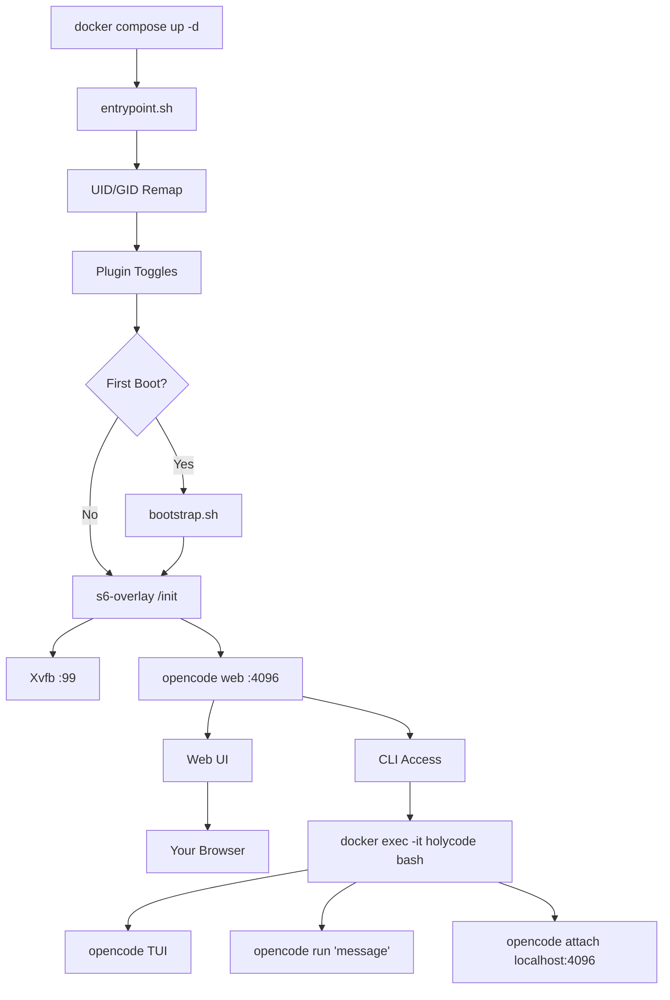

🌍 [English](../../README.md) | [Español](README.es.md) | [Français](README.fr.md) | [Italiano](README.it.md) | [Português](README.pt.md) | [Deutsch](README.de.md) | **Русский** | [हिन्दी](README.hi.md) | [中文](README.zh.md) | [日本語](README.ja.md) | [한국어](README.ko.md)

<a name="top"></a>

#  HolyCode

<div align="center">
  
</div>

<p align="center">

[](https://opensource.org/licenses/MIT)
[](https://hub.docker.com/r/coderluii/holycode)
[](https://hub.docker.com/r/coderluii/holycode)
[](https://github.com/coderluii/holycode)
[](https://x.com/CoderLuii)
[](https://www.paypal.com/donate/?hosted_button_id=PM2UXGVSTHDNL)
[](https://buymeacoffee.com/CoderLuii)
[](https://coderluii.dev)
[](https://github.com/coderluii/holycode/releases)
[](https://github.com/coderluii/holycode/issues)
[](https://github.com/coderluii/holycode/graphs/contributors)

</p>

### Один контейнер. Все инструменты. Любой провайдер.

OpenCode работает в контейнере — всё уже установлено. 50+ инструментов разработки, 10+ AI-провайдеров, безголовый браузер, постоянное состояние. Разверните на любой машине и продолжайте с того места, где остановились.

**Работает с вашей подпиской Claude.** Включите плагин Claude Auth и используйте существующий план Claude Max/Pro. Отдельный API-ключ не нужен.

**Мультиагентная оркестрация встроена.** Включите oh-my-openagent и превратите OpenCode в координированную систему агентов с параллельным выполнением.

**Вы собирались потратить час на восстановление окружения. Или просто запустить `docker compose up`.**
> **Не хотите самостоятельно размещать?** [HolyCode Cloud](https://holycode.coderluii.dev/cloud) скоро появится. Те же инструменты, ноль настройки. Ранний доступ бесплатный.

---

## Что это такое?

Всё как обычно. Вы идеально настраиваете своё рабочее окружение. Потом меняете машину. Или пересобираете контейнер. Или система решает, что сегодня её последний день.

Внезапно вы переустанавливаете инструменты. Ищете конфигурационные файлы. Заново вводите API-ключи. Гадаете, почему ripgrep больше нет в PATH. Разбираетесь, почему Chromium не запускается — Docker выделяет контейнерам 64 МБ общей памяти. Потом Xvfb не настроен. Потом UID внутри контейнера не совпадает с хостом, и везде «permission denied».

**HolyCode — это контейнер, который я собрал, решив каждую из этих проблем.**

Он оборачивает [OpenCode](https://opencode.ai) — AI-агент для программирования со встроенным веб-интерфейсом. Все настройки, сессии, MCP-конфиги, плагины и история инструментов хранятся в bind-монтировании за пределами контейнера. Пересобирайте, обновляйте или переходите на новую машину. Состояние возвращается автоматически.

Та же идея, что и в [HolyClaude](https://github.com/coderluii/holyclaude), но обёртывает OpenCode вместо Claude Code. И вот в чём дело: OpenCode не привязан к одному провайдеру. Направьте его на Anthropic, OpenAI, Google Gemini, Groq, AWS Bedrock или Azure OpenAI. Один контейнер — ваш выбор модели.

50+ инструментов разработки, две среды выполнения языков, стек безголового браузера и управление процессами. Всё подключено, всё готово с первого запуска. Я запускаю это на своём сервере. Каждый баг был воспроизведён, диагностирован и исправлен.

Вы скачиваете. Запускаете. Открываете браузер. Создаёте.

---

## Содержание

| | Раздел |
|---|---------|
| 1 | [Быстрый старт](#-быстрый-старт) |
| 2 | [HolyCode Cloud](#-holycode-cloud-скоро) |
| 3 | [Поддерживаемые платформы](#-поддерживаемые-платформы) |
| 4 | [Почему HolyCode](#-почему-holycode) |
| 5 | [Поддержка провайдеров](#-поддержка-провайдеров) |
| 6 | [Docker Compose — Быстрый](#-docker-compose---быстрый) |
| 7 | [Docker Compose — Полный](#-docker-compose---полный) |
| 8 | [Переменные окружения](#-переменные-окружения) |
| 9 | [Что внутри](#-что-внутри) |
| 10 | [Встроенные сервисы](#-встроенные-сервисы) |
| 11 | [Архитектура](#-архитектура) |
| 12 | [Использование CLI](#-использование-cli) |
| 13 | [Данные и постоянство](#-данные-и-постоянство) |
| 14 | [Разрешения](#-разрешения) |
| 15 | [Обновление](#-обновление) |
| 16 | [Устранение неполадок](#-устранение-неполадок) |
| 17 | [Локальная сборка](#-локальная-сборка) |
| 18 | [Участие в проекте](#-участие-в-проекте) |
| 19 | [Поддержка](#-поддержка) |
| 20 | [Лицензия](#-лицензия) |

---

## 🚀 Быстрый старт

**Шаг 1.** Скачайте образ.

```bash
docker pull coderluii/holycode:latest
```

**Шаг 2.** Создайте `docker-compose.yaml`.

```yaml
services:
  holycode:
    image: coderluii/holycode:latest
    container_name: holycode
    restart: unless-stopped
    shm_size: 2g
    ports:
      - "4096:4096"
    volumes:
      - ./data/opencode:/home/opencode
      - ./local-cache/opencode:/home/opencode/.cache/opencode
      - ./workspace:/workspace
    environment:
      - PUID=1000
      - PGID=1000
      - ANTHROPIC_API_KEY=your-key-here

```

**Шаг 3.** Запустите.

```bash
docker compose up -d
```

Откройте http://localhost:4096. Вы готовы.

> В поставляемом `docker-compose.yaml` используется синтаксис `${ANTHROPIC_API_KEY}`, который читает значение из вашей оболочки или файла `.env`. Скопируйте `.env.example` в `.env` и заполните свой API-ключ.

<p align="right">
  <a href="#top">наверх</a>
</p>

---

## ☁ HolyCode Cloud (Скоро)

Не хотите самостоятельно размещать? Мы создаём управляемую версию HolyCode.

Те же 50+ инструментов. Те же 10+ провайдеров. То же постоянное состояние. Без Docker. Без терминала. Просто откройте браузер и пишите код.

**Что вы получаете с Cloud:**
- Нулевая настройка. Без Docker, без конфигурационных файлов, без команд в терминале.
- Работает на любом устройстве. Ноутбук, планшет, телефон. Откройте браузер и вперёд.
- Всегда обновлено. Последняя версия OpenCode, последние инструменты. Мы всё берём на себя.
- Ваше состояние следует за вами. Сессии, настройки, MCP-конфиги сохраняются между использованиями.

**Ранний доступ бесплатный.** Кредитная карта не требуется.

**[Займите своё место](https://holycode.coderluii.dev/cloud)**

<p align="right">
  <a href="#top">наверх</a>
</p>

---

## 💻 Поддерживаемые платформы

| Платформа | Архитектура | Статус |
|----------|-------------|--------|
| Linux | amd64 | Поддерживается |
| Linux | arm64 | Поддерживается |
| macOS (Docker Desktop) | amd64 / arm64 | Поддерживается |
| Windows (WSL2) | amd64 | Поддерживается |

<p align="right">
  <a href="#top">наверх</a>
</p>

---

## ⚡ Почему HolyCode

Я создал это, потому что устал каждый раз повторять одну и ту же настройку. Устанавливать OpenCode, настраивать безголовый браузер, исправлять проблемы с разрешениями, отлаживать управление процессами. Каждый. Раз.

Поэтому я сделал контейнер, который делает всё это. И потом столкнулся со всеми возможными ошибками, чтобы вам не пришлось.

| | HolyCode | Своими руками |
|---|----------|-----|
| Время до первой рабочей сессии | Менее 2 минут | 30-60 минут |
| Chromium + Xvfb безголовый браузер | Предварительно настроен | Исследуйте, устанавливайте, отлаживайте сами |
| Набор инструментов разработки (ripgrep, fzf, lazygit и др.) | Предустановлен | Ищите и устанавливайте по одному |
| Сохранение состояния между пересборками | Автоматически через bind-монтирование | Ручные bind-монтирования, легко ошибиться |
| Переназначение прав доступа UID/GID | Встроенный PUID/PGID | Хаки с chmod в Dockerfile |
| Поддержка нескольких архитектур | amd64 + arm64 из коробки | Собирайте и публикуйте оба сами |
| Обновления | `docker pull` + `compose up` | Пересборка с нуля, надейтесь, что ничего не сломается |

<p align="right">
  <a href="#top">наверх</a>
</p>

---

## 🤖 Поддержка провайдеров

OpenCode не привязан к провайдеру. Установите нужный API-ключ — и готово.

| Провайдер | Переменная окружения | Примечания |
|----------|---------------------|-------|
| Anthropic | `ANTHROPIC_API_KEY` | Модели Claude |
| OpenAI | `OPENAI_API_KEY` | Модели GPT |
| Google Gemini | `GEMINI_API_KEY` | Модели Gemini |
| Groq | `GROQ_API_KEY` | Быстрый вывод |
| AWS Bedrock | `AWS_ACCESS_KEY_ID`, `AWS_SECRET_ACCESS_KEY`, `AWS_REGION` | Установите все три |
| Azure OpenAI | `AZURE_OPENAI_ENDPOINT`, `AZURE_OPENAI_API_KEY`, `AZURE_OPENAI_API_VERSION` | Установите все три |
| GitHub | `GITHUB_TOKEN` | GitHub Copilot через OpenAI-совместимый endpoint |
| Vertex AI | (настраивается через OpenCode) | Модели Google Vertex AI |
| GitHub Models | (настраивается через OpenCode) | Модели, размещённые на GitHub |
| Ollama | (настраивается через OpenCode) | Локальные модели через Ollama |

Устанавливайте ключи только для провайдеров, которые реально используете. Всё остальное опционально и игнорируется.

Vertex AI, GitHub Models и Ollama настраиваются через систему провайдеров OpenCode. Запустите `opencode providers login` внутри контейнера.

<p align="right">
  <a href="#top">наверх</a>
</p>

---

## 📋 Docker Compose — Быстрый

Минимальная настройка. Скопируйте, вставьте ключ, запустите.

```yaml
services:
  holycode:
    image: coderluii/holycode:latest
    container_name: holycode
    restart: unless-stopped
    shm_size: 2g              # Required for Chromium stability
    ports:
      - "4096:4096"           # OpenCode web UI
    volumes:
      - ./data/opencode:/home/opencode
      - ./local-cache/opencode:/home/opencode/.cache/opencode
      - ./workspace:/workspace  # Your project files
    environment:
      - PUID=1000
      - PGID=1000
      - ANTHROPIC_API_KEY=your-key-here  # Or swap for any provider key

```

<p align="right">
  <a href="#top">наверх</a>
</p>

---

## 📄 Docker Compose — Полный

Все параметры задокументированы. Скопируйте в `docker-compose.yaml` и раскомментируйте нужное.

```yaml
# HolyCode - Full Configuration Reference
# Copy this file to docker-compose.yaml and customize.
# All options documented. Uncomment what you need.

services:
  holycode:
    image: coderluii/holycode:latest
    container_name: holycode
    restart: unless-stopped
    shm_size: 2g

    ports:
      - "4096:4096"   # OpenCode web UI

    volumes:
      # --- Persistent state (all OpenCode data under home dir) ---
      - ./data/opencode:/home/opencode   # Config, sessions, plugins, all XDG paths

      # --- Cache isolation (keeps plugin cache on local disk, avoids CIFS/SMB symlink issues) ---
      - ./local-cache/opencode:/home/opencode/.cache/opencode

      # --- Workspace ---
      - ./workspace:/workspace   # Your project files

    environment:
      # --- Container user ---
      - PUID=1000                # Match your host UID for file permissions
      - PGID=1000                # Match your host GID for file permissions

      # --- Git identity (used on first boot) ---
      # - GIT_USER_NAME=Your Name
      # - GIT_USER_EMAIL=you@example.com

      # --- AI provider API keys (add the ones you use) ---
      - ANTHROPIC_API_KEY=${ANTHROPIC_API_KEY:-}
      # - OPENAI_API_KEY=${OPENAI_API_KEY:-}
      # - GEMINI_API_KEY=${GEMINI_API_KEY:-}
      # - GROQ_API_KEY=${GROQ_API_KEY:-}
      # - GITHUB_TOKEN=${GITHUB_TOKEN:-}

      # --- AWS Bedrock (uncomment all 3 for Bedrock) ---
      # - AWS_ACCESS_KEY_ID=
      # - AWS_SECRET_ACCESS_KEY=
      # - AWS_REGION=us-east-1

      # --- Azure OpenAI (uncomment all 3 for Azure) ---
      # - AZURE_OPENAI_ENDPOINT=
      # - AZURE_OPENAI_API_KEY=
      # - AZURE_OPENAI_API_VERSION=

      # --- OpenCode behavior (set by default in image, override if needed) ---
      # - OPENCODE_DISABLE_AUTOUPDATE=true
      # - OPENCODE_DISABLE_TERMINAL_TITLE=true
      # - OPENCODE_MODEL=claude-sonnet-4-6
      # - OPENCODE_PERMISSION=auto
      # - OPENCODE_DISABLE_LSP_DOWNLOAD=true
      # - OPENCODE_DISABLE_AUTOCOMPACT=true
      # - OPENCODE_ENABLE_EXA=true

      # --- Web UI Security (basic auth for opencode web) ---
      # - OPENCODE_SERVER_PASSWORD=your-password
      # - OPENCODE_SERVER_USERNAME=opencode

      # --- Claude Auth (use Claude subscription instead of API key) ---
      # Reads credentials from ./data/opencode/.claude/.credentials.json
      # NOTE: May violate Anthropic TOS. Use at your own risk.
      # Toggle on/off with docker compose down && up -d
      # - ENABLE_CLAUDE_AUTH=true

      # --- oh-my-openagent (multi-agent orchestration for OpenCode) ---
      # Installs automatically on first boot when enabled
      # Toggle on/off with docker compose down && up -d
      # - ENABLE_OH_MY_OPENAGENT=true

```

<p align="right">
  <a href="#top">наверх</a>
</p>

---

## 🔧 Переменные окружения

| Переменная | По умолчанию | Назначение |
|----------|---------|---------|
| `PUID` | `1000` | UID пользователя контейнера, укажите свой хостовый для корректного владения файлами |
| `PGID` | `1000` | GID пользователя контейнера, укажите свой хостовый для корректного владения файлами |
| `GIT_USER_NAME` | `HolyCode User` | Git-идентификация, применяется при первом запуске |
| `GIT_USER_EMAIL` | `noreply@holycode.local` | Git-идентификация, применяется при первом запуске |
| `ANTHROPIC_API_KEY` | (нет) | Anthropic Claude |
| `OPENAI_API_KEY` | (нет) | Модели OpenAI GPT |
| `GEMINI_API_KEY` | (нет) | Google Gemini |
| `GROQ_API_KEY` | (нет) | Быстрый вывод Groq |
| `GITHUB_TOKEN` | (нет) | Авторизация GitHub CLI и Copilot |
| `AWS_ACCESS_KEY_ID` | (нет) | AWS Bedrock — установите все три переменные AWS |
| `AWS_SECRET_ACCESS_KEY` | (нет) | AWS Bedrock |
| `AWS_REGION` | (нет) | Регион AWS Bedrock (например, `us-east-1`) |
| `AZURE_OPENAI_ENDPOINT` | (нет) | Azure OpenAI — установите все три переменные Azure |
| `AZURE_OPENAI_API_KEY` | (нет) | Azure OpenAI |
| `AZURE_OPENAI_API_VERSION` | (нет) | Версия Azure OpenAI API |
| `OPENCODE_DISABLE_AUTOUPDATE` | `true` | Запретить OpenCode самообновляться внутри контейнера |
| `OPENCODE_DISABLE_TERMINAL_TITLE` | `true` | Запретить OpenCode изменять заголовок терминала |
| `OPENCODE_MODEL` | (нет) | Переопределить модель по умолчанию |
| `OPENCODE_PERMISSION` | (нет) | Установите `auto` для пропуска запросов разрешений |
| `OPENCODE_DISABLE_LSP_DOWNLOAD` | (нет) | Отключить автоматическую загрузку LSP-серверов |
| `OPENCODE_DISABLE_AUTOCOMPACT` | (нет) | Отключить автоматическое сжатие контекста |
| `OPENCODE_ENABLE_EXA` | (нет) | Включить интеграцию веб-поиска Exa |
| `OPENCODE_SERVER_PASSWORD` | (нет) | Защитить веб-интерфейс базовой аутентификацией |
| `OPENCODE_SERVER_USERNAME` | `opencode` | Имя пользователя для базовой аутентификации веб-интерфейса |
| `ENABLE_CLAUDE_AUTH` | (нет) | Установите `true` для использования подписки Claude вместо API-ключа |
| `ENABLE_OH_MY_OPENAGENT` | (нет) | Установите `true` для включения плагина мультиагентной оркестрации |
| `ENABLE_PAPERCLIP` | (нет) | Установите `true` для запуска панели управления и доски агентов Paperclip |
| `PAPERCLIP_PORT` | `3100` | Переопределяет порт контейнера для Paperclip |
| `PAPERCLIP_INSTANCE_ID` | `default` | Имя локального экземпляра Paperclip для изолированного состояния |
| `ENABLE_HERMES` | (нет) | Установите `true` для запуска Hermes как встроенного мета-агентного API |
| `HERMES_PORT` | `8642` | Переопределяет порт контейнера для Hermes |
| `HOLYCODE_PLUGIN_UPDATE` | `manual` | Режим обновления плагинов: `manual` (устанавливает если отсутствует) или `auto` (устанавливает и обновляет при каждом запуске) |

> Переключатели плагинов (`ENABLE_CLAUDE_AUTH`, `ENABLE_OH_MY_OPENAGENT`) вступают в силу при перезапуске контейнера. Установите переменную и выполните `docker compose down && up -d`.

> `HOLYCODE_PLUGIN_UPDATE` управляет обновлениями пакетов плагинов. `manual` (по умолчанию) устанавливает включённые плагины только если они отсутствуют. `auto` устанавливает отсутствующие плагины и обновляет включённые при каждом запуске. Это отдельно от `OPENCODE_DISABLE_AUTOUPDATE`, который влияет только на OpenCode.

> `ENABLE_OH_MY_OPENAGENT=true` включает плагин и открывает встроенный навык `/oh-my-openagent-setup`. Навык появляется только когда плагин включён. Используйте его для создания или обновления файла конфигурации плагина в `~/.config/opencode/oh-my-openagent.jsonc`.

> Политика выбора по умолчанию в HolyCode: видимые: `sisyphus`, `hephaestus`, `prometheus`, `atlas`; скрытые подагенты: `oracle`, `librarian`, `explore`, `metis`, `momus`, `multimodal-looker`, `sisyphus-junior`. Если вы добавили нового провайдера и видимая модель по умолчанию выглядит устаревшей, перезапустите `/oh-my-openagent-setup`, затем выполните: `docker exec -it holycode bash -c "bunx oh-my-opencode doctor"` и `docker exec -it holycode bash -c "bunx oh-my-opencode refresh-model-capabilities"`.

> `ENABLE_PAPERCLIP=true` запускает Paperclip на порту `3100` внутри контейнера. Откройте панель управления, создайте компанию и наймите агентов OpenCode оттуда. Paperclip автоматически сохраняет состояние в `~/.paperclip`.

> `ENABLE_HERMES=true` запускает Hermes на порту `8642` внутри контейнера. Hermes сохраняет состояние в `~/.hermes`, использует уже установленный бинарный файл `opencode` и может предоставлять OpenAI-совместимый API, делегируя работу с кодом обратно в HolyCode.

> `GIT_USER_NAME` и `GIT_USER_EMAIL` применяются только при первом запуске. Для повторного применения удалите служебный файл и перезапустите: `docker exec holycode rm /home/opencode/.config/opencode/.holycode-bootstrapped` затем `docker compose restart`.

<p align="right">
  <a href="#top">наверх</a>
</p>

---

## 📦 Что внутри

<details>
<summary><strong>Основные инструменты</strong></summary>

| Инструмент | Назначение |
|------|---------|
| `git` | Контроль версий |
| `ripgrep` | Быстрый поиск содержимого файлов |
| `fd` | Быстрый поиск файлов |
| `fzf` | Нечёткий поиск |
| `bat` | Cat с подсветкой синтаксиса |
| `eza` | Современная замена ls |
| `lazygit` | Терминальный интерфейс git |
| `delta` | Улучшенные git-диффы |
| `gh` | GitHub CLI |
| `htop` | Монитор процессов |
| `tar` | Создание и извлечение архивов |
| `tree` | Визуализация дерева каталогов |
| `less` | Постраничный просмотр файлов |
| `vim` | Терминальный текстовый редактор |
| `tmux` | Мультиплексор терминала |

</details>

<details>
<summary><strong>Среды выполнения языков</strong></summary>

| Среда выполнения | Версия |
|---------|---------|
| Node.js | 22 (LTS) |
| npm | Поставляется с Node.js 22 |
| Python | 3 (системный) |
| pip | Поставляется с Python 3 |

</details>

<details>
<summary><strong>Инструменты разработки</strong></summary>

| Инструмент | Назначение |
|------|---------|
| `curl` | HTTP-запросы |
| `wget` | Загрузка файлов |
| `jq` | Обработка JSON |
| `unzip` / `zip` | Архивные инструменты |
| `ssh` | Удалённый доступ |
| `build-essential` + `pkg-config` | Компиляция нативных npm-аддонов |
| `python3-venv` | Виртуальные окружения Python |
| `procps` | Инструменты процессов: ps, top |
| `iproute2` | Сетевые инструменты: ip, ss |
| `lsof` | Диагностика открытых файлов |
| OpenSSL | Крипто и сертификаты (через базовый образ) |

</details>

<details>
<summary><strong>Стек браузера</strong></summary>

| Компонент | Назначение |
|-----------|---------|
| Chromium | Движок безголового браузера |
| Xvfb | Виртуальный фреймбуфер |
| Playwright | Фреймворк автоматизации браузера |

Стек браузера работает в безголовом режиме из коробки. Без дисплейного сервера, без GPU, без дополнительной настройки. Скрипты Playwright и Puppeteer работают как ожидается.

Включает шрифты Liberation, DejaVu, Noto и Noto Color Emoji для корректного отображения страниц и скриншотов.

</details>

<details>
<summary><strong>Встроенные сервисы</strong></summary>

| Сервис | Назначение |
|---------|---------|
| Hermes Agent | Самосовершенствующийся мета-агент с MCP, адаптерами сообщений и делегированием OpenCode |
| Paperclip | Локальная доска агентов, нанимающая работников OpenCode и пробуждающая их по heartbeat |
| Claude Code CLI | Установлен для потоков аутентификации подписки Claude через `ENABLE_CLAUDE_AUTH` |

</details>

<details>
<summary><strong>Управление процессами</strong></summary>

| Компонент | Назначение |
|-----------|---------|
| s6-overlay v3 | Супервизор процессов и система инициализации |
| Кастомная точка входа | Переназначение UID/GID, настройка git, начальная инициализация |

s6-overlay следит за OpenCode и Xvfb. Если процесс падает, он автоматически перезапускается. Политики перезапуска контейнера остаются чистыми, потому что супервизор обрабатывает это внутренне.

</details>

<p align="right">
  <a href="#top">наверх</a>
</p>

---

## 🧩 Встроенные сервисы

HolyCode теперь поставляется с двумя опциональными слоями поверх OpenCode. Они **не нужны** для использования контейнера. Включите переменную окружения, перезапустите контейнер — и сервис запустится рядом с обычным веб-интерфейсом.

### Hermes Agent

Hermes — это опция «умного мозга». Он работает как встроенный мета-агент, предоставляет OpenAI-совместимый API на порту `8642` и делегирует работу с кодом, вызывая локальный бинарный файл `opencode`, который HolyCode уже включает.

Включите с помощью:

```yaml
environment:
  - ENABLE_HERMES=true
  - HERMES_PORT=8642
```

Состояние Hermes хранится в `/home/opencode/.hermes` и следует той же истории постоянства, что и остальная часть HolyCode.

### Paperclip

Paperclip — это опция «доски агентов». Он предоставляет локальную панель управления на порту `3100`, где вы создаёте компанию, нанимаете агентов и позволяете им просыпаться по расписанию. Под капотом запускаются процессы `opencode run`, так что работники по-прежнему являются HolyCode.

Включите с помощью:

```yaml
environment:
  - ENABLE_PAPERCLIP=true
  - PAPERCLIP_PORT=3100
```

Состояние Paperclip хранится в `/home/opencode/.paperclip`. Откройте панель управления, настройте компанию и наймите сотрудников OpenCode оттуда.

<p align="right">
  <a href="#top">наверх</a>
</p>

---

## 🏗 Архитектура



Точка входа обрабатывает переназначение пользователя, переключение плагинов, переключение опциональных встроенных сервисов и начальную настройку. s6-overlay следит за Xvfb, веб-сервером OpenCode и любыми включёнными опциональными встроенными сервисами. Если контролируемый процесс падает, s6 автоматически перезапускает его. Обращайтесь к веб-интерфейсу на порту 4096 или заходите в контейнер для полного CLI-опыта.

<p align="right">
  <a href="#top">наверх</a>
</p>

---

## 💻 Использование CLI

Веб-интерфейс на порту 4096 является основным интерфейсом. Но вы также можете использовать OpenCode напрямую из командной строки внутри контейнера.

### Интерактивный TUI

```bash
docker exec -it holycode bash
opencode
```

Открывает полный терминальный интерфейс OpenCode со всеми теми же функциями, что и в веб-версии.

### Одиночные команды

Выполните одиночный запрос без входа в TUI:

```bash
docker exec -it holycode bash -c "opencode run 'explain this codebase'"
```

### Подключение к работающему серверу

Подключите локальную TUI-сессию к уже запущенному веб-серверу OpenCode:

```bash
docker exec -it holycode bash -c "opencode attach http://localhost:4096"
```

Это разделяет ту же сессию, что и веб-интерфейс. Изменения в одном отображаются в другом.

### Управление провайдерами

Просмотр и настройка AI-провайдеров изнутри контейнера:

```bash
docker exec -it holycode bash -c "opencode providers list"
docker exec -it holycode bash -c "opencode providers login"
```

### Настройка и перенастройка oh-my-openagent

Если вы включили `ENABLE_OH_MY_OPENAGENT=true`, навык `/oh-my-openagent-setup` становится доступным. Используйте его для создания или обновления конфигурации плагина:

```text
/oh-my-openagent-setup
```

Если вы добавили нового провайдера и видимая модель по умолчанию выглядит устаревшей, перезапустите `/oh-my-openagent-setup`, затем:

```bash
docker exec -it holycode bash -c "bunx oh-my-opencode doctor"
docker exec -it holycode bash -c "bunx oh-my-opencode refresh-model-capabilities"
```

### Полезные команды

| Команда | Что делает |
|---------|-------------|
| `opencode` | Запустить TUI |
| `opencode run 'message'` | Одиночный запрос |
| `opencode attach <url>` | Подключить TUI к работающему серверу |
| `opencode web --port 4096` | Запустить веб-сервер (уже запущен через s6) |
| `opencode serve` | Безголовый API-сервер |
| `opencode providers list` | Показать настроенных провайдеров |
| `opencode providers login` | Добавить или сменить провайдера |
| `bunx oh-my-opencode doctor` | Диагностировать конфигурацию oh-my-openagent и разрешение моделей |
| `bunx oh-my-opencode refresh-model-capabilities` | Обновить кэш возможностей провайдера/модели |
| `opencode models` | Список доступных моделей |
| `opencode models <provider>` | Список моделей для конкретного провайдера |
| `opencode stats` | Показать использование токенов и стоимость |
| `opencode session list` | Список прошлых сессий |
| `opencode export <sessionID>` | Экспортировать сессию в JSON |
| `opencode plugin <module>` | Установить плагин |
| `opencode upgrade` | Обновить OpenCode (по умолчанию отключено в контейнере) |

<p align="right">
  <a href="#top">наверх</a>
</p>

---

## 💾 Данные и постоянство

Всё состояние OpenCode хранится в одном bind-монтировании по пути `./data/opencode`. Контейнер не имеет состояния. Bind-монтирование содержит всё важное.

| Путь на хосте | Путь в контейнере | Содержимое |
|-----------|---------------|-------------|
| `./data/opencode/.config/opencode` | `/home/opencode/.config/opencode` | Настройки, агенты, MCP-конфиги, темы, плагины |
| `./data/opencode/.local/share/opencode` | `/home/opencode/.local/share/opencode` | SQLite-база сессий, OAuth-токены MCP |
| `./data/opencode/.local/state/opencode` | `/home/opencode/.local/state/opencode` | Данные frecency, кэш моделей, хранилище ключ-значение |
| `./local-cache/opencode` | `/home/opencode/.cache/opencode` | node_modules плагинов, автоустановленные зависимости |

Пересобирайте контейнер в любое время. Запустите `docker compose pull && docker compose up -d` — ваши сессии, настройки и конфиги вернутся автоматически.

**Примечание о SQLite WAL.** База данных сессий использует Write-Ahead Logging. Не копируйте файл `.db` во время работы контейнера. Остановите контейнер, если нужно сделать резервную копию или перенести базу данных.

**Примечание о сетевом хранилище.** Если `./data/opencode` находится на сетевом монтировании CIFS/SMB (NAS, Synology, TrueNAS), режим WAL SQLite может не работать, так как SMB по умолчанию не поддерживает блокировку диапазона байтов. HolyCode обнаруживает это при запуске и выводит предупреждение с решением. См. раздел Устранение неполадок ниже.

<p align="right">
  <a href="#top">наверх</a>
</p>

---

## 🔐 Разрешения

HolyCode использует `PUID` и `PGID` для переназначения внутреннего пользователя контейнера на вашего хостового. Это означает, что файлы, записанные в `./workspace`, принадлежат вам, а не root.

Найдите свои ID в Linux и macOS:

```bash
id -u   # PUID
id -g   # PGID
```

На большинстве систем это `1000:1000`. На macOS часто `501:20`. Установите в файле compose:

```yaml
environment:
  - PUID=501
  - PGID=20
```

Если пропустить, файлы в рабочем пространстве могут принадлежать root, и для их редактирования с хоста потребуется sudo.

<p align="right">
  <a href="#top">наверх</a>
</p>

---

## ⬆️ Обновление

Скачайте последний образ и пересоздайте контейнер. Ваши данные остаются нетронутыми.

```bash
docker compose pull
docker compose up -d
```

Вот и всё. Одна команда. Ваши сессии, настройки и конфиги хранятся в bind-монтировании — ничего не потеряется.

<p align="right">
  <a href="#top">наверх</a>
</p>

---

## 🛠 Устранение неполадок

<details>
<summary><strong>Chromium падает или автоматизация браузера не работает</strong></summary>

Наиболее распространённая причина — недостаточно общей памяти. Chromium требует не менее 1-2 ГБ `/dev/shm` для стабильной работы.

Убедитесь, что в вашем compose-файле есть `shm_size: 2g`:

```yaml
services:
  holycode:
    shm_size: 2g
```

Без этого Chromium будет падать без предупреждения или создавать повреждённые скриншоты.

</details>

<details>
<summary><strong>Permission denied для файлов рабочего пространства</strong></summary>

Ваши `PUID` и `PGID` не совпадают с хостовым пользователем. Найдите свои ID:

```bash
id -u && id -g
```

Обновите секцию environment в compose-файле:

```yaml
environment:
  - PUID=1001   # replace with your actual UID
  - PGID=1001   # replace with your actual GID
```

Затем пересоздайте контейнер: `docker compose up -d --force-recreate`

</details>

<details>
<summary><strong>Порт 4096 уже используется</strong></summary>

Что-то на вашей машине использует порт 4096. Переназначьте на другой хостовый порт:

```yaml
ports:
  - "4097:4096"   # access via http://localhost:4097
```

Или найдите и остановите конфликтующий процесс:

```bash
# Linux / macOS
lsof -i :4096

# Windows
netstat -ano | findstr :4096
```

</details>

<details>
<summary><strong>Контейнер запускается, но веб-интерфейс не загружается</strong></summary>

Проверьте логи контейнера:

```bash
docker compose logs -f holycode
```

OpenCode требует несколько секунд для инициализации. После `docker compose up -d` подождите 10-15 секунд перед открытием браузера. Если не работает, логи объяснят причину.

</details>

<details>
<summary><strong>Почему HolyCode не требует SYS_ADMIN или seccomp=unconfined?</strong></summary>

Chromium запускается с `--no-sandbox` внутри контейнера, что является стандартом для контейнеризированных браузерных установок. Это исключает необходимость в возможностях `SYS_ADMIN` или `seccomp=unconfined`, которые требуют некоторые другие Docker-установки с браузером. Сам контейнер обеспечивает границу изоляции.

Если вы предпочитаете использовать встроенный песочница Chromium, добавьте следующее в compose-файл и уберите `--no-sandbox` из переменной окружения `CHROMIUM_FLAGS`:

```yaml
cap_add:
  - SYS_ADMIN
security_opt:
  - seccomp=unconfined
```

</details>

<details>
<summary><strong>SQLite WAL не работает на сетевых монтированиях CIFS/SMB (NAS)</strong></summary>

Если директория `./data/opencode` находится на сетевом ресурсе CIFS/SMB, OpenCode может
завершиться с ошибкой:

```
Failed to run the query 'PRAGMA journal_mode = WAL'
```

OpenCode использует SQLite с Write-Ahead Logging (WAL) для базы данных сессий.
WAL требует блокировки диапазона байтов, которую CIFS/SMB не поддерживает по умолчанию. HolyCode обнаруживает это при запуске.

**Решение:** Добавьте `nobrl,mfsymlinks` к параметрам монтирования CIFS в `/etc/fstab`:

```
# До
//192.168.1.100/share /mnt/share cifs credentials=/etc/smbcreds,uid=1000,gid=1000 0 0

# После (добавить nobrl,mfsymlinks)
//192.168.1.100/share /mnt/share cifs credentials=/etc/smbcreds,uid=1000,gid=1000,nobrl,mfsymlinks 0 0
```

Затем перемонтируйте:

```bash
sudo umount /mnt/share
sudo mount /mnt/share
```

Перезапустите HolyCode: `docker compose up -d --force-recreate`

</details>

<p align="right">
  <a href="#top">наверх</a>
</p>

---

## 🔨 Локальная сборка

Клонируйте репозиторий, соберите образ, замените в compose-файле.

```bash
git clone https://github.com/coderluii/holycode.git
cd holycode
docker build -t holycode:local .
```

Затем в `docker-compose.yaml` замените образ:

```yaml
image: holycode:local
```

<p align="right">
  <a href="#top">наверх</a>
</p>

---

## 🤝 Участие в проекте

1. Форкните репозиторий
2. Создайте ветку: `git checkout -b feature/your-feature`
3. Зафиксируйте изменения: `git commit -m "feat: your feature"`
4. Запушьте: `git push origin feature/your-feature`
5. Откройте pull request

Полные правила см. в [CONTRIBUTING.md](.github/CONTRIBUTING.md).

<p align="right">
  <a href="#top">наверх</a>
</p>

---

## ⭐ Поддержка

Если HolyCode сэкономил вам ещё один час настройки окружения, вот как отблагодарить.

- Поставьте звезду репозиторию на GitHub
- Поделитесь с тем, кому это будет полезно
- [Buy Me A Coffee](https://buymeacoffee.com/CoderLuii)
- [PayPal](https://www.paypal.com/donate/?hosted_button_id=PM2UXGVSTHDNL)
- [GitHub Sponsors](https://github.com/sponsors/CoderLuii)

<p align="right">
  <a href="#top">наверх</a>
</p>

---

## 📄 Лицензия

Лицензия MIT — см. [LICENSE](../../LICENSE).

<p align="right">
  <a href="#top">наверх</a>
</p>

---

<div align="center">

Создано [CoderLuii](https://github.com/coderluii) · [coderluii.dev](https://coderluii.dev)

</div>
