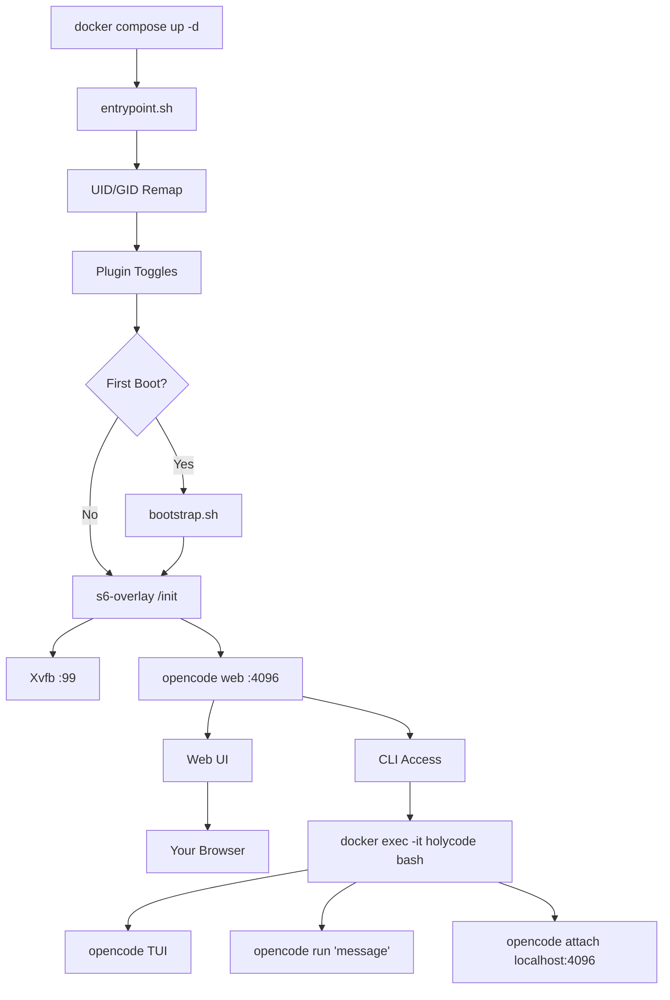

🌍 [English](../../README.md) | [Español](README.es.md) | [Français](README.fr.md) | [Italiano](README.it.md) | [Português](README.pt.md) | [Deutsch](README.de.md) | [Русский](README.ru.md) | [हिन्दी](README.hi.md) | **中文** | [日本語](README.ja.md) | [한국어](README.ko.md)

> **📝 Note:** The [English README](../../README.md) is the canonical version. This translation may lag behind. Check the English version for the most current feature set and configuration options.

<a name="top"></a>

#  HolyCode

<div align="center">
  
</div>

<p align="center">

[](https://opensource.org/licenses/MIT)
[](https://hub.docker.com/r/coderluii/holycode)
[](https://hub.docker.com/r/coderluii/holycode)
[](https://github.com/coderluii/holycode)
[](https://x.com/CoderLuii)
[](https://www.paypal.com/donate/?hosted_button_id=PM2UXGVSTHDNL)
[](https://buymeacoffee.com/CoderLuii)
[](https://coderluii.dev)
[](https://github.com/coderluii/holycode/releases)
[](https://github.com/coderluii/holycode/issues)
[](https://github.com/coderluii/holycode/graphs/contributors)

</p>

### 一个容器。所有工具。任意提供商。

OpenCode 在容器中运行，一切都已预先安装。50+ 开发工具，10+ AI 提供商，无头浏览器，持久状态。部署到任何机器上，从上次离开的地方继续。

**你本来要花一个小时恢复环境。或者直接运行 `docker compose up`。**
> **不想自托管？** [HolyCode Cloud](https://holycode.coderluii.dev/cloud) 即将推出。相同的工具，零配置。抢先体验免费。

---

## 这是什么？

你知道这个套路。你把开发环境配置得恰到好处。然后换了台机器。或者重建了容器。或者系统决定今天是它的终结之日。

突然间你在重新安装工具。寻找配置文件。重新输入 API 密钥。纳闷为什么 ripgrep 不在 PATH 里了。搞清楚为什么 Chromium 无法启动，因为 Docker 给容器只分配了 64MB 共享内存。然后 Xvfb 没有配置。然后容器内的 UID 与你的宿主机不匹配，所有地方都是 permission denied。

**HolyCode 是我在解决了所有这些问题之后构建的容器。**

它封装了 [OpenCode](https://opencode.ai)，一个带有内置 Web UI 的 AI 编码代理。你所有的设置、会话、MCP 配置、插件和工具历史都保存在容器外的绑定挂载中。重建、更新或迁移到新机器。你的状态会立即恢复。

这与 [HolyClaude](https://github.com/coderluii/holyclaude) 的理念相同，只是封装的是 OpenCode 而不是 Claude Code。重点在于：OpenCode 不锁定于单一提供商。将其指向 Anthropic、OpenAI、Google Gemini、Groq、AWS Bedrock 或 Azure OpenAI。同一个容器，你选择模型。

30 多种开发工具、两种语言运行时、无头浏览器堆栈和进程监控。全部连接好，首次启动即可使用。我一直在自己的服务器上运行这个。每个 bug 都已被触发、诊断和修复。

你拉取。你运行。你打开浏览器。你构建。

---

## 目录

| | 章节 |
|---|---------|
| 1 | [快速开始](#-快速开始) |
| 2 | [HolyCode Cloud](#-holycode-cloud即将推出) |
| 3 | [平台支持](#-平台支持) |
| 4 | [为什么选择 HolyCode](#-为什么选择-holycode) |
| 5 | [提供商支持](#-提供商支持) |
| 6 | [Docker Compose - 快速版](#-docker-compose---快速版) |
| 7 | [Docker Compose - 完整版](#-docker-compose---完整版) |
| 8 | [环境变量](#-环境变量) |
| 9 | [内部包含什么](#-内部包含什么) |
| 10 | [捆绑服务](#-捆绑服务) |
| 11 | [架构](#-架构) |
| 12 | [CLI 使用](#-cli-使用) |
| 13 | [数据与持久化](#-数据与持久化) |
| 14 | [权限](#-权限) |
| 15 | [升级](#-升级) |
| 16 | [故障排除](#-故障排除) |
| 17 | [本地构建](#-本地构建) |
| 18 | [贡献](#-贡献) |
| 19 | [支持](#-支持) |
| 20 | [许可证](#-许可证) |

---

## 🚀 快速开始

**第 1 步。** 拉取镜像。

```bash
docker pull coderluii/holycode:latest
```

**第 2 步。** 创建 `docker-compose.yaml`。

```yaml
services:
  holycode:
    image: coderluii/holycode:latest
    container_name: holycode
    restart: unless-stopped
    shm_size: 2g
    ports:
      - "4096:4096"
    volumes:
      - ./data/opencode:/home/opencode
      - ./local-cache/opencode:/home/opencode/.cache/opencode
      - ./workspace:/workspace
    environment:
      - PUID=1000
      - PGID=1000
      - ANTHROPIC_API_KEY=your-key-here

```

**第 3 步。** 启动。

```bash
docker compose up -d
```

打开 http://localhost:4096。完成。

> 附带的 `docker-compose.yaml` 使用 `${ANTHROPIC_API_KEY}` 语法，从你的 shell 环境或 `.env` 文件读取。将 `.env.example` 复制为 `.env` 并填入你的 API 密钥。

<p align="right">
  <a href="#top">返回顶部</a>
</p>

---

## ☁ HolyCode Cloud（即将推出）

不想自托管？我们正在构建 HolyCode 的托管版本。

同样的 30 多种工具。同样的 10 多个提供商。同样的持久状态。无需 Docker。无需终端。只需打开浏览器开始编码。

**Cloud 版本提供：**
- 零配置。无需 Docker，无需配置文件，无需终端命令。
- 任意设备可用。笔记本、平板、手机。打开浏览器即可。
- 始终保持更新。最新的 OpenCode，最新的工具。我们来处理。
- 你的状态跟着你走。会话、设置、MCP 配置在使用之间保存。

**抢先体验免费。** 无需信用卡。

**[抢占名额](https://holycode.coderluii.dev/cloud)**

<p align="right">
  <a href="#top">返回顶部</a>
</p>

---

## 💻 平台支持

| 平台 | 架构 | 状态 |
|----------|-------------|--------|
| Linux | amd64 | 支持 |
| Linux | arm64 | 支持 |
| macOS (Docker Desktop) | amd64 / arm64 | 支持 |
| Windows (WSL2) | amd64 | 支持 |

<p align="right">
  <a href="#top">返回顶部</a>
</p>

---

## ⚡ 为什么选择 HolyCode

我构建它是因为厌倦了每次都重复相同的设置。安装 OpenCode，连接无头浏览器，修复权限问题，调试进程监控。每。一。次。

所以我制作了一个容器来完成所有这些工作。然后我遇到了每一个可能的 bug，这样你就不必经历了。

| | HolyCode | 自己动手 |
|---|----------|-----|
| 第一次工作会话所需时间 | 不到 2 分钟 | 30-60 分钟 |
| Chromium + Xvfb 无头浏览器 | 预配置 | 自行研究、安装、调试 |
| 开发工具套件（ripgrep、fzf、lazygit 等） | 预安装 | 逐一查找和安装 |
| 重建之间的状态持久化 | 通过绑定挂载自动实现 | 手动绑定挂载，容易配置错误 |
| UID/GID 文件权限重映射 | 内置 PUID/PGID | Dockerfile chmod 技巧 |
| 多架构支持 | 开箱即用 amd64 + arm64 | 自行构建和推送 |
| 更新 | `docker pull` + `compose up` | 从头重建，希望不会出问题 |

<p align="right">
  <a href="#top">返回顶部</a>
</p>

---

## 🤖 提供商支持

OpenCode 与提供商无关。设置你使用的 API 密钥即可。

| 提供商 | 环境变量 | 备注 |
|----------|---------------------|-------|
| Anthropic | `ANTHROPIC_API_KEY` | Claude 模型 |
| OpenAI | `OPENAI_API_KEY` | GPT 模型 |
| Google Gemini | `GEMINI_API_KEY` | Gemini 模型 |
| Groq | `GROQ_API_KEY` | 快速推理 |
| AWS Bedrock | `AWS_ACCESS_KEY_ID`, `AWS_SECRET_ACCESS_KEY`, `AWS_REGION` | 三个都要设置 |
| Azure OpenAI | `AZURE_OPENAI_ENDPOINT`, `AZURE_OPENAI_API_KEY`, `AZURE_OPENAI_API_VERSION` | 三个都要设置 |
| GitHub | `GITHUB_TOKEN` | 通过 OpenAI 兼容端点使用 GitHub Copilot |
| Vertex AI | （通过 OpenCode 配置） | Google Vertex AI 模型 |
| GitHub Models | （通过 OpenCode 配置） | GitHub 托管的模型 |
| Ollama | （通过 OpenCode 配置） | 通过 Ollama 使用本地模型 |

只需为你实际使用的提供商设置密钥。其他一切都是可选的，会被忽略。

Vertex AI、GitHub Models 和 Ollama 通过 OpenCode 的提供商系统配置。在容器内运行 `opencode providers login`。

<p align="right">
  <a href="#top">返回顶部</a>
</p>

---

## 📋 Docker Compose - 快速版

最简配置。复制，填入你的密钥，运行。

```yaml
services:
  holycode:
    image: coderluii/holycode:latest
    container_name: holycode
    restart: unless-stopped
    shm_size: 2g              # Required for Chromium stability
    ports:
      - "4096:4096"           # OpenCode web UI
    volumes:
      - ./data/opencode:/home/opencode
      - ./local-cache/opencode:/home/opencode/.cache/opencode
      - ./workspace:/workspace  # Your project files
    environment:
      - PUID=1000
      - PGID=1000
      - ANTHROPIC_API_KEY=your-key-here  # Or swap for any provider key

```

<p align="right">
  <a href="#top">返回顶部</a>
</p>

---

## 📄 Docker Compose - 完整版

每个选项均已记录。复制到 `docker-compose.yaml` 并取消注释你需要的部分。

```yaml
# HolyCode - Full Configuration Reference
# Copy this file to docker-compose.yaml and customize.
# All options documented. Uncomment what you need.

services:
  holycode:
    image: coderluii/holycode:latest
    container_name: holycode
    restart: unless-stopped
    shm_size: 2g

    ports:
      - "4096:4096"   # OpenCode web UI

    volumes:
      # --- Persistent state (all OpenCode data under home dir) ---
      - ./data/opencode:/home/opencode   # Config, sessions, plugins, all XDG paths

      # --- Cache isolation (keeps plugin cache on local disk, avoids CIFS/SMB symlink issues) ---
      - ./local-cache/opencode:/home/opencode/.cache/opencode

      # --- Workspace ---
      - ./workspace:/workspace   # Your project files

    environment:
      # --- Container user ---
      - PUID=1000                # Match your host UID for file permissions
      - PGID=1000                # Match your host GID for file permissions

      # --- Git identity (used on first boot) ---
      # - GIT_USER_NAME=Your Name
      # - GIT_USER_EMAIL=you@example.com

      # --- AI provider API keys (add the ones you use) ---
      - ANTHROPIC_API_KEY=${ANTHROPIC_API_KEY:-}
      # - OPENAI_API_KEY=${OPENAI_API_KEY:-}
      # - GEMINI_API_KEY=${GEMINI_API_KEY:-}
      # - GROQ_API_KEY=${GROQ_API_KEY:-}
      # - GITHUB_TOKEN=${GITHUB_TOKEN:-}

      # --- AWS Bedrock (uncomment all 3 for Bedrock) ---
      # - AWS_ACCESS_KEY_ID=
      # - AWS_SECRET_ACCESS_KEY=
      # - AWS_REGION=us-east-1

      # --- Azure OpenAI (uncomment all 3 for Azure) ---
      # - AZURE_OPENAI_ENDPOINT=
      # - AZURE_OPENAI_API_KEY=
      # - AZURE_OPENAI_API_VERSION=

      # --- OpenCode behavior (set by default in image, override if needed) ---
      # - OPENCODE_DISABLE_AUTOUPDATE=true
      # - OPENCODE_DISABLE_TERMINAL_TITLE=true
      # - OPENCODE_MODEL=claude-sonnet-4-6
      # - OPENCODE_PERMISSION=auto
      # - OPENCODE_DISABLE_LSP_DOWNLOAD=true
      # - OPENCODE_DISABLE_AUTOCOMPACT=true
      # - OPENCODE_ENABLE_EXA=true

      # --- Web UI Security (basic auth for opencode web) ---
      # - OPENCODE_SERVER_PASSWORD=your-password
      # - OPENCODE_SERVER_USERNAME=opencode


```

<p align="right">
  <a href="#top">返回顶部</a>
</p>

---

## 🔧 环境变量

| 变量 | 默认值 | 用途 |
|----------|---------|---------|
| `PUID` | `1000` | 容器用户 UID，与宿主机匹配以获得正确的文件所有权 |
| `PGID` | `1000` | 容器用户 GID，与宿主机匹配以获得正确的文件所有权 |
| `GIT_USER_NAME` | `HolyCode User` | 首次启动时配置的 Git 身份 |
| `GIT_USER_EMAIL` | `noreply@holycode.local` | 首次启动时配置的 Git 身份 |
| `ANTHROPIC_API_KEY` | （无） | Anthropic Claude |
| `OPENAI_API_KEY` | （无） | OpenAI GPT 模型 |
| `GEMINI_API_KEY` | （无） | Google Gemini |
| `GROQ_API_KEY` | （无） | Groq 快速推理 |
| `GITHUB_TOKEN` | （无） | GitHub CLI 认证和 Copilot |
| `AWS_ACCESS_KEY_ID` | （无） | AWS Bedrock - 设置所有三个 AWS 变量 |
| `AWS_SECRET_ACCESS_KEY` | （无） | AWS Bedrock |
| `AWS_REGION` | （无） | AWS Bedrock 区域（如 `us-east-1`） |
| `AZURE_OPENAI_ENDPOINT` | （无） | Azure OpenAI - 设置所有三个 Azure 变量 |
| `AZURE_OPENAI_API_KEY` | （无） | Azure OpenAI |
| `AZURE_OPENAI_API_VERSION` | （无） | Azure OpenAI API 版本 |
| `OPENCODE_DISABLE_AUTOUPDATE` | `true` | 阻止 OpenCode 在容器内自我更新 |
| `OPENCODE_DISABLE_TERMINAL_TITLE` | `true` | 阻止 OpenCode 更改终端标题 |
| `OPENCODE_MODEL` | （无） | 覆盖默认模型 |
| `OPENCODE_PERMISSION` | （无） | 设置为 `auto` 以跳过权限提示 |
| `OPENCODE_DISABLE_LSP_DOWNLOAD` | （无） | 禁用自动 LSP 服务器下载 |
| `OPENCODE_DISABLE_AUTOCOMPACT` | （无） | 禁用自动上下文压缩 |
| `OPENCODE_ENABLE_EXA` | （无） | 启用 Exa 网络搜索集成 |
| `OPENCODE_SERVER_PASSWORD` | （无） | 使用基本认证保护 Web UI |
| `OPENCODE_SERVER_USERNAME` | `opencode` | Web UI 基本认证用户名 |

> `GIT_USER_NAME` 和 `GIT_USER_EMAIL` 仅在首次启动时应用。要重新应用，删除哨兵文件并重启：`docker exec holycode rm /home/opencode/.config/opencode/.holycode-bootstrapped` 然后 `docker compose restart`。

<p align="right">
  <a href="#top">返回顶部</a>
</p>

---

## 📦 内部包含什么

<details>
<summary><strong>核心工具</strong></summary>

| 工具 | 用途 |
|------|---------|
| `git` | 版本控制 |
| `ripgrep` | 快速文件内容搜索 |
| `fd` | 快速文件查找 |
| `fzf` | 模糊查找 |
| `bat` | 带语法高亮的 Cat |
| `eza` | 现代 ls 替代品 |
| `lazygit` | 终端 git UI |
| `delta` | 更好的 git diff |
| `gh` | GitHub CLI |
| `htop` | 进程监控 |
| `tar` | 归档创建和提取 |
| `tree` | 目录树可视化 |
| `less` | 分页文件查看器 |
| `vim` | 终端文本编辑器 |
| `tmux` | 终端复用器 |

</details>

<details>
<summary><strong>语言运行时</strong></summary>

| 运行时 | 版本 |
|---------|---------|
| Node.js | 22 (LTS) |
| npm | 随 Node.js 22 捆绑 |
| Python | 3（系统版） |
| pip | 随 Python 3 捆绑 |

</details>

<details>
<summary><strong>开发工具</strong></summary>

| 工具 | 用途 |
|------|---------|
| `curl` | HTTP 请求 |
| `wget` | 文件下载 |
| `jq` | JSON 处理 |
| `unzip` / `zip` | 归档工具 |
| `ssh` | 远程访问 |
| `build-essential` + `pkg-config` | 原生 npm 插件编译 |
| `python3-venv` | Python 虚拟环境 |
| `procps` | 进程工具：ps、top |
| `iproute2` | 网络工具：ip、ss |
| `lsof` | 打开文件诊断 |
| OpenSSL | 加密和证书工具（通过基础镜像） |

</details>

<details>
<summary><strong>浏览器堆栈</strong></summary>

| 组件 | 用途 |
|-----------|---------|
| Chromium | 无头浏览器引擎 |
| Xvfb | 虚拟帧缓冲显示服务器 |
| Playwright | 浏览器自动化框架 |

浏览器堆栈开箱即用地以无头模式运行。无需显示服务器，无需 GPU，无需额外配置。Playwright 和 Puppeteer 脚本按预期工作。

包含 Liberation、DejaVu、Noto 和 Noto Color Emoji 字体，用于正确的页面渲染和截图。

</details>

<details>
<summary><strong>捆绑服务</strong></summary>

| 服务 | 用途 |
|---------|---------|
| Hermes Agent | 具有 MCP、消息适配器和 OpenCode 委托的自我改进元代理 |
| Paperclip | 本地代理看板，雇用 OpenCode 工作者并在心跳时唤醒它们 |

</details>

<details>
<summary><strong>进程管理</strong></summary>

| 组件 | 用途 |
|-----------|---------|
| s6-overlay v3 | 进程监控器和初始化系统 |
| 自定义入口点 | UID/GID 重映射、git 设置、引导 |

s6-overlay 监督 OpenCode 和 Xvfb。如果进程崩溃，它会自动重启。容器重启策略保持干净，因为监控器在内部处理它。

</details>

<p align="right">
  <a href="#top">返回顶部</a>
</p>

---

## 🏗 架构



入口点处理用户重映射、插件切换、可选捆绑服务切换和首次启动设置。s6-overlay 监督 Xvfb、OpenCode Web 服务器以及你启用的任何可选捆绑服务。如果受监督的进程崩溃，s6 会自动重启它。通过端口 4096 访问 Web UI，或 exec 进入容器获得完整的 CLI 体验。

<p align="right">
  <a href="#top">返回顶部</a>
</p>

---

## 💻 CLI 使用

端口 4096 上的 Web UI 是主要界面。但你也可以在容器内直接从命令行使用 OpenCode。

### 交互式 TUI

```bash
docker exec -it holycode bash
opencode
```

这将打开 OpenCode 的完整终端 UI，与 Web 版本具有相同的所有功能。

### 一次性命令

无需进入 TUI 即可运行单个提示：

```bash
docker exec -it holycode bash -c "opencode run 'explain this codebase'"
```

### 连接到运行中的服务器

将本地 TUI 会话连接到已运行的 OpenCode Web 服务器：

```bash
docker exec -it holycode bash -c "opencode attach http://localhost:4096"
```

这与 Web UI 共享同一个会话。一方的更改会出现在另一方。

### 提供商管理

从容器内列出和配置 AI 提供商：

```bash
docker exec -it holycode bash -c "opencode providers list"
docker exec -it holycode bash -c "opencode providers login"
```

### 常用命令

| 命令 | 功能 |
|---------|-------------|
| `opencode` | 启动 TUI |
| `opencode run 'message'` | 一次性提示 |
| `opencode attach <url>` | 将 TUI 连接到运行中的服务器 |
| `opencode web --port 4096` | 启动 Web 服务器（已通过 s6 运行） |
| `opencode serve` | 无头 API 服务器 |
| `opencode providers list` | 显示已配置的提供商 |
| `opencode providers login` | 添加或切换提供商 |
| `opencode models` | 列出可用模型 |
| `opencode models <provider>` | 列出特定提供商的模型 |
| `opencode stats` | 显示 token 用量和费用 |
| `opencode session list` | 列出过去的会话 |
| `opencode export <sessionID>` | 将会话导出为 JSON |
| `opencode plugin <module>` | 安装插件 |
| `opencode upgrade` | 升级 OpenCode（容器中默认禁用） |

<p align="right">
  <a href="#top">返回顶部</a>
</p>

---

## 💾 数据与持久化

所有 OpenCode 状态保存在 `./data/opencode` 的单个绑定挂载中。容器是无状态的。绑定挂载保存了所有重要内容。

| 宿主机路径 | 容器路径 | 内容 |
|-----------|---------------|-------------|
| `./data/opencode/.config/opencode` | `/home/opencode/.config/opencode` | 设置、代理、MCP 配置、主题、插件 |
| `./data/opencode/.local/share/opencode` | `/home/opencode/.local/share/opencode` | SQLite 会话数据库、MCP OAuth 令牌 |
| `./data/opencode/.local/state/opencode` | `/home/opencode/.local/state/opencode` | 频率数据、模型缓存、键值存储 |
| `./local-cache/opencode` | `/home/opencode/.cache/opencode` | 插件 node_modules、自动安装的依赖 |

随时重建容器。运行 `docker compose pull && docker compose up -d`，你的会话、设置和配置会自动恢复。

**SQLite WAL 注意事项。** 会话数据库使用预写日志。容器运行时不要复制 `.db` 文件。如需备份或迁移数据库文件，请先停止容器。

**网络存储注意事项。** 如果 `./data/opencode` 位于 CIFS/SMB 网络挂载（NAS、Synology、TrueNAS）上，SQLite WAL 模式可能会失败，因为 SMB 默认不支持字节范围锁定。HolyCode 会在启动时检测此问题并打印修复建议。请参阅下面的故障排除部分。

<p align="right">
  <a href="#top">返回顶部</a>
</p>

---

## 🔐 权限

HolyCode 使用 `PUID` 和 `PGID` 将容器内部用户重映射为你的宿主机用户。这意味着写入 `./workspace` 的文件归你所有，而不是 root。

在 Linux 和 macOS 上找到你的 ID：

```bash
id -u   # PUID
id -g   # PGID
```

在大多数系统上这是 `1000:1000`。在 macOS 上通常是 `501:20`。在 compose 文件中设置：

```yaml
environment:
  - PUID=501
  - PGID=20
```

如果跳过这步，工作区中的文件可能归 root 所有，你需要用 sudo 从宿主机编辑它们。

<p align="right">
  <a href="#top">返回顶部</a>
</p>

---

## ⬆️ 升级

拉取最新镜像并重新创建容器。你的数据保持不变。

```bash
docker compose pull
docker compose up -d
```

就这样。一条命令。你的会话、设置和配置在绑定挂载中，不会丢失任何内容。

<p align="right">
  <a href="#top">返回顶部</a>
</p>

---

## 🛠 故障排除

<details>
<summary><strong>Chromium 崩溃或浏览器自动化失败</strong></summary>

最常见的原因是共享内存不足。Chromium 需要至少 1-2 GB 的 `/dev/shm` 才能可靠运行。

确保你的 compose 文件中有 `shm_size: 2g`：

```yaml
services:
  holycode:
    shm_size: 2g
```

没有这个，Chromium 会静默崩溃或生成损坏的截图。

</details>

<details>
<summary><strong>工作区文件 Permission denied</strong></summary>

你的 `PUID` 和 `PGID` 与宿主机用户不匹配。找到你的 ID：

```bash
id -u && id -g
```

更新 compose environment 部分以匹配：

```yaml
environment:
  - PUID=1001   # replace with your actual UID
  - PGID=1001   # replace with your actual GID
```

然后重新创建容器：`docker compose up -d --force-recreate`

</details>

<details>
<summary><strong>端口 4096 已被占用</strong></summary>

你机器上有其他程序在使用端口 4096。重新映射到不同的宿主机端口：

```yaml
ports:
  - "4097:4096"   # access via http://localhost:4097
```

或者找到并停止冲突的进程：

```bash
# Linux / macOS
lsof -i :4096

# Windows
netstat -ano | findstr :4096
```

</details>

<details>
<summary><strong>容器启动但 Web UI 始终无法加载</strong></summary>

检查容器日志：

```bash
docker compose logs -f holycode
```

OpenCode 需要几秒钟来初始化。`docker compose up -d` 后等待 10-15 秒再打开浏览器。如果仍然无法使用，日志会告诉你原因。

</details>

<details>
<summary><strong>为什么 HolyCode 不需要 SYS_ADMIN 或 seccomp=unconfined？</strong></summary>

Chromium 在容器内以 `--no-sandbox` 运行，这是容器化浏览器设置的标准做法。这消除了对 `SYS_ADMIN` 能力或 `seccomp=unconfined` 的需求，而某些其他 Docker 浏览器设置需要这些。容器本身提供隔离边界。

如果你希望使用 Chromium 的内置沙盒，请将以下内容添加到 compose 文件中，并从 `CHROMIUM_FLAGS` 环境变量中删除 `--no-sandbox`：

```yaml
cap_add:
  - SYS_ADMIN
security_opt:
  - seccomp=unconfined
```

</details>

<details>
<summary><strong>SQLite WAL 在 CIFS/SMB 网络挂载上失败（NAS）</strong></summary>

如果 `./data/opencode` 目录位于 CIFS/SMB 网络共享上，OpenCode 可能会失败并显示：

```
Failed to run the query 'PRAGMA journal_mode = WAL'
```

OpenCode 使用 SQLite 的 Write-Ahead Logging (WAL) 作为会话数据库。WAL 需要字节范围锁定，而 CIFS/SMB 默认不支持。HolyCode 会在启动时检测此问题。

**修复：** 在 `/etc/fstab` 中的 CIFS 挂载选项中添加 `nobrl,mfsymlinks`：

```
# 修改前
//192.168.1.100/share /mnt/share cifs credentials=/etc/smbcreds,uid=1000,gid=1000 0 0

# 修改后（添加 nobrl,mfsymlinks）
//192.168.1.100/share /mnt/share cifs credentials=/etc/smbcreds,uid=1000,gid=1000,nobrl,mfsymlinks 0 0
```

然后重新挂载：

```bash
sudo umount /mnt/share
sudo mount /mnt/share
```

重启 HolyCode：`docker compose up -d --force-recreate`

</details>

<p align="right">
  <a href="#top">返回顶部</a>
</p>

---

## 🔨 本地构建

克隆仓库，构建镜像，在 compose 文件中替换。

```bash
git clone https://github.com/coderluii/holycode.git
cd holycode
docker build -t holycode:local .
```

然后在 `docker-compose.yaml` 中替换镜像：

```yaml
image: holycode:local
```

<p align="right">
  <a href="#top">返回顶部</a>
</p>

---

## 🤝 贡献

1. Fork 仓库
2. 创建分支：`git checkout -b feature/your-feature`
3. 提交更改：`git commit -m "feat: your feature"`
4. 推送：`git push origin feature/your-feature`
5. 打开 pull request


<p align="right">
  <a href="#top">返回顶部</a>
</p>

---

## ⭐ 支持

如果 HolyCode 为你节省了又一个小时的环境配置，这是回馈的方式。

- 在 GitHub 上给仓库加星
- 分享给会觉得有用的人
- [Buy Me A Coffee](https://buymeacoffee.com/CoderLuii)
- [PayPal](https://www.paypal.com/donate/?hosted_button_id=PM2UXGVSTHDNL)
- [GitHub Sponsors](https://github.com/sponsors/CoderLuii)

<p align="right">
  <a href="#top">返回顶部</a>
</p>

---

## 📄 许可证

MIT 许可证 - 见 [LICENSE](../../LICENSE)。

<p align="right">
  <a href="#top">返回顶部</a>
</p>

---

<div align="center">

由 [CoderLuii](https://github.com/coderluii) 构建 · [coderluii.dev](https://coderluii.dev)

</div>
